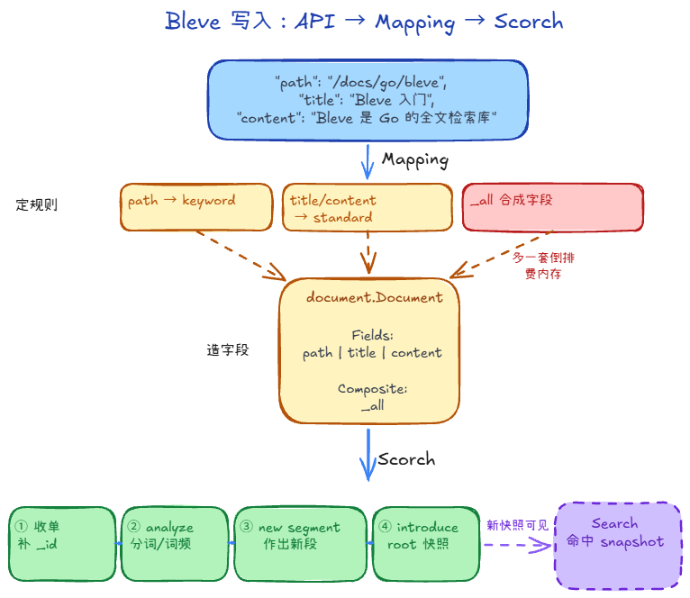

# Bleve：从文档到倒排索引

Bleve 是 Go 的嵌入式全文检索库。应用直接调用 `Index` 写入、调用 `Search` 查询，不需要单独部署搜索服务。本文以 **Bleve v2.5.5 的默认 Scorch 索引**为例，说明文档如何变成可搜索的索引。

## 1. 一份文档怎样变成倒排索引

假设写入一篇文档：

```text
_id:     doc-1
path:    /guide/raft
title:   Raft consensus
content: Raft powers consensus
```

`_id` 是传给 `Index` 的文档标识。Bleve 分析文本后，会建立类似下面的入口：

```text
title:raft         → doc-1
title:consensus    → doc-1
content:raft       → doc-1
content:consensus  → doc-1
```

理解它只需记住两点：

- **普通文档**按文档保存字段值；**倒排索引**按“字段 + 词”找到文档。
- `title:raft` 和 `content:raft` 是两个入口，所以可以只搜索标题或正文。

## 2. Mapping：决定每个字段怎么建索引

Mapping 主要回答三个问题：

1. **能不能搜索？** `Index` 控制是否建立索引。
2. **怎么分词？** 正文通常用文本分析器；路径、编号若要整串匹配，应显式使用 `keyword`。
3. **还要保存什么？** `Store` 保存原值；`DocValues` 用于按字段读取、排序等；`IncludeTermVectors` 保存位置和偏移，供短语查询、高亮使用。

Bleve v2.5.5 的 Go API 中，`NewTextFieldMapping()` 默认开启 `Index`、`Store`、`DocValues`、`IncludeTermVectors` 和 `IncludeInAll`。这些开关带来功能，也会增加索引体积。

### 分词和 `_all`

- 默认 `standard` 分析器会切词、转小写、去掉英文停用词。例如 `Raft is reliable` 得到 `raft`、`reliable`，没有 `is`。
- 对中文，它通常按字切分。若要按词搜索，需要换合适的分析器，并让写入与查询使用兼容的分析方式。
- 默认情况下，字段还会把词加入 `_all`，供不指定字段的查询使用。若关闭各字段的 `IncludeInAll`，也要把 `DefaultField` 从 `_all` 改成实际要搜索的字段，例如 `content`。



## 3. Scorch：一批文档怎么写入

`Index` 写一篇文档，`Batch` 一次写多篇。进入 Scorch 后，可以按四步理解：

1. **准备**：Mapping 展开字段，并加入内部 `_id`。
2. **分析**：`analysisQueue` 产生词项、词频和位置等信息。
3. **建段**：`segPlugin.New` 把这一批数据建成内存 Segment。它已经可以用于查询。
4. **引入**：`prepareSegment` 标记旧版本失效，随后把新段加入 root。新查询取得的快照就能看到它。

可查询与写入返回不是同一时刻。新 root 生效后，其他请求就可以搜索；默认 `Index` / `Batch` 还会等待持久化后才返回。

## 4. Segment 里有什么

Segment 是一批文档对应的独立索引。搜索 `content:raft` 时，先找词，再找包含它的文档：

1. **词典**：按字段保存词项。 
    - 在倒排索引中，快速从成千上万个词（Terms）里找到目标词，是检索的第一步
    - zap 磁盘段用 Vellum FST，输入词语，输出偏移量，指向倒排列表起始位置。
2. **倒排列表**：记录命中的段内文档编号 `docNum`
    - 找到词项后，下一步是获取包含该词的文档列表以及位置信息
3. **Stored Fields**：保存需要从索引取回的字段原值。
    - 如果需要向前端展示原始数据（如文章标题、摘要），就依赖 Stored Fields。
4. **Doc Values**：按字段组织值，方便排序等操作。
    - 专门用于 排序（Sorting）、聚合（Aggregations/Facets） 和 范围查询（Range Query）

倒排列表本质是从词到文档的映射。
- 经典实现是存增量（Delta）再做变长编码，记录 Doc ID、词频和位置。
- 现代实现里（如 Bleve），为了极速求交集，将 Doc ID 用 Roaring Bitmap 单独抽离，配合 SIMD 位运算，实现了‘匹配’与‘词频/位置解析’的分层解耦。

## 5. 删除、更新与合并

- **删除**：先把旧 Segment 中的文档标记为失效，查询时过滤。
- **更新**：让旧版本失效，再把新版本写进新 Segment。
- **持久化与合并**：persister 把内存段写到磁盘；merger 合并小段并清理失效文档。因此删除后磁盘空间通常不会立刻减少。
