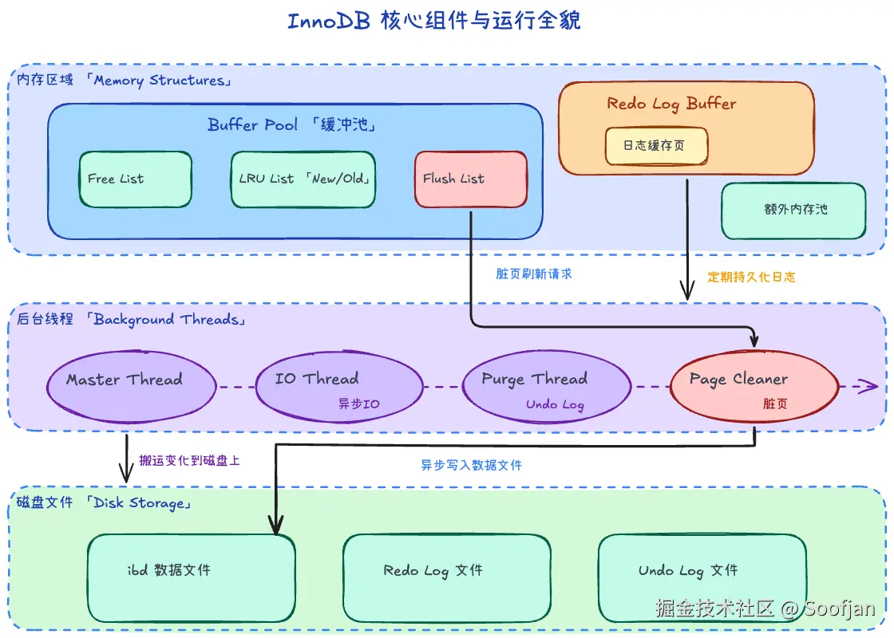
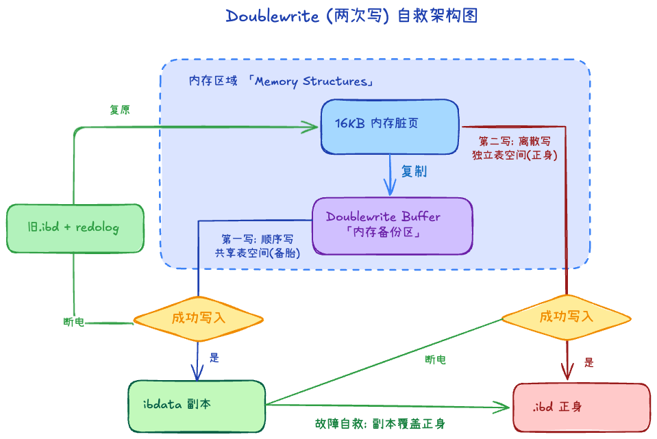

## MyISAM 与 InnoDB 的本质区别

1. InnoDB 支持事务、行锁、外键、崩溃恢复以及MVCC；MyISAM只支持表锁
2. InnoDB 聚簇索引有完整数据，二级索引保存索引列和主键值，每张表通常对应一个 .ibd 文件。MyISAM 的数据和索引分别存放在 .MYD 与 .MYI 文件中

# InnoDB组件

作为 MySQL 默认的存储引擎，InnoDB 是一个复杂的体系。其核心组件大致可以分为内存、后台线程和日志

## 内存组件

1. 缓冲池

InnoDB 以页作为数据组织、Buffer Pool 缓存和常规 I/O 的基本单位，默认页大小为 16KB

- 读策略：读数据时，先查缓冲池。如果在，直接走内存；如果不在，去磁盘读取并放入缓冲池。
- 写策略：改数据时，优先修改内存中的缓冲池页（此时该页变为“脏页”），然后在未来的合适时机（通过 Checkpoint 机制）统一写回磁盘。

缓冲池中不仅有数据页，还包括索引页、undo 页、插入缓冲页等

2. 内存链表管理

为了高效管理缓冲池的有限空间，InnoDB 用了三个关键链表：

- Free List (空闲链表)：记录哪些页是空的。当需要从磁盘读新页时，优先来这里找空位。若没空位，只能去 LRU List 踢人。
- LRU List (冷热链表)：记录正在使用的页。普通的 LRU（最近最少使用）算法有致命弱点：一次全表扫描会把真正的热点数据全部踢出内存（缓存污染）。
    - Midpoint 优化：InnoDB 将 LRU 切分为热区（New Sublist）和冷区（Old Sublist，通常占 3/8）。
    - 从磁盘新读入的页，首先放在 Midpoint（冷区头部）。如果它在冷区度过了观察期（如 1 秒）且再次被访问，才会晋升到热区头部。这有效防止了全表扫描造成的缓存冲刷。
- Flush List (脏页链表)：记录被修改过但还未写入磁盘的页。这些页同时存在于 LRU 中，但由专门的后台线程依据 Flush List 决定何时落盘。

3. Redo Log Buffer

Redo Log Buffer (重做日志缓存)：数据在缓冲池被修改时，会同时生成一条 Redo 记录放入这里。

## 后台线程

内存里的变化，最终需要人去默默搬运到磁盘上，这就依赖于后台线程。

1. Master Thread：核心调度者，负责将缓冲池中的数据异步刷新到磁盘，保证数据的一致性。
2. IO Thread：InnoDB 大量使用异步 IO (AIO) 处理写请求，多个 IO Thread 负责处理这些请求的回调。
3. Purge Thread：事务被提交后，负责顺手回收那些不再需要的 Undo Log 版本，保持系统清洁。
4. Page Cleaner Thread：将脏页从 Flush List 刷新到磁盘的任务从 Master Thread 中剥离出来，减轻主线程负担。

# InnoDB关键特性

## ChangeBuffer +1

**基本等价于唯一索引和普通索引在实现上的区别**

1. 为什么需要ChangeBuffer
二级索引的键值通常是离散无序的，插入/更新时大概率需要修改分散在磁盘不同位置的索引页，产生高昂的随机读磁盘 I/O。

2. 核心机制

对于普通索引：
- 页在内存中：直接修改内存页（变为脏页），不走 Change Buffer。
- 页不在内存中：无需从磁盘读取该页，直接将修改操作追加到 Change Buffer 中，操作即可返回成功。这一步省下了一次随机磁盘读。
- Merge（合并）时机：当后续有查询需要访问该页、或后台线程空闲、或数据库关闭时，才会把磁盘页加载进内存，将 Change Buffer 的操作“合并（Merge）”上去，最终刷盘。

对于唯一索引（不能使用 Change Buffer）：
- 必须做唯一性冲突检查（判重）。
- 即使目标页不在内存中，也必须强行从磁盘读入内存才能判断是否重复，无法推迟这一操作，因此无法使用 Change Buffer。

Change Buffer 收益最大场景：写多读少（如归档日志、账单、埋点流水）

## 两次写

1. 核心危机：页断裂 (Partial Page Write)

InnoDB 页 16KB，磁盘常按 4KB 原子写。刷脏页写到一半断电，页里新旧数据掺在一起，CRC 失败，页废了。
Redo 记的是「在某页某偏移改什么」，页结构都坏了就没法重做。

2. 工作机制：先留底，再干活

InnoDB 引入了一个额外的存储层：
- 留底（快写）：在脏页真正写入 .ibd 数据文件前，先将其复制到内存的 Doublewrite Buffer。然后它会被顺序写入到共享表空间的连续块中（因为是顺序写，开销非常极小）。
- 干活（慢写）：确认“备胎”写完毕后，再将脏页按本来的方式离散地写入真正的表数据 .ibd 文件中。

3. 自救表现

情况 A： 如果在写“共享表空间”时断电，数据页还没动，直接用该页+redolog重做。
情况 B： 如果在写“正式数据文件”时断电，导致页损坏。会去 Doublewrite Buffer 的共享表空间里找到那个完整的副本。
