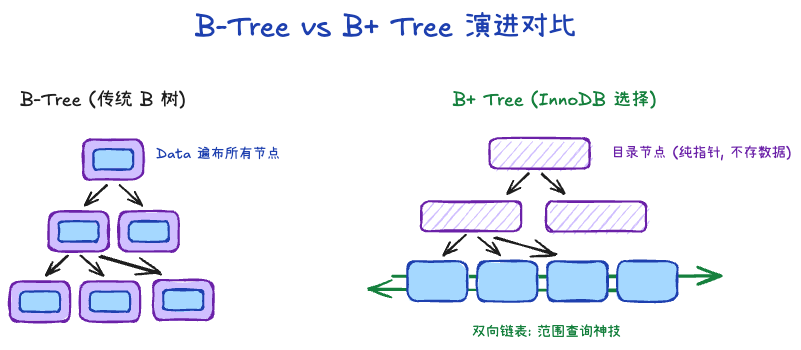
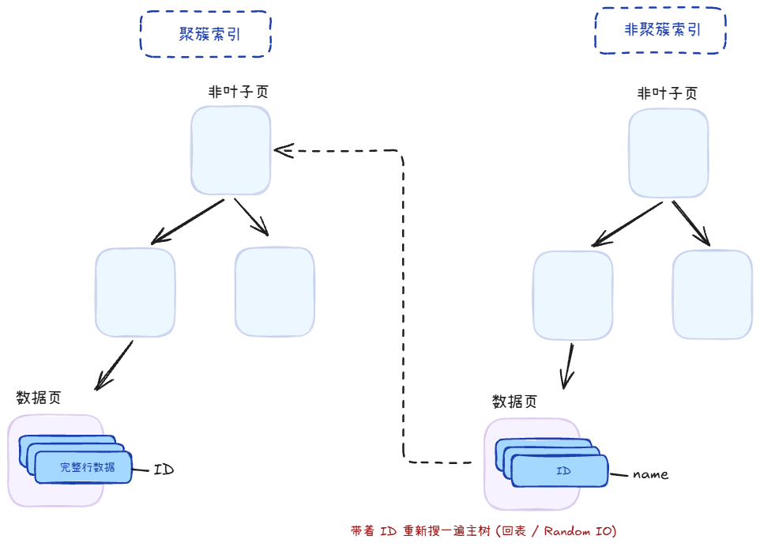

## B+ 树结构 +999

1. 非叶子只当路标，存键和指针，不存整行，所以一页能指很多子页，树很矮。
2. 叶子节点才存数据，聚簇索引是主键+整行，非聚簇索引是索引列+主键
2. 叶子节点有双向链表连接，方便范围查询

## 对比 +1

1. Hash：O(1)时间存取，但是不支持范围查询
2. 二叉查找树：容易退化成链表
3. 二叉平衡树、红黑树
    - 二叉树，一个节点两个分支，会导致树变高
    - 维持平衡需要消耗性能
    - 内存局部性低
4. B树：
    - 所有节点都有数据
    - 范围查询是中序遍历
    - 全表查询是整棵树遍历，而B+是叶子节点直接遍历即可

## 索引类型、作用 +3

### 类型

1. 聚簇索引：叶子节点是主键ID-数据，存放的是**完整的一整行记录数据**
2. 非聚簇索引：叶子节点是其它索引-主键ID，比如name-主键ID，还需回表查一次聚簇索引

### 作用

1. 加快查找速度：就跟字典里有目录查询更快一样
2. 减少磁盘IO次数：如果没有索引，就得顺序、逐页读盘 

## 表的最大长度是？+1

### 推导

InnoDB 的数据是按 页（Page） 组织和管理的，默认页大小为 16 KB。

1. 计算单个非叶子页（16 KB）可容纳的指针数
    - 非叶子节点（主键索引页）只存储：主键值 + 指向下一层页的指针
    - 主键，设BIGINT 占 8 字节；页指针，InnoDB 内部占用 6 字节。
    - 单个非叶子页（16 KB）可容纳的指针数： 16*1024字节/14字节 ≈ 1170
2. 计算叶子节点能存多少条数据
    - 叶子节点存储的是完整的行记录（Row Data）
    - 假设我们业务表的一行记录平均大小（加上 InnoDB 隐藏列如 DB_TRX_ID、DB_ROLL_PTR 等）约为 1 KB。
    - 单个叶子页（16 KB）可容纳的数据行数：16KB/1KB = 16行
3. 计算不同 B+Tree 高度下的总数据量
    - 高度为 2 的 B+Tree（1 层根节点 + 1 层叶子节点）：总行数 = 1170 * 16 ≈ 1.87 万行
    - 高度为 3 的 B+Tree（1 层根节点 + 1 层非叶子节点 + 1 层叶子节点）：总行数 = 1170 * 1170 * 16 ≈ 2190 万行

推导结论：当 B+Tree 高度保持在 3 层 时，单表容纳的数据量极限大约就是 2000 万到 2200 万行左右。

### 后果

B+ 树从 3 层增加到 4 层，本身通常不会造成性能断崖式下降

因为只是多访问一个中间索引页，而高层索引页通常具有很高的 Buffer Pool 命中率。

数据量增大后真正需要关注的是 Working Set 超过 Buffer Pool 导致的物理 I/O 增加，以及二级索引大量回表、范围扫描、深分页等带来的大量页访问

### 单表达到 2000 万必须立马分库分表吗？

答： 不一定。如果大部分查询都是高效的主键点查（Point Select），且 SSD 性能极佳，即使 5000 万条数据性能依然很好；但如果有较多的复杂范围查询、多表 JOIN 或模糊搜索，或者内存有限，就应该提前规划分表或归档方案。

