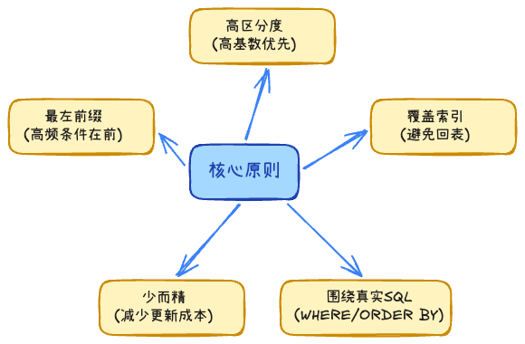
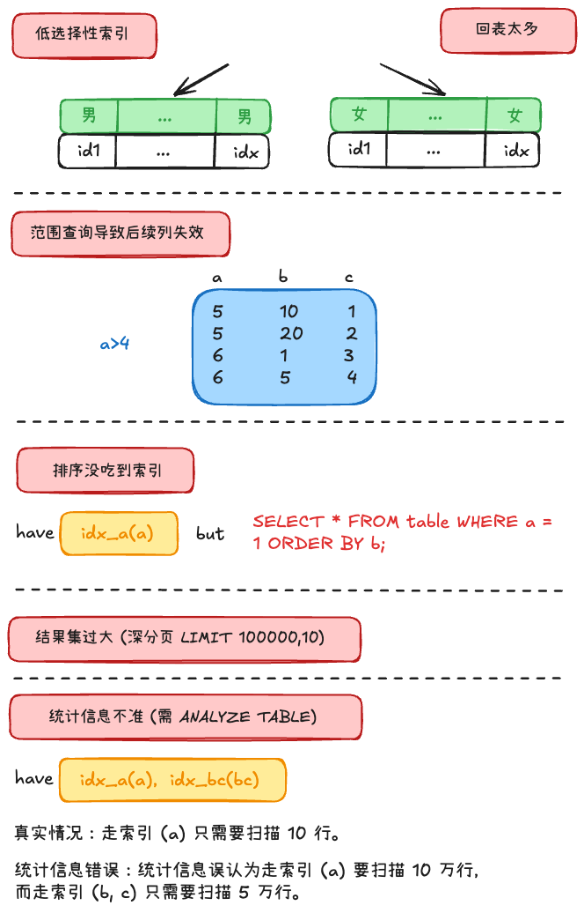

## 什么情况会设计索引 +1 



- 读多写少，读是瓶颈，explain显示代价高
- where、join、排序、分组 重复出现，数据量大
- 唯一性要求

# 索引查看 +3

## 预计查看


1. type：
    - system / const：极优，通过主键或唯一索引一次定位。
    - eq_ref：极优（JOIN）。 JOIN 里主键或唯一索引一次命中一行。
    - ref：较好，常见于普通索引等值查询。
    - range：中等，适用于范围查询。
    - index：全索引扫描，说明虽然扫描的是索引树，但仍然遍历了大量叶子节点
    - All：全表扫描，数据量一大就是危险信号。
2. key：表示实际使用到的索引
3. possible_keys：MySQL 预测可能会用到的索引
4. key_len：实际使用的索引字节数，可以推断联合索引到底命中了多少列
5. extra
    - **Using index**：命中了覆盖索引，不需要回表，效率极高。
    - **Using index condition**：触发了 ICP（索引下推），在索引遍历阶段就做了一部分过滤。
    - **Using filesort / Using temporary**：说明排序、分组、去重没有很好地利用索引，往往需要进一步优化。
6. rows：预估扫描行数 

## 实际扫描

EXPLAIN ANALYZE（MySQL 8.0.+）

-> Filter: (users.age > 18)  (cost=10.5 rows=25) (actual time=0.081..0.155 rows=30 loops=1)

> 除了 `EXPLAIN`，还有慢查询日志查看，有个开关log_queries_not_using_indexes = ON可以看

## Index Hint（索引提示）

- FORCE INDEX（强制使用索引）
- USE INDEX（建议使用）
- IGNORE INDEX（忽略索引）

# 其它问题

## 索引失效 +2

1. 索引列参与运算
    - WHERE age + 1 = 18 或 WHERE YEAR(birthday) = 2020
    - B+树无法对“计算后的结果”进行二分查找，因为树里没有存“计算后的值”。
    - 如果做优化，计算成本、边界都要考虑，更麻烦
2. 格式转换
3. like '%xxx'
    - WHERE name LIKE '%ob'，前导通配无法 seek。覆盖索引仍可能 type=index 扫叶子。
4. a or b，有一列不是索引
5. 组合索引没用对
6. 优化器认为全表更快

## possible_keys 有值，但 key 是 NULL

可能是回表成本（Random I/O）与优化器的代价估算。

## possible_keys 为 NULL，但 key 却有值

可能在没写 WHERE 条件，或者 WHERE 根本没走索引的情况下

优化器检查 SELECT 的字段列表时，发现要查的所有列刚好全包含在某个二级索引里

## 多列 OR 查询时，key 字段可能同时出现两个索引吗？

WHERE A = 1 OR B = 2, 如果 `A`、`B` 都有索引，MySQL 5.0+ 的 **Index Merge（索引合并）** 机制将会生效。引擎会分别并发扫描 A 索引和 B 索引，提取出匹配的主键 ID 集合，并在内存中进行**求并集（Union 去重）**操作，最终拿着并集后的 ID 统一进行回表。

## 什么情况下格式转换也会用到索引？

在 MySQL 中，当一个数字和一个字符串进行比较时，MySQL 会把“字符串”转换成“数字”再比较。

```
-- age 是 INT，传入的是字符串 "12"
SELECT * FROM users WHERE age = "12";

-- 在 MySQL 优化器眼里，等价于变成了：
SELECT * FROM users WHERE age = CAST("12" AS SIGNED);

-- 也就是：
SELECT * FROM users WHERE age = 12;
```

既然 age 本身没有包裹任何函数，B+ 树的有序性就没有被破坏，所以 MySQL 依然可以顺畅地利用 age 上的索引进行二分查找。

```
-- phone 是 VARCHAR，参数是 INT
SELECT * FROM users WHERE phone = 13800000000; 

-- 每一行的 phone 字段都必须先被转成数字，才能跟后面的数字比较
SELECT * FROM users WHERE CAST(phone AS SIGNED) = 13800000000;

```

后果：B+ 树索引里存的是字符串的字典序（'138...'），而转成数字后的大小关系可能被打乱，MySQL 无法再使用索引树进行 Seek 定位，索引彻底失效，直接退化为全表扫描（type: ALL）

## null一定不走索引吗？

在 InnoDB 引擎中，B+树索引（二级索引）是记录了 NULL 值的。在 B+树中，所有 NULL 值都会被放在叶子节点的最左边（最小端）。既然索引里有，那么理论上绝对可以走索引。可能走，可能不走的原因还是在优化器的估算

## 为什么用了索引还是慢 +1



1. 区分度低，重复的太多
2. 回表次数太多
3. 范围查询导致联合索引后缀利用不足
4. 排序、分页没按索引
4. 返回结果集过大
5. 统计信息不准
