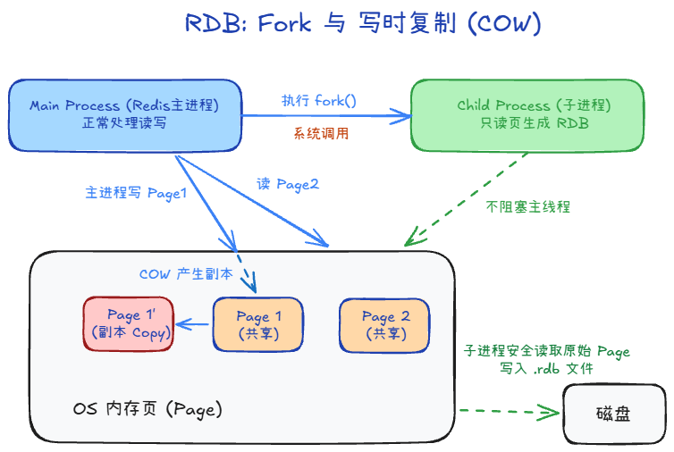
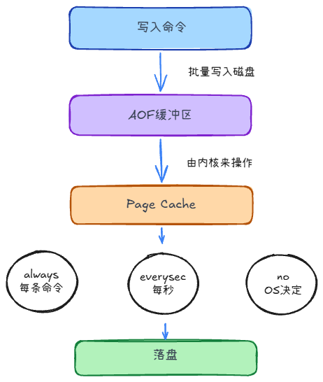

## RDB：定期保存快照

RDB 把某一时刻的内存数据写成二进制快照。

1. **何时生成**：可用 `save N M` 设置“在 N 秒内至少有 M 次修改”时自动保存，也可手动执行 `BGSAVE`。后台子进程先写临时文件，完成后替换旧 RDB。
2. **写时复制（COW）**：fork 后，父子进程先共享内存页；主进程修改某页时，操作系统才复制该页。子进程据此保存 fork 时的数据。
3. **代价和丢失窗口**：fork 可能让主进程短暂停顿；保存期间写入越多，COW 额外占用的内存可能越大。故障时，最近一次快照之后的修改可能丢失。

## AOF：记录写命令

AOF 记录会改变数据的命令：命令先进入 AOF 缓冲区，再 `write` 到操作系统 Page Cache，最后按策略执行 `fsync`。

**`appendfsync` 决定持久性与写入成本：**

- `always`：每批写入后同步，丢失窗口最小，写入成本最高。
- `everysec`：默认约每秒同步一次；故障时通常可能丢失约 1 秒的写入。
- `no`：Redis 不主动同步，由操作系统决定何时落盘，丢失窗口更难预估。

### AOF 为什么需要重写

反复修改同一个键会让旧命令持续累积。`BGREWRITEAOF` 根据**当前数据**生成等价但通常更短的基础文件，不是简单裁剪旧日志。

重写期间主进程继续接收写入。Redis 7 起，主进程把新写入追加到新的增量 AOF，后台子进程生成新的基础 AOF；完成后通过 manifest 切换到新文件集合。

## RDB 与 AOF 怎么选

1. **数据形式**：RDB 是时间点快照；AOF 记录写入变化。Redis 7 起，AOF 由基础文件和增量文件组成。
2. **丢失窗口**：RDB 可能丢失上次快照以来的修改；AOF 取决于 `appendfsync` 策略。
3. **体积和恢复**：RDB 通常较紧凑，通常比重放纯命令 AOF 恢复更快；AOF 可重写，使用 RDB 格式的基础文件后也不能简单断言它一定更大、更慢。

## 混合持久化

**同时开启 RDB 和 AOF，不等于混合持久化。**两者都开启时，Redis 重启会选择 AOF 恢复；混合持久化说的是 **AOF 内部的基础数据使用 RDB 格式**。

开启 `aof-use-rdb-preamble yes` 后，AOF 重写生成 RDB 格式的基础数据，后续写命令继续以 AOF 格式保存。恢复时先加载基础数据，再重放增量命令。

- **Redis 7 以前**：可以把它理解为单个 AOF 文件的 RDB 格式头部与后续命令。
- **Redis 7 及以后**：AOF 由基础文件、一个或多个增量文件及 manifest 组成；不能再说只读取单个 `appendonly.aof`。

