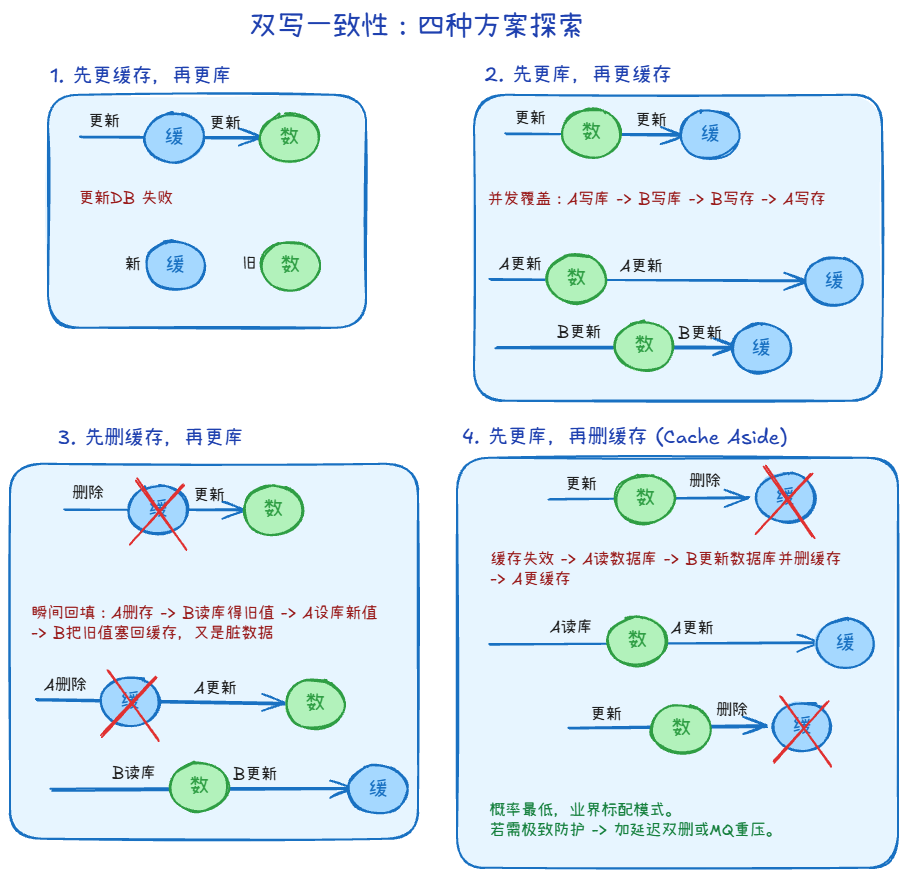
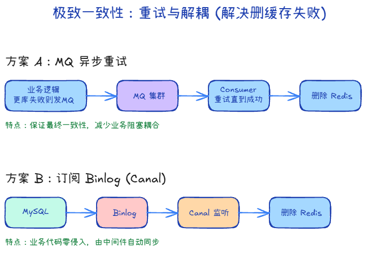
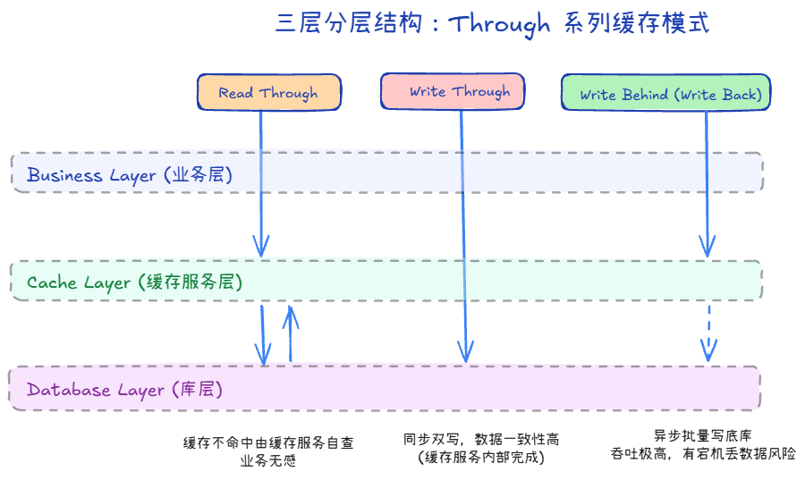

## Cache Aside（旁路缓存）+1

### 读和写是什么样的？

1. 读：先读缓存；未命中再读数据库，写回缓存时设置 TTL
2. 写：先提交数据库，再删除缓存。数据库是数据源，缓存允许短暂不一致

### 四种情况

只记得有删除，我们可以做推理

1. 先更新数据库 再删除缓存

假设 A 更新了数据库，B 在删缓存前读到旧缓存，会短暂读到旧数据。

还有一种少见的并发情况：B 缓存未命中，读到旧数据库值但尚未写缓存；A 提交新值并删缓存；B 随后把旧值写回缓存。因此“先更新数据库，再删缓存”也不保证强一致，需要用 TTL 限制旧值持续时间。

2. 先删除缓存 再更新数据库

假设A删了缓存，B读没读到，去数据库拿，放回缓存，A才更新数据库。

3. 先更新数据库 再更新缓存

A和B同样操作，A比B慢，会造成数据不一致

4. 先更新缓存 再更新数据库

和3一样，会造成数据不一致。但是更危险，因为你先让别人看到一个“数据库还没承认”的值。

> 总结：更新数据时，不要想着“把缓存改对”，而是“把缓存删掉，让它下次从数据库重新长出来”。

## 提高删除可靠性：重试与解耦

### 删除缓存失败

当 A 更新数据库成功，但删除 Redis 缓存失败时，后续请求可能继续读旧值，直到重试删除成功或 TTL 到期。

### 解决方法

1. 重试删除：失败后记录并重试；缓存键仍应设置 TTL 作为兜底。
2. 消息队列：由消费者重试删除。但“数据库提交后再发 MQ”仍可能在发消息前崩溃，需要事务 Outbox 等可靠事件来源。
3. 订阅 Binlog：用 Canal 等工具捕获数据库变更，再删除缓存；消费失败也要重试。

## Through 系列（读穿 / 写穿 / 写回）

以下是需要由缓存服务层实现的模式，普通 Redis 不会自动读写数据库：

1. 读穿：应用读缓存；未命中时由缓存服务层查询数据库。
2. 写穿：应用写缓存服务层；服务层同步写数据库，等写入完成后返回，但两处写入并非原子事务。
3. 写回：应用先写缓存服务层，之后异步写数据库；落库前缓存故障可能丢数据。
