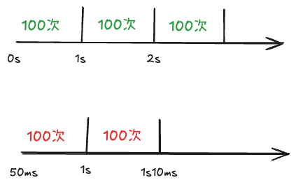
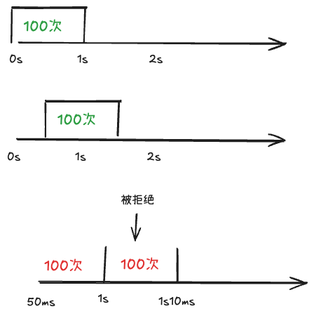
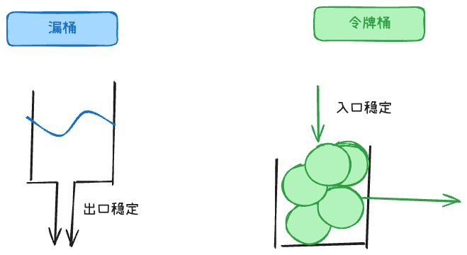

## 固定窗口计数器



每分钟只能有x个请求，实现简单。

但是有临界突刺问题，比如第1秒最后10ms进来100个请求，第2秒前10ms又进来100个请求，短时间内实际通过了200个请求。

最简单的 Redis 实现是 String + INCR。

# 滑动窗口

规则举例：任意连续 1 秒内，最多 100 次请求。

## 滑动窗口计数器



滑动窗口把一个大窗口拆成多个小格子，请求来了就落到当前小格子里，统计最近一段时间所有格子的总和

比如拆成6格，每格10ms，只记录来了几次。新请求来了，该格+1，然后把最近6格的次数加起来，如果超过100，则拒绝请求。

```
Key:   ratelimit:login:10001          ← 一个用户一个 key
Field: 1718000060, 1718000061, ...   ← 每个小格的时间戳（10秒一格）
Value: 该格子的请求次数

HINCRBY ratelimit:login:10001 1718000060 1
# 删掉 6 格以前的 field，HGET 最近 6 个 field 求和
```

## 滑动日志

而滑动日志会记录每个请求的时间戳，每次请求进来时删除窗口外的旧记录，再判断窗口内请求数是否超过阈值。精度更高。

来一个请求，就记一条时间戳；每次判断时：删掉 60 秒之前的旧记录。数还剩多少条，超过 100 → 拒绝

滑动日志要存的是：每一次请求的时间，不是「某 10 秒来了几次」。

```
用 Hash 会遇到的问题:
1. field 会冲突：假设10:00:05 这一秒内来了 3 次 → 同一个 field，只能存一个数，丢请求
2. Hash 没有「按 score/时间范围删除」这种操作

ZSET 结构：
score  = 请求时间戳（用于排序、范围删）
member = 唯一 ID（如 nanoid，或 timestamp+uuid，防重复）

每次请求：
# 1. 删掉窗口外的
ZREMRANGEBYSCORE ratelimit:login:10001 0 (now - 60)
# 2. 看窗口内有多少
count = ZCARD ratelimit:login:10001
# 3. 未超限则记录本次
if count < 100:
    ZADD ratelimit:login:10001 now {unique_id}
```

# 桶



## 漏桶

漏桶把请求看成水，请求先进入桶，桶以固定速率向外流出。出口速率稳定，但即使系统暂时有空闲能力，也只能按固定速率放行。

## 令牌桶算法

令牌桶按固定速率生成令牌，请求必须拿到令牌才能通过。Go 官方的 `x/time/rate` 库实现了令牌桶算法。

## 对比

1. 令牌桶装的是令牌；漏桶是请求
2. 令牌桶的流出速率动态可变；漏桶是固定的
3. 令牌桶能应对突发流量，只要桶里有积攒的令牌，瞬间全部放行；漏桶不能，必须匀速处理

## x/time/rate讲解

初学者设计令牌桶时，往往会想：“我是不是要开一个后台定时线程，每隔 10ms 往桶里 push 一个令牌？”

千万不要这么做！ 维护上万个定时器会把 CPU 拖垮。

工业界的做法是 “惰性计算（Lazy Evaluation）”：不启动任何定时器，只在请求到达时，用时间戳差值算一下应该加多少令牌。

**Go 官方标准扩展库 golang.org/x/time/rate 的核心实现就是基于这种惰性计算（Lazy Evaluation）**

在 rate.Limiter 的结构体中，你会发现根本没有任何 time.Ticker 或后台 Goroutine，只存了这几个字段：

```go
type Limiter struct {
	mu     sync.Mutex
	limit  Limit         // 每秒生成速率 (r)
	burst  int           // 桶容量 (b)
	tokens float64       // 当前剩余的令牌数 (可以带小数)
	last   time.Time     // 上次更新 tokens 的时间戳
	lastEvent time.Time  // 上次有事件发生的时间
}

// 每次你调用 limiter.Allow()、limiter.Wait() 或 limiter.Reserve() 时，底层都会先调用一个叫 advance 的内部函数。
// 源码简化版逻辑：根据时间流逝，推进并计算当前的 tokens
func (lim *Limiter) advance(now time.Time) (newNow time.Time, newTokens float64) {
	last := lim.last
	if now.Before(last) {
		last = now
	}

	// 1. 计算时间差：从上次到现在过去了多久
	elapsed := now.Sub(last)
	
	// 2. 计算这段时间应该补充多少令牌：时间差 * 速率
	delta := lim.limit.tokensFromDuration(elapsed)
	
	// 3. 累加令牌，但不能超过容量上限 (burst)
	tokens := lim.tokens + delta
	if burst := float64(lim.burst); tokens > burst {
		tokens = burst
	}
	
	return now, tokens
}

```

### 为什么tokens是小数

假设每秒 3 个令牌：
- 理论上每约 333ms 应该补 1 个。
- 若只用“每秒整数补充”，就会在整秒时突然加 3 个请求额度：前 999ms 全部拒绝，1 秒整又突然允许 3 个。
- float64 可以随着时间累计 3 × elapsedSeconds，到约 333ms、666ms、1s 分别形成可用令牌，限流更均匀。