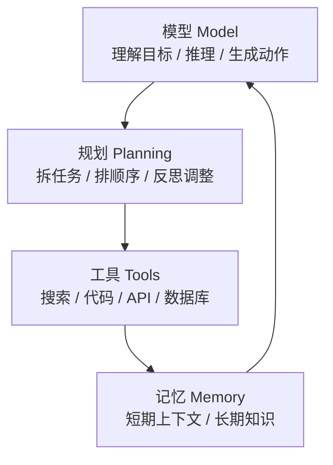
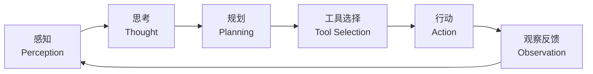
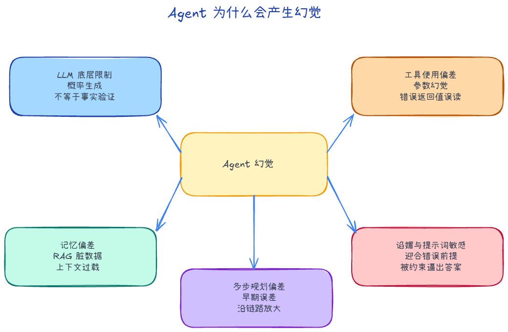

# Agent 的组成：模型、规划、记忆、工具

一个可用的 Agent，通常不是“一个会聊天的模型”，而是四块能力拼在一起：

- **模型（Model）**：负责理解目标、推理和生成下一步动作。
- **规划（Planning）**：把目标拆成步骤，并在执行中调整计划。
- **记忆（Memory）**：记住当前上下文，以及需要跨轮次复用的信息。
- **工具（Tools）**：让 Agent 能查询、计算、改文件、调接口，而不只是“说出来”。

## 智能体（Agent）与普通 AI 的本质区别

理解 AI Agent，可以先抓住一个核心差异：普通 AI 更像“回答问题的助手”，而智能体更像“能围绕目标持续行动的执行者”。

## 智能体的协作模式

1. 作为开发者工具：它的目标是帮助程序员或创作者更高效地完成工作，但人仍然掌控方向和最终决策。
    - **典型代表**：GitHub Copilot、Cursor、Codeium。
2. 作为自主协作者（Autonomous Collaborator）：你不需要一步步告诉它怎么做，只需要给出最终目标，它会自己规划路径并尝试执行。
    - **典型代表**：Codex、Cursor、CC 的Agent模式

# 智能体的运行机制

一个典型的智能体系统，可以理解为“感知 -> 思考 -> 行动”的循环。

# Agent 为什么会产生幻觉

Agent 的能力来自大语言模型、工具调用、上下文记忆和多步规划。也正是这些能力来源，带来了更复杂的出错方式。

1. LLM 本质：根据上下文预测下一个最可能出现的词。
2. 工具使用偏差：输入和输出环节，都可能出现偏差。
3. 记忆偏差：RAG 与上下文带来的信息污染
4. 多步规划偏差：误差会沿着链路累积
5. 谄媚效应与提示词敏感

# 如何降低 Agent 的幻觉风险

在工程实践中，我们无法 100% 消除大模型幻觉，但可以通过架构设计把风险降到可接受范围。

1. 输入端：高质量 RAG、Prompt 边界声明、确定性 Schema

2. 过程端：任务拆分、严格工具校验、确定性代码兜底

3. 输出端：Self-Reflection、Critic Agent 审核、Guardrails 过滤

4. 权限端：把高风险动作交给人确认

## Guardrails

用多种轻量级技术的组合拳去做输入防护、输出防护

可以用Guardrails AI、NVIDIA NeMo Guardrails现有框架
   