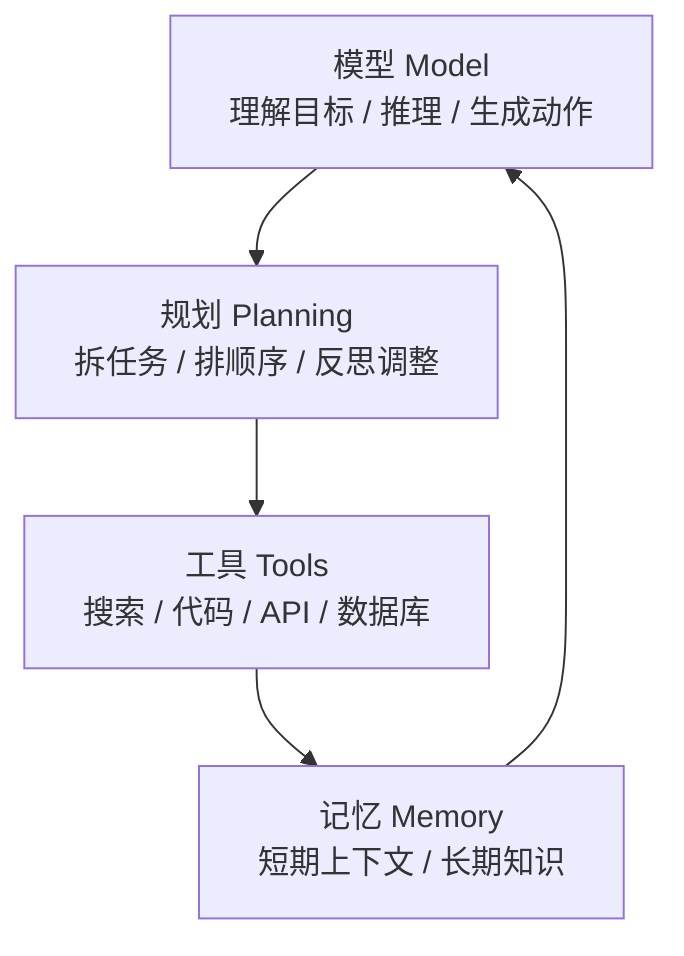
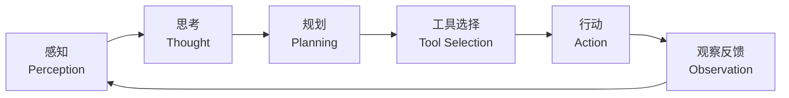

# Agent 的组成：模型、规划、记忆、工具

一个可用的 Agent，通常不是“一个会聊天的模型”，而是四块能力拼在一起：

- **模型（Model）**：负责理解目标、推理和生成下一步动作。
- **规划（Planning）**：把目标拆成步骤，并在执行中调整计划。
- **记忆（Memory）**：记住当前上下文，以及需要跨轮次复用的信息。
- **工具（Tools）**：让 Agent 能查询、计算、改文件、调接口，而不只是“说出来”。

## 智能体（Agent）与普通 AI 的本质区别

理解 AI Agent，可以先抓住一个核心差异：普通 AI 更像“回答问题的助手”，而智能体更像“能围绕目标持续行动的执行者”。

## 智能体的协作模式

1. 作为开发者工具：它的目标是帮助程序员或创作者更高效地完成工作，但人仍然掌控方向和最终决策。
    - **典型代表**：GitHub Copilot、Cursor、Codeium。
2. 作为自主协作者（Autonomous Collaborator）：你不需要一步步告诉它怎么做，只需要给出最终目标，它会自己规划路径并尝试执行。
    - **典型代表**：Codex、Cursor、CC 的Agent模式

# 智能体的运行机制

一个典型的智能体系统，可以理解为“感知 -> 思考 -> 行动”的循环。

1. **感知（Perception）**

这是循环的起点。智能体通过用户输入、API 回调、系统事件、数据库变化等方式接收环境信息。这些信息也常被称为**观察（Observation）**，既可以是用户最初给出的指令，也可以是上一步行动之后得到的反馈。

2. **思考（Thought）**

接收到观察信息后，智能体进入决策阶段。对于基于大语言模型（LLM）的智能体来说，这通常由模型完成推理、判断和计划更新。这个阶段可以进一步拆成两个动作：
- **规划（Planning）**：根据当前目标、上下文和已有记忆，制定或调整行动计划，把复杂目标拆成更具体的子任务。
- **工具选择（Tool Selection）**：从可用工具中选择下一步最合适的工具，并生成调用所需的参数。

3. **行动（Action）**

决策完成后，智能体通过工具或执行器完成具体动作。例如调用搜索 API、运行代码、查询数据库、发送邮件，或触发某个业务系统的接口。

这个循环会不断重复：每一次行动都会带来新的观察，新的观察又会影响下一轮思考和行动。也正因为如此，Agent 比单次问答更适合处理多步骤、长链路、需要反馈调整的任务。

# Agent 为什么会产生幻觉

Agent 的能力来自大语言模型、工具调用、上下文记忆和多步规划。也正是这些能力来源，带来了更复杂的出错方式。

1. LLM 本质：根据上下文预测下一个最可能出现的词。
2. 工具使用偏差：输入和输出环节，都可能出现偏差。
3. 记忆偏差：RAG 与上下文带来的信息污染
4. 多步规划偏差：误差会沿着链路累积
5. 谄媚效应与提示词敏感

# 如何降低 Agent 的幻觉风险

在工程实践中，我们无法 100% 消除大模型幻觉，但可以通过架构设计把风险降到可接受范围。

1. **输入端：优化 RAG 和数据质量**  
   
确保喂给智能体的数据干净、结构化、可追溯，减少过时信息、噪声信息和错误事实的干扰。

2. **过程端：引入自我检查和外部校验**  
   
让智能体在关键步骤后进行自检，并用数据库、业务规则或独立模型交叉验证。例如生成订单号后，不直接相信文本输出，而是回到数据库中校验。

3. **输出端：设置 Guardrails 和强约束**  
   
用 Workflow、正则表达式、Pydantic 格式校验、API 强校验等机制作为最后一层防线。一旦检测到不合规输出，就直接拦截、修正或要求重新生成。

4. **权限端：把高风险动作交给人确认**  
   
对支付、删除、发布、发送外部消息等高风险动作，应设置明确授权点。Agent 可以准备方案，但最终执行需要用户确认。

总结来说，Agent 的价值不在于“完全自动化”，而在于把模型、工具、记忆和反馈循环组合起来，让 AI 能够围绕目标持续推进任务。真正可靠的 Agent 系统，既要让它有行动能力，也要给它足够清晰的边界。
