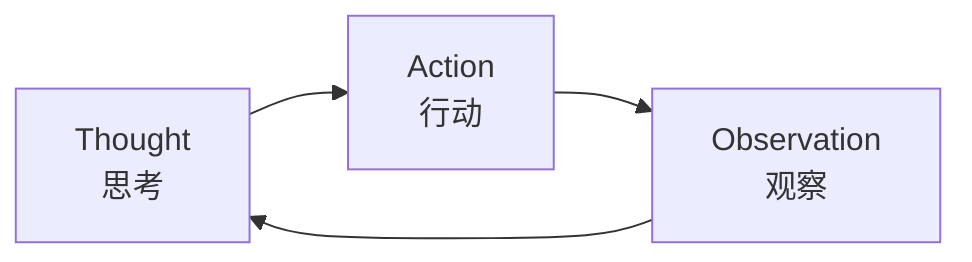
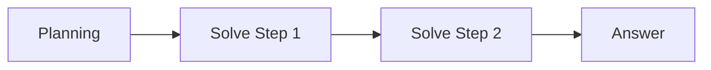
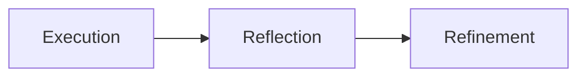

# 目录

1. ReAct
2. Plan-and-Solve 与 Plan-and-Execute
3. Reflection
4. 三种范式的区别与优缺点
5. 低代码平台构建

# ReAct

在ReAct诞生之前，主流的方法可以分为两类：一类是“纯思考”型，如**思维链 (Chain-of-Thought)**，它能引导模型进行复杂的逻辑推理，但无法与外部世界交互，容易产生事实幻觉；另一类是“纯行动”型，模型直接输出要执行的动作，但缺乏规划和纠错能力。

ReAct的巧妙之处在于，它认识到**思考与行动是相辅相成的**。思考指导行动，而行动的结果又反过来修正思考

ReAct 的核心是一个不断循环的“大循环”，直到问题被解决：

ReAct 最初用自然语言的 Thought、Action、Observation 表达推理与行动。生产系统通常用模型原生的结构化 Tool Calling 输出工具名和参数，由程序校验、执行并回填结果；循环思想仍适用，但不依赖模型把 `Action:` 文本写对。

# Plan-and-Solve 与 Plan-and-Execute

**Plan-and-Solve** 是先列计划、再按计划推理的零样本提示方法，可以在一次模型生成中完成，并不自带工具执行器。需要多次调用模型或工具、按结果调整计划的 Agent 流程，通常称为 **Plan-and-Execute**。

思考与行动在**时间上是分离的**（分阶段进行）。  

1. **规划阶段 (Planning Phase)**：模型先接收完整问题，将任务分解为步骤。Plan-and-Solve 把计划写入同次推理；Plan-and-Execute 可单独调用规划器生成或更新计划。
2. **求解阶段 (Solving Phase)**：Plan-and-Solve 在同次生成中按计划逐步推理。Plan-and-Execute 则由执行器逐步调用模型或工具，遇到新信息可以重新规划，不必僵硬执行原计划。
# Reflection
大语言模型通常**自回归生成**：已经输出的 Token 不会在同次生成中被直接改写。这里说的是因果掩码与逐 Token 解码；Transformer 的 Feed-Forward 是网络中的 MLP 层，含义不同。

它们在输出内容时，就像“脱缰的野马”，字是一个个吐出来的，根本没有“回头看”的机会。一旦中间某一步说错了、代码写出 Bug 了，它就会顺着这个错误一路错下去。

在传统的开发流程中，我们写完代码需要：**运行 -> 报错 -> 看日志 -> 修改**。  
**Reflection 范式就是把“看日志、自我纠错”的这个循环，搬进了 AI 智能体的内部。**

思考是对**既成事实（过去的行为和结果）的全局复盘**。  

1. **执行 (Execution)**：首先，智能体使用我们熟悉的方法（如 ReAct 或 Plan-and-Solve）尝试完成任务，生成一个初步的解决方案或行动轨迹。这可以看作是“初稿”。
2. **反思 (Reflection)**：接着，智能体进入反思阶段。它会调用一个独立的、或者带有特殊提示词的大语言模型实例，来扮演一个“评审员”的角色。这个“评审员”会审视第一步生成的“初稿”，并从多个维度进行评估，例如：
    - **事实性错误**：是否存在与常识或已知事实相悖的内容？
    - **逻辑漏洞**：推理过程是否存在不连贯或矛盾之处？
    - **效率问题**：是否有更直接、更简洁的路径来完成任务？
    - **遗漏信息**：是否忽略了问题的某些关键约束或方面？ 根据评估，它会生成一段结构化的**反馈 (Feedback)**，指出具体的问题所在和改进建议。
3. **优化 (Refinement)**：最后，智能体将“初稿”和“反馈”作为新的上下文，再次调用大语言模型，要求它根据反馈内容对初稿进行修正，生成一个更完善的“修订稿”。

# 三种范式的区别与优缺点

ReAct、规划式求解和 Reflection 都在帮助模型完成更复杂的任务；其中 Plan-and-Solve 是提示方法，涉及工具执行的流程应称为 Plan-and-Execute。

它们的核心差异在于：**ReAct 强调边想边做，规划式求解强调先规划再推进，Reflection 强调得到初稿后再检查优化**。

| 范式 | 核心思路 | 适合场景 | 主要优点 | 主要缺点 |
|---|---|---|---|---|
| ReAct | Thought、Action、Observation 交替循环 | 需要频繁调用工具、边查边判断的任务 | 反馈及时、可解释性强、能根据工具结果动态调整 | 调用次数多、延迟高、容易循环、对模型格式遵守能力要求高 |
| Plan-and-Solve / Plan-and-Execute | 先规划再求解；后者由执行器调用工具并可重新规划 | 目标清晰、步骤可拆解的任务 | 结构清晰，复杂任务容易分步检查 | 初始计划可能错误，需要根据执行反馈调整 |
| Reflection | 先生成结果，再通过反思机制评估和修正 | 写作、代码生成、方案设计、需要质量优化的任务 | 能发现遗漏和逻辑问题，提升最终质量 | 需要额外模型调用，成本更高；反思本身也可能判断错误 |

从执行节奏上看，三者可以这样理解：

1. **ReAct：边走边看**
   
每一步都根据外部反馈调整下一步，适合不确定性较高的任务。

2. **规划式求解：先拆解再推进**
   
先把任务拆成完整计划，再按计划执行，适合路径明确的任务。

3. **Reflection：做完之后再检查**
   
先得到一个初稿，再通过评审和修订提升质量，适合对结果质量要求较高的任务。

在真实 Agent 系统中，可以先用 Plan-and-Execute 制定并执行大方向，在步骤内根据工具反馈调整，最后用 Reflection 检查结果。

# 低代码平台构建
相比于纯代码实现的智能体，低代码平台通过图形化、模块化的方式，显著降低了技术门槛、提升了开发效率，并提供了更优的可视化调试体验。

**Coze** 以其零代码的友好体验和丰富的插件生态脱颖而出。
- 你是一个**个人创作者、自媒体运营或业务人员**，不懂代码，只想快速做一个好玩、好看、实用的 AI 助理
- 扣子有托管服务；Coze Studio 也有开源版本。对比时要区分具体产品形态和可用功能。
- 已支持接入 MCP（当前支持 Streamable HTTP、SSE，不支持 STDIO）。选型还需核对工具数量、配额、私有化和配置导出能力；接入过多工具会增加成本并干扰工具选择。

**Dify** 作为开源的企业级平台，展现了全栈式开发能力。
- 你是在为**企业开发 AI 落地项目**，对数据隐私、合规性要求极高，必须私有化部署
- **开源**（Apache 2.0 协议，支持二次开发）
- 复杂
