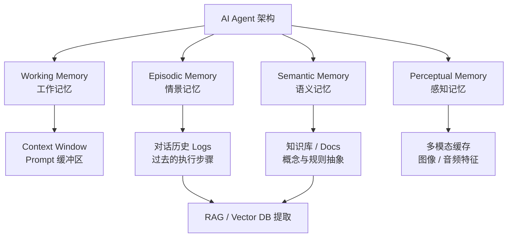

## 为什么需要记忆模块

LLM 本身是**无状态**的：每一次调用都只理解当前传入的 Prompt，不会天然记住用户偏好、历史任务、长期事实或上一次工具执行结果。

记忆模块的作用，就是把值得复用的信息从一次性上下文中沉淀出来，在需要时再通过检索、摘要或状态恢复的方式放回当前 Prompt。

## 对照

## 记忆

### ① Working Memory（工作记忆 / 短期记忆）

- **人类大脑：** 你此时此刻正在思考的内容、大脑里临时占用的“内存区”（比如背一个刚看到的电话号码，几秒后就忘）。
- **AI 落地：** 本轮实际放进 Prompt 的任务状态、近期消息、摘要和检索片段，受 Context Window 限制。全量历史可以存放在外部，不必每轮全部投喂。
- **特点：** 读写极快，但容量有限，一旦对话重置（Clear Context）或者超出 Token 限制，这段记忆就消失了。
    

### ② Episodic Memory（情景记忆 / 经历记忆）

- **人类大脑：** 关于**特定时间、地点发生的具体事件/经历**的记忆（例如：“我昨天下午在咖啡馆和张三讨论了项目，他穿了一件蓝色衬衫”）。
- **AI 落地：** **Agent 的历史交互日志（Interaction Logs / Trajectories）**。
- **特点：** 记录“过去发生过什么”。当用户问“我上周让你帮我写的那个 Go 函数改好了吗？”时，Agent 必须去翻查过去的**情景记忆**。
    

### ③ Semantic Memory（语义记忆 / 知识记忆）

- **人类大脑：** 脱离了特定时间地点的事实、概念、规则和通用知识（例如：“Go 语言的 GMP 模型是什么”、“水在 100 度沸腾”）。
    
- **AI 落地：**
    - **静态知识：** 大模型预训练阶段写入参数（Weights）里的知识；
    - **动态/领域知识：** **知识库（Knowledge Base）**，例如存储在向量数据库或图数据库（Neo4j）中的 Markdown 文档、规章制度等。

### ④ Perceptual Memory（感知记忆 / 瞬时感知）

- **人类大脑：** 视觉、听觉、触觉在极短时间内留下的物理信号残影（比如闪光灯在你眼前闪过后的余晖）。
- **AI 落地：** 在多模态 AI（Vision-LLM、语音 Agent）中，**原始图像帧、音频信号特征（Embeddings）、传感器原始数据流**在被转化为文本标号之前的缓存区域。
