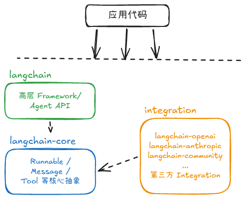

# 为什么使用 LangChain/LangGraph，而不是 Dify？

Dify 更适合快速搭建标准化的 LLM Workflow 和 RAG 应用；LangChain/LangGraph 则把更多控制权留给开发者。

企业真实的开发场景中，定制化能力和复杂流程编排都很重要

# LangChain演变

## 第一阶段：Chain 时代——快速扩张的一体化框架

LangChain 最初的目标是降低 LLM 应用开发门槛，把 `Model`、`Prompt`、`Retriever`、`Memory`、`Tool`、`Agent` 等能力统一封装起来。开发者可以通过 Chain 将多个组件串联，例如最典型的 `Prompt → Model → OutputParser`，

随着生态快速扩张，LangChain不断加入 OpenAI、Anthropic、向量数据库、Document Loader 等第三方集成，主包承担的职责越来越多。这带来了明显的问题：框架体积不断膨胀，不同第三方依赖相互耦合，版本兼容和维护成本也越来越高。

因此这一阶段可以概括为：**先把 LLM 应用需要的东西全部封装起来，让开发者快速构建应用。**

## 第二阶段：模块化时代——Core、Integration 与 Framework 分层

随着项目规模扩大，LangChain开始进行模块化拆分，把不同职责从主包中分离出来，逐渐形成清晰的分层结构：



其中 `langchain-core` 尽量保持轻量，负责 `Runnable`、Message、Tool 等基础协议；`langchain-openai`、`langchain-anthropic` 等负责具体模型厂商的适配；`langchain` 则提供更高层的开发接口。

LCEL 在这个阶段非常重要。它让实现 `Runnable` 接口的组件可以通过 `|` 进行组合：`Prompt → Model → Parser`

甚至可以构建包含并行、分支等逻辑的 Workflow。

因此这一阶段主要解决的是**框架工程化问题**：通过拆包降低核心框架与第三方 Integration 之间的耦合，让不同组件可以独立演进。

## 第三阶段：Agent Runtime 时代——LangGraph 解决复杂 Agent 的控制流与状态问题

随着 Agent 越来越复杂，LangChain发现传统 Chain 抽象并不足以很好地描述 Agent。

普通 Chain 通常是：`Prompt → Model → Parser`；RAG 也通常可以描述成：`Question → Retriever → Prompt → Model → Answer`

这些流程的执行路径基本是开发者提前确定的。但真正的 Agent 不一样。它可能执行：

```text
User → LLM → 是否调用工具？
              ├─ 是 → Tool → 工具结果返回 LLM → 再次判断
              └─ 否 → Answer
```

这里已经出现了**循环、条件分支和动态决策**。

复杂 Agent 还会进一步出现 `State`、Checkpoint、Persistence、Retry、Human-in-the-loop、Multi-Agent、故障恢复等需求。

这种执行过程本质上已经不是简单的 Chain，而是一个**有状态的图**。

因此 LangGraph 将 Agent Workflow 抽象成：**State + Node + Edge**

其中 `State` 保存 Agent 当前状态，`Node` 执行模型或工具等具体操作，`Edge` 决定下一步执行哪个 Node，而 `Conditional Edge` 可以根据当前 State 动态选择执行路径。

图允许存在环，因此非常适合表达 Agent 的反复推理和工具调用。

与此同时，LangGraph Runtime 提供持久化、Checkpoint、Streaming、Human-in-the-loop、Durable Execution 等基础设施，使 Agent 不只是“能跑起来”，而是能够作为长期运行的应用进行管理。

## 第四阶段：LangChain Python v1——聚焦高层 Agent API

LangChain Python v1 将 `langchain` 主包聚焦于 Agent 开发，以 `create_agent` 作为标准 Agent 入口，并通过 middleware 扩展模型调用、工具执行和状态处理等行为。旧版 chains 等功能迁入 `langchain-classic`。

这使前面的演变衔接起来：早期 LangChain 以 Chain 和组件封装为主；LangGraph 提供有状态的编排与运行能力；LangChain v1 则在 LangGraph 之上提供高层 Agent API。阅读旧教程时，需要区分旧版 API 与 v1 的使用方式。

参考：[LangChain v1 官方说明](https://docs.langchain.com/oss/python/releases/langchain-v1)。

## LangChain Python v1 和 LangGraph 是什么关系？

它们不是竞争关系，而是互补的——一个帮你快速搭基础，一个帮你管控复杂流程。

```text
             AI Application
                    │
        ┌───────────┴───────────┐
        │                       │
   标准 Agent              复杂 Workflow
        │                       │
        ▼                       ▼
    LangChain               LangGraph
   create_agent            StateGraph
        │                State / Node / Edge
        │                       │
        └──────────┬────────────┘
                   ▼
            LangGraph Runtime
                   │
        ┌──────────┼──────────┐
        ▼          ▼          ▼
   Persistence  Streaming   HITL
   Checkpoint   Durable Execution
```

在 LangChain Python v1 中，**LangChain 更接近高层 Agent Framework，LangGraph 更接近底层 Agent Runtime / Orchestration Framework**。

如果只是构建一个“LLM 根据用户问题选择几个 Tool，然后返回答案”的标准 Agent，可以直接使用 LangChain 的 `create_agent`。而这个 Agent 底层本身就是运行在 LangGraph 上的。

`create_agent` 同样支持 Checkpoint、状态恢复和人工审批，例如通过 `HumanInTheLoopMiddleware` 对工具调用进行审批。这些需求本身并不意味着必须直接使用 LangGraph。

当标准 Agent 循环及其 middleware 能满足需求时，可以优先使用 `create_agent`；当业务需要精确控制节点、分支、循环和状态流转，例如自定义 `Planner → Executor → Reviewer` 的执行与回退规则时，再直接使用 LangGraph 的 `StateGraph`。


