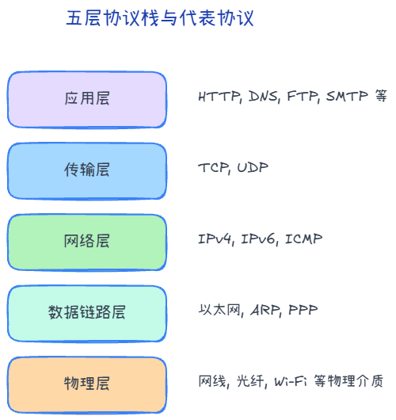
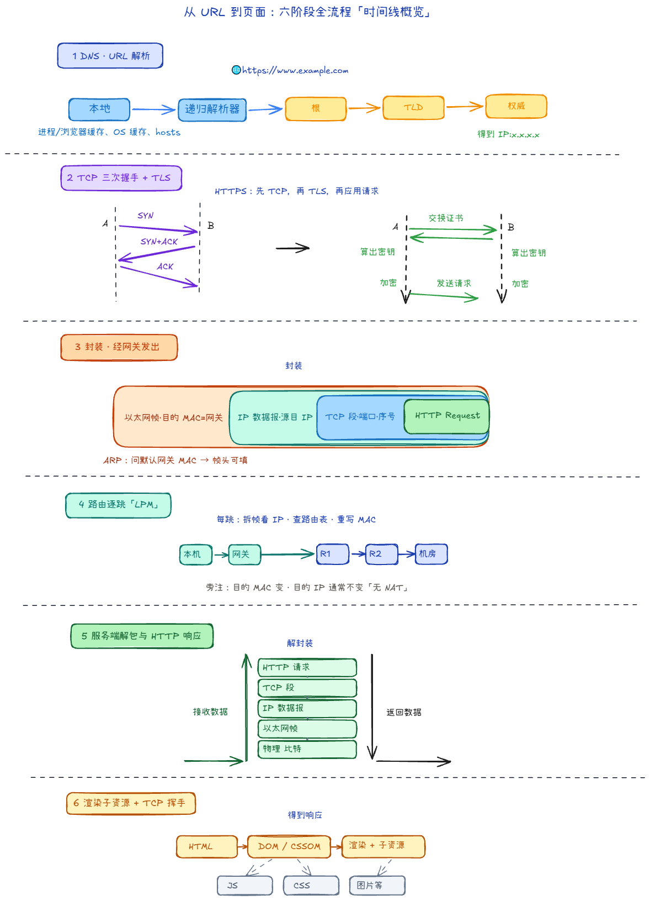

## 各层「协议地图」

先建立「这一层大概管什么、常见词有哪些」的印象；与 Wireshark 里包展开顺序（Frame → IP → TCP → HTTP）也能对上号。

| 层级 | 这一层大致管什么 | 常见协议 / 概念（举例） |
|------|------------------|-------------------------|
| **应用层** | 具体应用语义：网页、域名、邮件… | HTTP/HTTPS、DNS、FTP、SMTP、SSH、MQTT… |
| **传输层** | 进程到进程：端口、可靠/不可靠、拥塞 | **TCP**、**UDP**；端口（如 80、443） |
| **网络层** | 主机到主机：跨网段寻址与路由 | **IPv4/IPv6**、**ICMP**、路由协议（如 OSPF、BGP 等，偏运维） |
| **数据链路层** | 同一链路/二层域内：帧、MAC | **以太网**、**ARP**（常视为紧贴 IP 的辅助）、交换机转发 |
| **物理层** | 比特与介质：电气、光、无线电 | 网线、光纤、Wi‑Fi 射频 |

## 输入网址到显示网页的完整过程

当我们不仅在浏览器里敲下 `https://www.example.com` 并按下回车时，网络世界究竟经历了什么？

1. **URL 解析与 DNS 查询（应用层查找）**
   - 浏览器首先解析 URL 的结构，确定通信协议（HTTPS）与域名（www.example.com）。
   - 浏览器需要目标主机的 IP，便依次查询浏览器缓存、操作系统（`hosts` 文件）、本地 DNS 路由器缓存，若未命中则向 ISP 的 DNS 服务器发起请求，并最终解析出真正要通信的服务器 **IP 地址**。

2. **TCP 建立连接（传输层三次握手）**
   - 拿到目标 IP 后，操作系统的协议栈准备在双端之间建立可靠的数据通道。
   - 客户端（浏览器随机分配端口）向服务端（默认 443 端口）发起 **TCP 三次握手**（SYN -> SYN+ACK -> ACK）。
   - *（注：因为是 HTTPS，随着 TCP 链接建成后，立刻会追加进行 **TLS/SSL 四次安全握手**以协商加密密钥。）*

3. **封装并发送 HTTP 请求（层层包装出海）**
   - 浏览器将用户的访问意图组装成纯文本的 **HTTP Request 报文**（包含 Header 与体）。
   - **传输层**：将超长的 HTTP 报文切分成多个 TCP **段 (Segment)**，标上源目的端口号与序号。
   - **网络层**：将 TCP 段打包成 IP **数据报 (Packet)**，标上源 IP 与目标 IP。
   - **数据链路层**：如果目标 IP 不在局域网内，通过查询路由表，利用 **ARP** 请求得出“默认网关（光猫/路由器接口）”的 MAC 地址，封装包进入以太网**帧 (Frame)** 中。
   - **物理层**：网卡将帧转化为光电/无线电波信号，向外发送。

4. **路由转发与寻址（网络层的万里长征）**
   - 数据包离开你的路由器，进入主干网，途径经过一个个骨干路由器与交换机。
   - 路由器一层一层拆开数据包，查看网络层里的**目标 IP**，查询自己的**路由表**（最长前缀匹配Longest Prefix Match），再重新包装链路层的 MAC 后，将数据包扔向下一跳（Next Hop）。直至抵达百公里外的机房主机。

5. **服务器处理并响应（层层解包归原）**
   - 目标服务器收到光电信号后，一层接着一层去壳拆盒：核对 MAC -> 剥掉 IP 头 -> 剥掉 TCP 头组装好乱序的分段 -> 将完整的 HTTP Request 数据通过预设端口递交给应用层的 Nginx / Tomcat 进程。
   - Web 进程读取完请求并查询数据库后，组装好 **HTTP Response**（包含 HTML 等资源）按照同样的逻辑原路发回给你的主机。

6. **浏览器解析渲染**
   - 浏览器收到回传的 HTML 页面资源后，开始解析 DOM 树与 CSSOM 树，引擎构建呈现出精美的画面。并进一步发请求拉取相应的图片与 JS 文件。