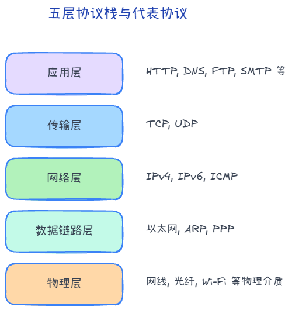
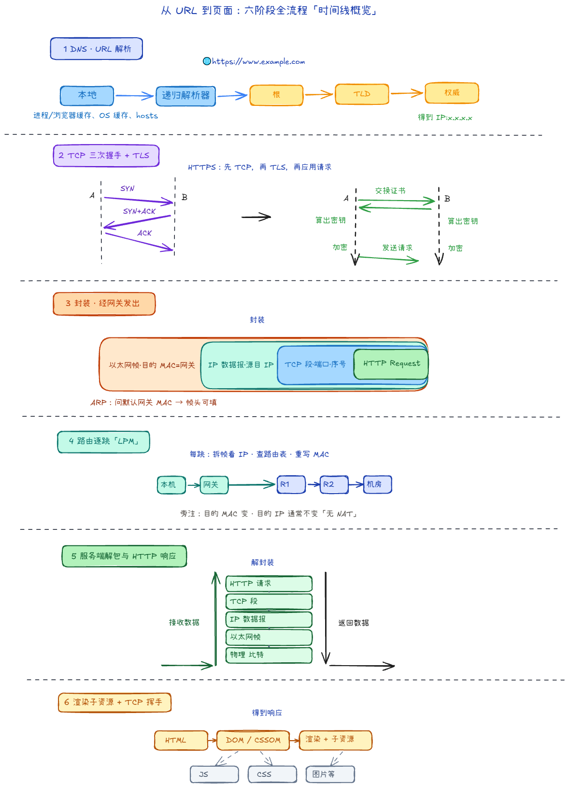

## 各层「协议地图」

先建立「这一层大概管什么、常见词有哪些」的印象；与 Wireshark 里包展开顺序（Frame → IP → TCP → HTTP）也能对上号。

| 层级 | 这一层大致管什么 | 常见协议 / 概念（举例） |
|------|------------------|-------------------------|
| **应用层** | 具体应用语义：网页、域名、邮件… | HTTP/HTTPS、DNS、FTP、SMTP、SSH、MQTT… |
| **传输层** | 进程到进程：端口、可靠/不可靠、拥塞 | **TCP**、**UDP**；端口（如 80、443） |
| **网络层** | 主机到主机：跨网段寻址与路由 | **IPv4/IPv6**、**ICMP**、路由协议（如 OSPF、BGP 等，偏运维） |
| **数据链路层** | 同一链路/二层域内：帧、MAC | **以太网**、**ARP**（常视为紧贴 IP 的辅助）、交换机转发 |
| **物理层** | 比特与介质：电气、光、无线电 | 网线、光纤、Wi‑Fi 射频 |

## 输入网址到显示网页的完整过程

以浏览器访问 `https://www.example.com` 为例，看看从输入网址到显示网页经历了什么。下面按 HTTPS 运行在 TCP 上的常见情况说明；若使用 HTTP/3，底层则是基于 UDP 的 QUIC，不走 TCP 三次握手。

1. **URL 解析与 DNS 查询（应用层查找）**
   - 浏览器首先解析 URL 的结构，确定通信协议（HTTPS）与域名（www.example.com）。
   - 浏览器需要目标主机的 IP，通常先查浏览器缓存，再由操作系统查询 DNS 缓存、`hosts` 文件；仍未命中时，向系统配置的递归 DNS 解析器查询。家用路由器有时充当 DNS 转发器，递归解析器也不一定由 ISP 提供。最终得到域名对应的 **IP 地址**。

2. **TCP 建立连接（传输层三次握手）**
   - 拿到目标 IP 后，操作系统的协议栈准备与服务器建立 TCP 连接。源端口通常由操作系统分配为临时端口，目标端口通常是 HTTPS 默认的 443。
   - 客户端与服务端完成 **TCP 三次握手**（SYN → SYN+ACK → ACK）。
   - 随后进行 **TLS 握手**，验证服务器身份并建立会话密钥。完整握手后即可发送 HTTP 请求：TLS 1.3 通常约需 1 个 RTT，TLS 1.2 通常约需 2 个 RTT。TLS 1.3 会话恢复时还可能用 0-RTT 提前发送请求数据，但早期数据存在重放风险；不能把 HTTPS 一概说成“TLS/SSL 四次握手”。

3. **封装并发送 HTTP 请求（层层包装出海）**
   - TLS 握手完成后，浏览器构造 **HTTP 请求**，其中有请求行或伪首部、请求头，以及可选的请求体。HTTP/1.1 使用文本格式，HTTP/2 使用二进制帧；在 HTTPS 下，请求内容经过 TLS 加密后再交给 TCP。
   - **传输层**：TCP 将字节流按需要分成多个 **段 (Segment)**，添加源端口、目标端口和序号；TCP 段的边界不等于 HTTP 请求的边界。
   - **网络层**：IP 为 TCP 段添加源 IP、目标 IP 等信息，形成 IP **数据报 (Packet)**。
   - **数据链路层**：以 IPv4 以太网为例，系统根据路由表确定下一跳；目标不在本地网段时，通过 ARP 获取默认网关接口的 MAC 地址，再封装为以太网**帧 (Frame)**。
   - **物理层**：网卡将帧转化为光电/无线电波信号，向外发送。

4. **路由转发与寻址（网络层的万里长征）**
   - 数据包经过本地网关和沿途路由设备，逐跳转发到服务器所在网络。
   - 每一跳的路由器查看 **目标 IP**，按路由表做最长前缀匹配，选出下一跳，并为下一段链路重新封装链路层帧；IP 包不需要在每一跳都拆到 TCP 或 HTTP 层。

5. **服务器处理并响应（层层解包归原）**
   - 服务器网卡收到帧后，协议栈逐层处理链路层、IP 和 TCP 数据；TCP 按序交付字节流，TLS 解密后，Web 服务才解析 HTTP 请求。
   - Web 服务处理请求，按需访问数据库或其他服务，再生成 **HTTP 响应**（例如 HTML）。响应也逐层封装并经网络返回浏览器，但不保证经过与请求完全相同的路由。

6. **浏览器解析渲染**
   - 浏览器解析 HTML 和 CSS，构建 DOM 与 CSSOM，布局并绘制页面；遇到脚本、图片等资源时，还会继续发起相应请求。
