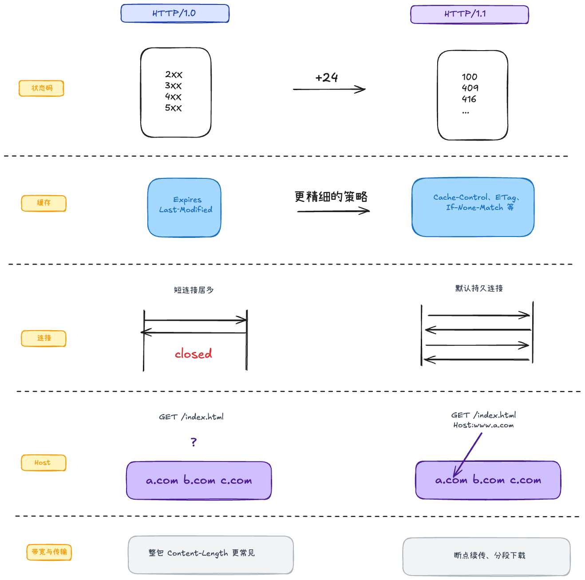
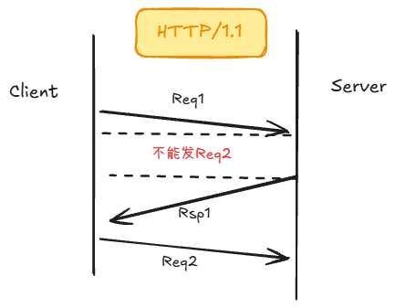
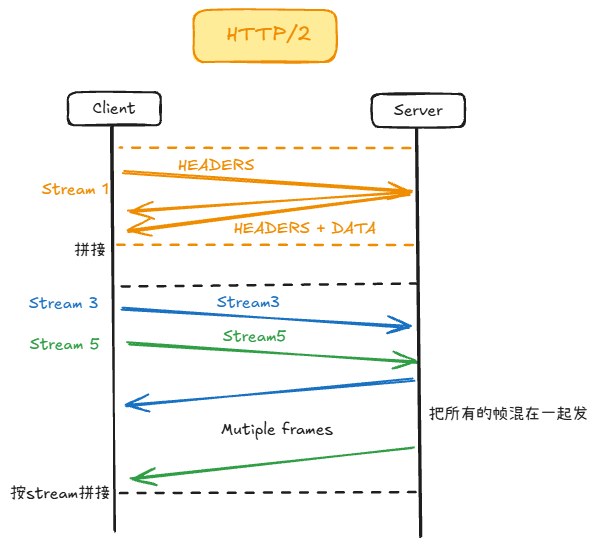

# HTTP 版本演进

## HTTP 1.0 / 1.1 的区别

1. 响应状态码更完善。
2. 缓存控制策略更精细。
    - 引入相对时间：`max-age`。
    - 引入内容校验：`ETag` / `If-None-Match`。
3. HTTP/1.1 支持 Range 范围请求和分块传输。
    - 断点续传：`Range`。
    - 分块传输：`Transfer-Encoding: chunked`。
4. HTTP/1.1 强制要求 `Host`。
5. HTTP/1.1 默认使用持久连接（Keep-Alive）。

## HTTP 1.1

在 HTTP/1.1 时代，网页变得越来越复杂（包含大量 JS、CSS、图片）。HTTP/1.1 的设计存在以下致命缺陷：

1. 队头阻塞（Head-of-Line Blocking, HOL）：
在 HTTP/1.1 中，一个 TCP 连接一次只能发送一个请求。如果前一个请求因为某些原因变慢了，后面的请求就必须排队等待。

2. 连接数受限：
为了解决排队问题，浏览器允许对同一个域名建立多个 TCP 连接（通常是 6 个）。但这也带来了额外的握手延迟和服务器资源消耗。

3. 头部冗余：
HTTP/1.1 的请求和响应头部（Header）是纯文本的，且每次请求都会携带大量重复的信息（如 User-Agent、Cookie 等），浪费带宽。

4. 只能由客户端发起请求：
服务器不能主动向客户端推送资源，客户端必须先解析 HTML，发现需要 CSS 和 JS 后，再发送请求去拿。

## HTTP/2

1. 二进制分帧层 (Binary Framing)
    - HTTP/1.1 传输的是纯文本；HTTP/2 将信息分割为更小的消息和帧，并采用二进制格式编码。
    - 分为“头部帧 (Headers Frame)”和“数据帧 (Data Frame)”。二进制格式更易于机器解析，也更高效。
2. 多路复用 (Multiplexing) —— 解决队头阻塞
    - 在同一个 TCP 连接上，客户端和服务器可以同时、双向地发送多个请求和响应。
    - 不同的请求/响应被拆分成带有编号（Stream ID）的帧，在连接中交叉传输，到达目的地后再根据 ID 组装。
3. 头部压缩 (HPACK) —— 减少传输体积
    - HTTP/2 使用 HPACK 算法对 Header 进行压缩。
        - 客户端和服务器在两端共同维护一张首部表（包含常用的、已发送过的 Header 键值对）。
        - 再次发送请求时，如果 Header 没变，就只发送一个索引号；如果变了，只发送改变的部分（差量更新）。
4. 服务器推送 (Server Push)
    - 服务器在接收到 HTML 请求后，可以预测到客户端接下来需要 CSS、JS 或图片，并在客户端还没发起请求时，主动将这些资源推送到客户端缓存中。

需要理解这三个概念的关系：

- 连接 (Connection)： 一个 TCP 连接，里面可以承载任意数量的双向数据流。
流 (Stream)： 连接中的一个虚拟信道，可以双向传输。每个流都有一个唯一的整数标识符。
- 消息 (Message)： 对应 HTTP/1.1 中的一个完整请求或响应，由一个或多个帧组成。
帧 (Frame)： HTTP/2 传输的最小单位。
- 关系： 一个 Connection 包含多个 Stream → 一个 Stream 传输一个 Message → 一个 Message 被拆分为多个 Frame。

二进制分帧 + 多路复用，多个 Stream 可交错传输；但底层仍是一条 TCP 字节流，某个 TCP 报文丢失后，后续字节需等待补齐，其他 Stream 也可能被拖慢，属于 **TCP 层队头阻塞**。

## HTTP/3

基于 QUIC（运行在 UDP 之上，但自行提供可靠传输、拥塞控制等能力）。各 Stream 独立排序和重传；A 流丢包时，B 流通常无需等待，因此避免了 TCP 层队头阻塞。

### QUIC 的优点

1. 传输握手与 TLS 合并，比 TCP 三次握手再 TLS 更少 RTT（首次约 1-RTT）
2. 用 **Connection ID** 标识连接，不绑死四元组，换网（Wi-Fi→4G）可不断连
3. **Stream 级**多路复用，缓解 HTTP/2 被底层 TCP「连坐」的队头阻塞

### 新问题

1. 中间设备：防火墙、NAT 网关、路由器，一般都只信任TCP
2. 硬件兼容：网卡硬件优化TCP，而无法优化QUIC，CPU负载高
3. 实现难度极高：HTTP/3 要求在应用层用户态重新实现一套极其复杂的TCP 机制，比如可靠传输、拥塞控制、流量控制；目前成熟、稳定的 QUIC 库又不多