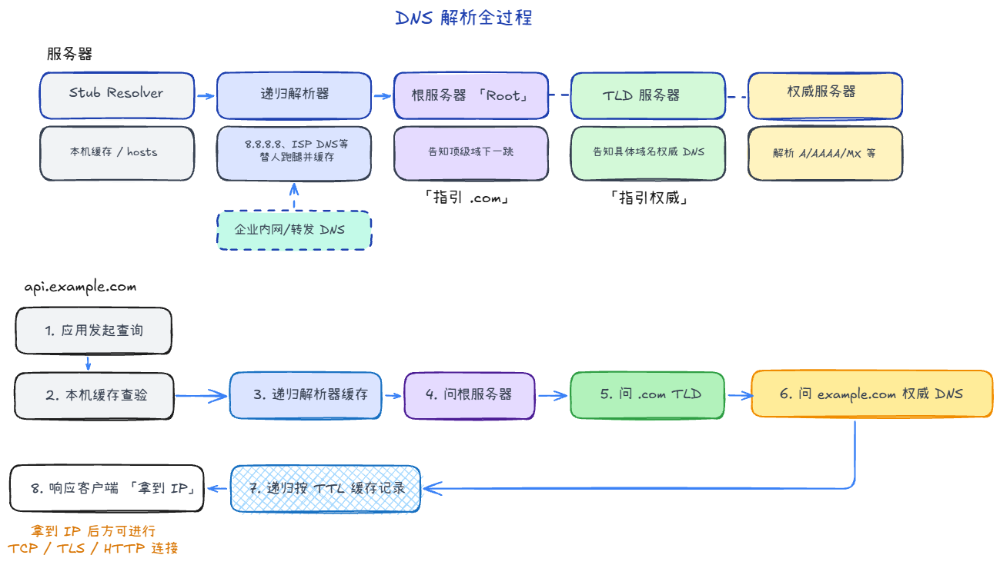

## DNS 服务器

### 3.1 本地 DNS Stub Resolver（系统解析器）

- 在你的设备里（操作系统/运行库），负责把应用发起的域名查询交给上游 DNS。
- 先查本机缓存、`hosts`，再决定是否向配置的 DNS 服务器发包。
- 它通常不负责完整的“全球递归解析”，而是把任务交给递归解析器。

### 3.2 递归解析器（Recursive Resolver）

- 用户最常直接配置的 DNS（如运营商 DNS、`8.8.8.8`、`1.1.1.1`）。
- 职责：替客户端一路问到最终答案，并把结果缓存起来。
- 同一个问题问第二次时，命中缓存可直接返回，速度会快很多。

### 3.3 根 / TLD / 权威服务器（Authoritative Chain）

- **根服务器（Root）**：告诉你 `.com`、`.cn` 这类顶级域该去问谁。
- **TLD （Top-Level Domain）服务器**：告诉你 `example.com` 这个域该去问哪个权威 DNS。
- **权威 DNS**：对某个 zone 有最终解释权，返回 A/AAAA/CNAME/MX 等记录。

> 根和 TLD 多数时候返回的是“下一跳线索（NS + glue）”，不是最终业务记录。

### 3.4 缓存与转发型 DNS（企业常见）

- 企业内网常有一层本地 DNS（转发器/缓存服务器）。
- 它本身可能不做完整递归，只把请求转给上游递归解析器，同时缓存结果。
- 好处是统一策略（审计、劫持防护、内网域名解析）和提升局域网命中率。