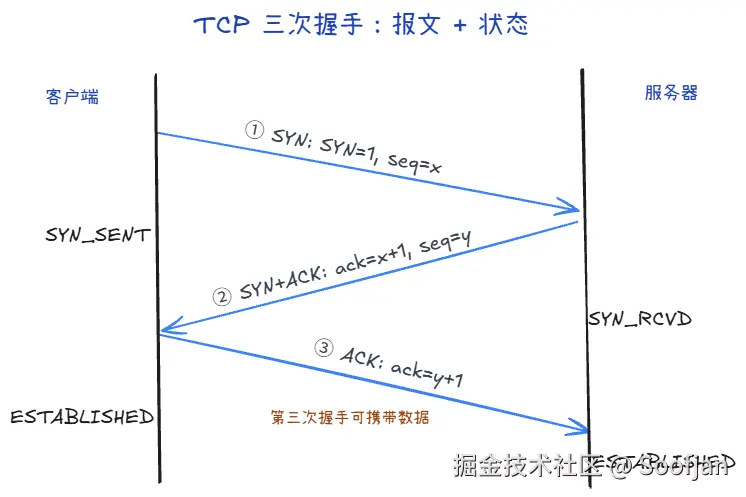
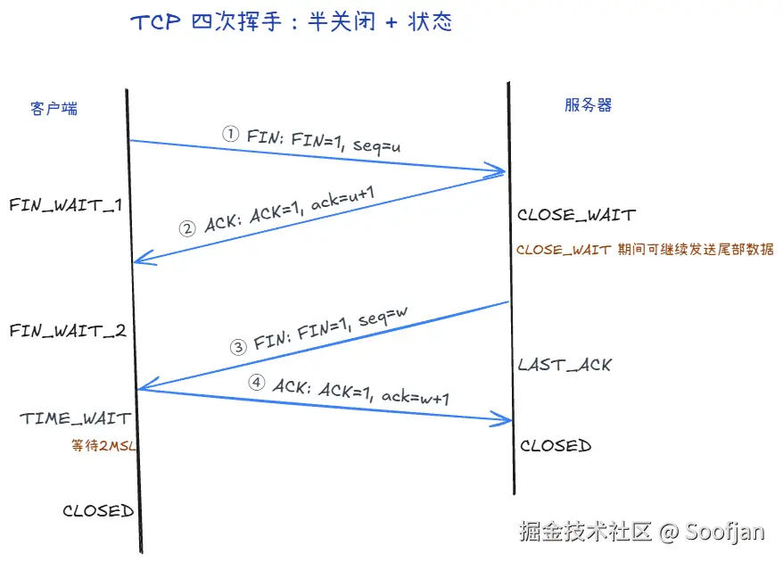
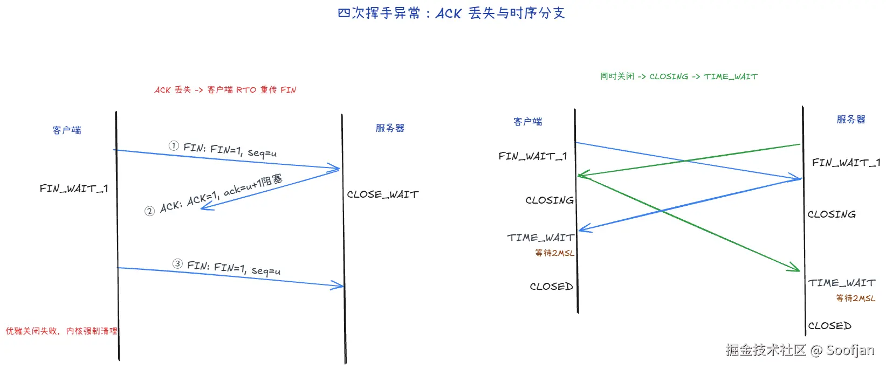

# TCP 三次握手 

目的：确认双方收发都正常，并同步初始序号（seq）。

1. 第一次 SYN
    - 客户端发：SYN=1, seq=x
    - 客户端进入 SYN_SENT
2. 第二次 SYN + ACK
    - 服务端发：SYN=1, ACK=1, ack=x+1, seq=y
    - 服务端进入 SYN_RCVD
3. 第三次 ACK
    - 客户端发：ACK=1, ack=y+1
    - 客户端进入 ESTABLISHED；服务端收到后也进入 ESTABLISHED

## 为什么不是两次

1. 两次无法确认客户端也收到了服务端的 SYN+ACK
2. 网络里迟到的旧 SYN 到达时，服务端会直接建连空等，浪费资源
    - 客户端曾发过 SYN，超时放弃了；这个 SYN 在网上绕了一圈才到服务端
    - 若只有两次：服务端回 SYN+ACK 就算建连成功，占着套接字和内存傻等数据，客户端这边早已不认这笔连接
    - 三次握手：服务端仍在 SYN_RCVD 等第三次 ACK。客户端对不上当前连接（或已不在等），回 RST，服务端立刻拆掉，不会空占资源

## 握手能带数据吗

1. 前两次一般不带数据（安全和防 SYN 洪水）
2. 第三次时客户端侧已 ESTABLISHED，可以带数据

## 第三次 ACK 丢了，客户端已经开始发包，能成功吗

可以。除第一次 SYN 外，后续报文几乎都带 ACK=1。纯 ACK 丢了，紧接着的数据包里仍有 ACK=1 和正确确认号，服务端收到后从 SYN_RCVD 切到 ESTABLISHED。

## 三次握手后，对方宕机了

对端主机直接挂了，不会发 FIN，本端仍是 ESTABLISHED，形成半开连接。

1. 本端一直不发包
    - 默认几乎感知不到
    - 开了 TCP keepalive 才会在空闲一段时间后发探测包
    - Linux 常见默认要空闲约 2 小时才开始探，探几次失败才认定死掉
2. 本端继续发包
    - 等不到 ACK，按 RTO 重传
    - 重传若干次仍无响应，内核断开连接（常见是超时错误）
3. 对端后来重启
    - TCB 是内核里一条连接的控制块（四元组、序号、窗口等），重启后内存清空，旧连接的 TCB 全没了
    - 本端还以为 ESTABLISHED，继续往旧四元组发数据或 keepalive
    - 对端找不到匹配的 TCB，按 TCP 约定回 RST（重置：这条连接不存在）
    - 本端收到 RST，套接字立刻报错（常见 connection reset），不用等超时

应用层心跳通常比 keepalive 更及时，业务超时自己 close。

# TCP 四次挥手 +1

TCP 全双工，断开要支持半关闭：一方不发了，还可以继续收。

1. 第一次 FIN
    - 客户端发：FIN=1, seq=u（可带最后一段数据）
    - 客户端进入 FIN_WAIT_1
2. 第二次 ACK
    - 服务端发：ACK=1, ack=u+1
    - 服务端进入 CLOSE_WAIT；客户端收到后进入 FIN_WAIT_2
    - 服务端可能还有数据没发完，先 ACK，发完再发自己的 FIN
3. 第三次 FIN
    - 服务端发：FIN=1, seq=w
    - 服务端进入 LAST_ACK
4. 第四次 ACK
    - 客户端发：ACK=1, ack=w+1
    - 客户端进入 TIME_WAIT，等 2MSL 后 CLOSED；服务端收到后 CLOSED

## TCP状态 +1 

1. TIME_WAIT：
    - 第四次挥手时主动关闭方进入的状态
    - 大量TIME_WAIT短连接太多、主动关闭太频繁，可以HTTP Keep-Alive、连接池
2. CLOSE_WAIT：
    - 第二次挥手时接收端进入的状态，还可继续发数据
    - 大量CLOSE_WAIT可能是因为代码没写close，可以修代码、设置读写超时

> MSL（Maximum Segment Lifetime，报文最大生存时间，通常是 1-2 分钟）

## 为什么 TIME_WAIT 要等 2MSL

1. 保证最后的 ACK 到达：ACK 丢了服务端会重传 FIN，还能再回 ACK
2. 让旧连接报文在网上消亡，避免相同四元组新连接收到幽灵数据

## 第二次挥手的 ACK 没到客户端

1. 客户端等 ACK、按 RTO 重传 FIN
    - 状态：FIN_WAIT_1（对「自己的 FIN 是否被对方确认」心里没底）。
    - 行为：超时后按 RTO（Retransmission time out） 认为「FIN 或对端 ACK 可能丢了」，会重传同一条 FIN（对端若已收过，会当重复 FIN 处理）。
    - 退出：重传与等待不是无限的；若长期得不到有效回应，连接会由内核会强制清理该连接状态。

2. 和「服务端先发自己的 FIN」别混
    - 服务端在 CLOSE_WAIT 里把数据发完后，会发 自己的 FIN（第三次挥手），进入 LAST_ACK（这是服务端状态，不是客户端状态）。
    - 客户端若在 FIN_WAIT_2 收到对端 FIN：应 ACK 后进入 TIME_WAIT。
    - 若在 FIN_WAIT_1 就收到对端 FIN（双方几乎同时关）：会走同时关闭路径，可能进入 CLOSING 等状态；这是另一类时序，不要和「单纯第二次 ACK 丢了」绑死成一句话。

