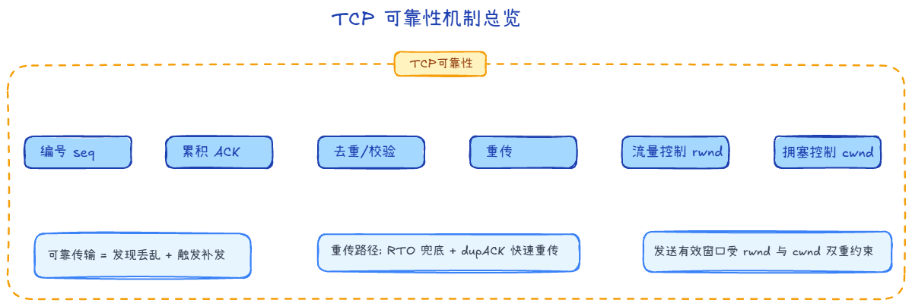
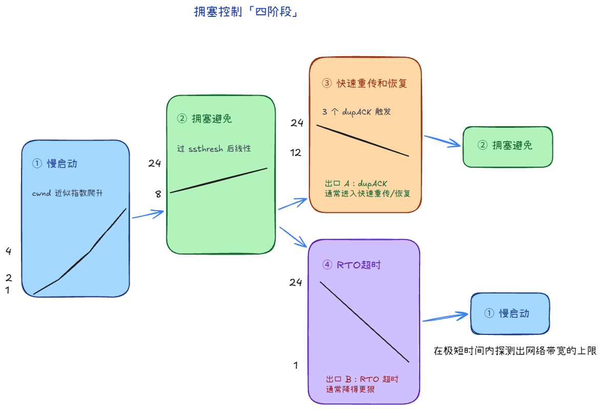

## TCP 如何保证数据不丢失？ +1

发现丢/乱（序号、校验和）→ 要求重传（ACK、超时重传、快速重传）→ 控速（rwnd 滑动窗口、cwnd 拥塞窗口）

## TCP 拥塞控制怎么做？ +1

1. 开始是慢开始，逐步指数级增长，1，2，4，8
2. 然后到了threshold开始拥塞避免，比如10，11，12
3. 如果是有包丢失，一直发送相同的ACK，则降到中界线，继续拥塞避免（有包丢失，说明网络还可以接收数据）
4. 如果是响应超时，则降到低端，继续慢开始（响应超时，说明网络已经很拥塞）

## TCP和UDP的区别

1. TCP面向连接；UDP无连接
2. TCP高可靠；UDP不可靠
3. TCP面向字节流；UDP面向报文
4. TCP首部开销大，传输较慢；UDP首部开销小，传输快

网页、文件传输、邮件适合TCP；音视频、游戏适合UDP

## TCP粘包

例如客户端连续发送Hello和World，服务端可能收到HelloWorld，也可能收到Hel、lo、World。

因为 TCP 只保证：字节顺序正确，数据不丢失。可能发送方合并发送、缓冲区批量接收了。

解决方法：
1. 固定长度协议：浪费空间
2. 分隔符
3. 长度字段：长度+数据

> HTTP为什么没有粘包问题：HTTP 自己定义了协议Content-Length: 1024