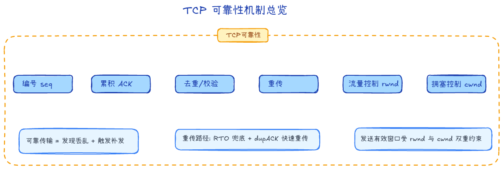
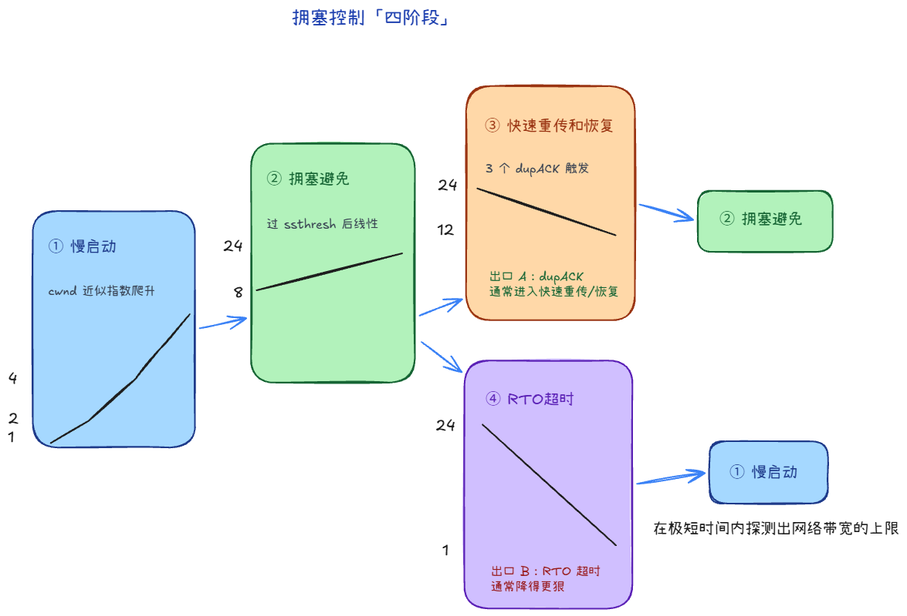

## TCP 如何提供可靠传输？ +1

发现丢/乱（序号、校验和）→ 要求重传（ACK、超时重传、快速重传）→ 控速（rwnd 滑动窗口、cwnd 拥塞窗口）

## TCP 拥塞控制怎么做？ +1

下图按经典 Reno 模型说明四个阶段，`cwnd` 是拥塞窗口，`ssthresh` 是慢开始阈值；不能用含糊的“中界线”“低端”代替这些术语。

1. **慢开始**：`cwnd` 从较小值起步，收到 ACK 后增长，理想情况下约每个 RTT 翻倍。
2. **拥塞避免**：达到 `ssthresh` 后，Reno 的 `cwnd` 大约每个 RTT 增加 1 个最大报文段，不再指数增长。
3. **3 个重复 ACK**：提示某个报文段可能丢失，但后续报文段仍到达了接收方；Reno 触发快重传、快恢复，并把 `ssthresh` 降到约为当前在途数据量的一半。快恢复期间 `cwnd` 有临时调整，恢复结束后再按拥塞避免增长，
4. **重传超时（RTO）**：比重复 ACK 提供的信息更少。按经典规则，`ssthresh` 降到约为当前在途数据量的一半，`cwnd` 降到 1 个最大报文段的丢失窗口，再重新慢开始

## TCP和UDP的区别

1. TCP面向连接；UDP无连接
2. TCP高可靠；UDP不可靠
3. TCP面向字节流；UDP面向报文
4. TCP 提供连接管理、可靠性和拥塞控制；UDP 首部较小、机制较少，但应用的实际速度仍取决于网络条件和上层实现

网页、文件传输、邮件常用 TCP；实时音视频、游戏常用 UDP，并按需要在上层实现可靠性或拥塞控制。

## TCP粘包

例如客户端连续发送Hello和World，服务端可能收到HelloWorld，也可能收到Hel、lo、World。

因为 TCP 交付的是有序字节流，不保留应用写入时的消息边界：一次 `read` 可能读到半条、整条或多条应用消息。这不是 TCP 把消息弄坏了，而是应用需要自己判断消息在哪里结束。

解决方法：

1. 固定长度协议：浪费空间
2. 分隔符
3. 长度字段：长度+数据

HTTP/1.1 和 HTTP/2 基于 TCP 时，同样可能一次 `read` 只拿到半个请求。区别是 HTTP 自己规定了消息边界：HTTP/1.1 可用 `Content-Length` 或 `Transfer-Encoding: chunked` 等规则确定报文体长度，部分响应还以连接关闭作为结束标志；HTTP/2 和基于 QUIC 的 HTTP/3 使用带长度信息的帧。