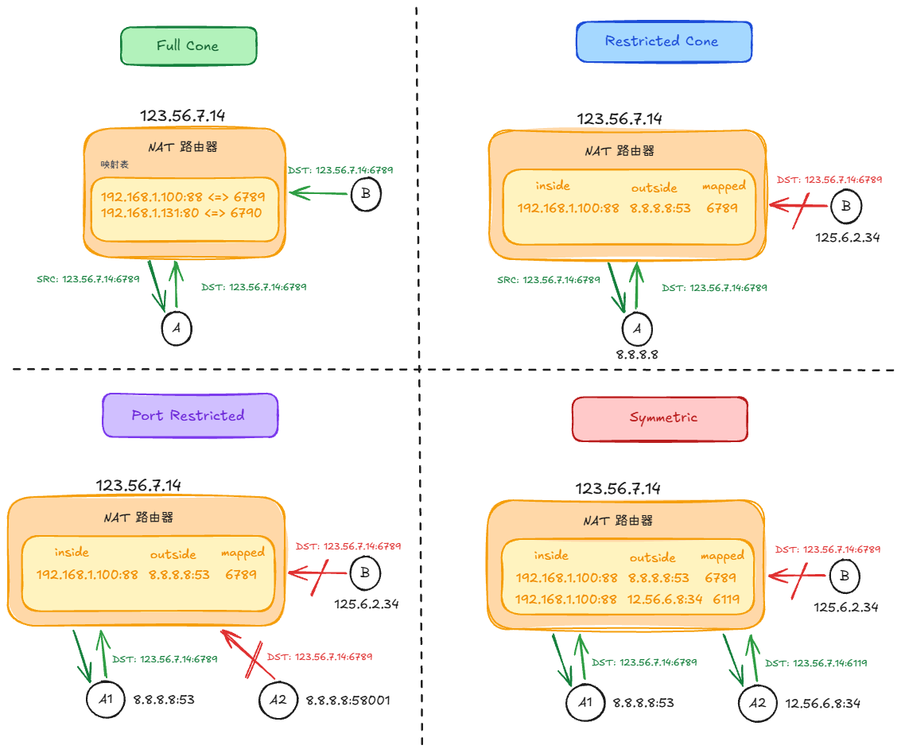
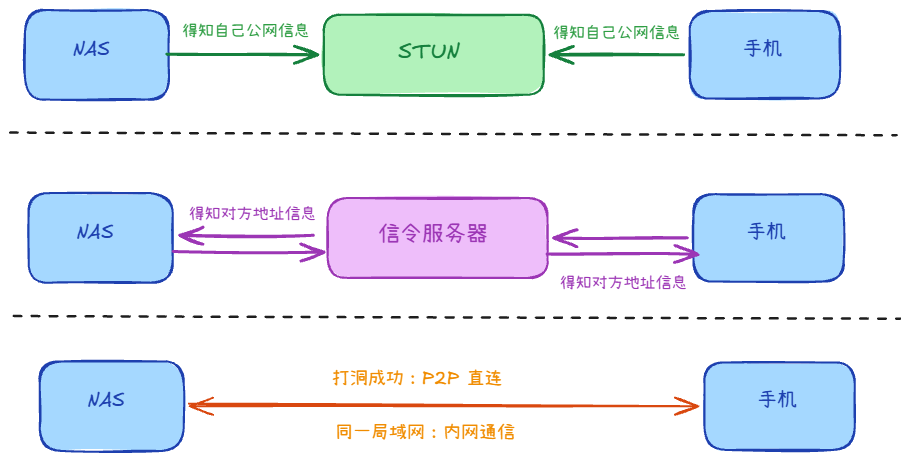
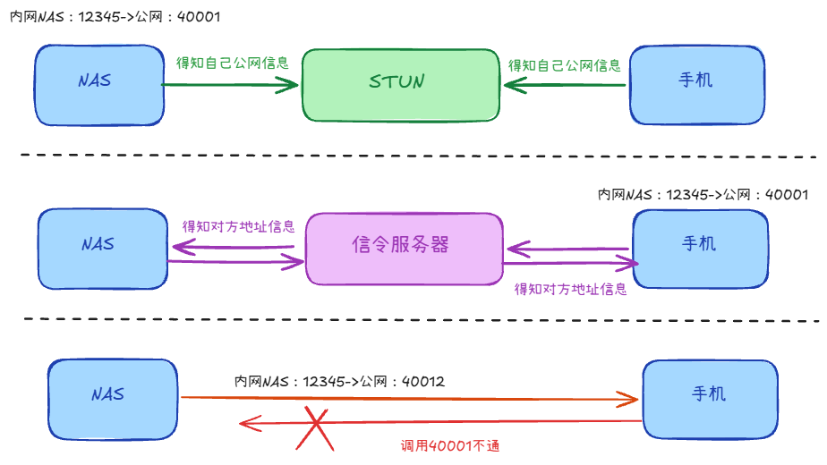
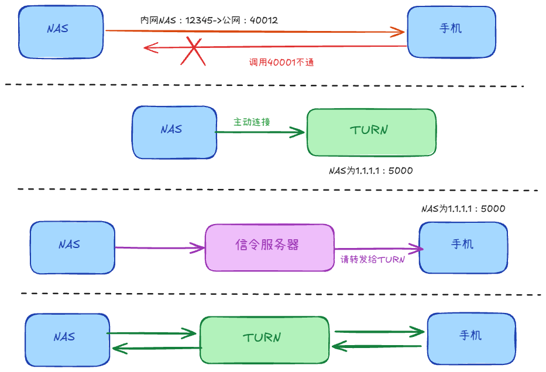

## NAT 是什么？

为了解决IPV4地址不足的问题，有了NAT技术的出现，让内网的多个设备可以通过NAT来共享一个公网地址去向外网访问。

副作用：内网可主动出站；外网一般不能主动连内网（映射表里没有）→ 才有穿透问题

## SNAT 和 DNAT +1

路由器维护映射表，改包头里的地址（经常连端口一起改）。

1. SNAT：改源地址
    - 内网访问外网时，把源 IP:Port 换成网关的公网 IP:Port
    - 回包到网关后，按映射表改回内网地址再转给主机
    - 例：家里多台设备共用一个公网 IP 上网；Linux MASQUERADE（出口 IP 会变时常用）
2. DNAT：改目的地址
    - 外网访问进来时，把目的 IP:Port 换成内网某台机器的 IP:Port
    - 例：端口映射（公网 80 → 内网 8080）；四层负载均衡 VIP 转到后端

## 常见类型有哪些？

路由器有个映射表，出站时记 内网 IP:Port ↔ 公网 IP:Port

1. 全锥型：映射之后地址不变，任何地址都可以通过这个公网地址访问内网设备
2. 受限型：只有被访问过的地址，才能通过这个公网地址访问内网设备
3. 端口受限：只有被访问过的地址+端口，才能通过
4. 对称型：针对不同的访问地址，会映射不同的端口

打洞难度越来越大

# NAT 穿透怎么做？

## STUN穿透

- 两方向 STUN 查询，得到自己在 NAT 外的公网 IP:Port
- 两方通过信令服务器交换公网地址
- 双方同时发请求，为了在映射表里留下记录
- 此时再发，就能通信了

但是在对称型NAT下，STUN穿透困难，因为地址会变化，所以需要使用TURN穿透

## TURN穿透

- 在对称型NAT时，STUN穿透困难，因为地址会变化
- 服务端会连接TURN服务器，它会生成一个新的地址
- 服务端把这个地址给客户端，让它请求
- 双方就通过这个TURN服务器进行转发通信

代价：带宽占服务器、延迟更高；收益：对称 NAT、双对称场景也能连通

## 保活呢？

1. 为什么需要保活？
    - UDP 超时时间短：绝大多数 NAT 穿透（包括 STUN）使用的是 UDP 协议。NAT 路由器对 UDP 的映射生命周期非常短，通常在 30 秒到 120 秒之间。
    - TCP 超时时间稍长：如果是 TCP 穿透，生命周期通常会达到几分钟到几小时，但移动网络（如 4G/5G 基站）的 NAT 超时时间依然可能非常短。
2. 怎么保活？
    - 应用层心跳：手机每隔 x 秒发送极小的 UDP 包（比如 {"type":"ping"}），对方回个 {"type":"pong"}。
    - 协议层心跳：标准的 WebRTC 或 STUN 框架，协议本身就定义了保活机制，使用 STUN Binding Indication（无须响应的绑定指示）或 STUN Binding Request（需要响应的请求）。
3. 如果是转发呢？
    - TURN 规范规定，转发端口的生命周期（Lifetime）默认是 20 分钟。
    - 手机/NAS 需要向 TURN 服务器发送 Refresh 请求，通常建议每 10 分钟。