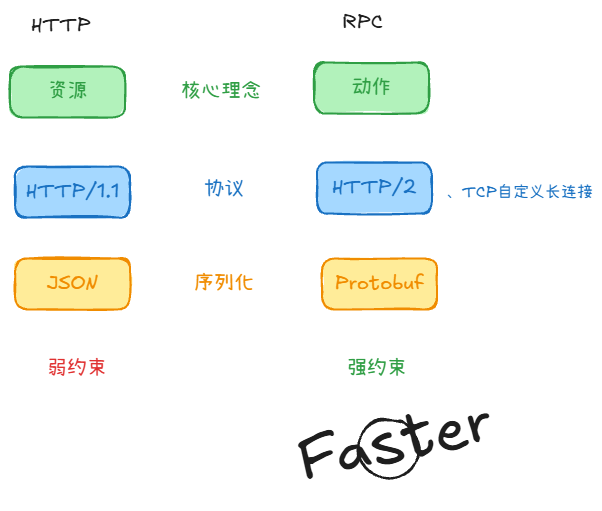

# 什么是RPC

RPC（Remote Procedure Call，远程过程调用）是一种远程调用方式，不是某一种固定的传输协议。它让调用方以类似本地函数的形式调用远端服务，但网络超时、重试和远端故障仍需显式处理。

## gRPC呢？

gRPC 是 Google 开源的 RPC 框架，默认 HTTP/2 + Protobuf。一份 `.proto` 能生成多种语言的客户端/服务端，所以能跨语言调用。

## 四种 gRPC 调用模型

gRPC 不只有“请求一次、返回一次”，服务方法在 `.proto` 中可定义为四种模型：

```proto
service PhotoService {
    // 1. 一元 RPC：一次请求，对应一次响应。
    rpc GetPhoto(PhotoRequest) returns (PhotoResponse);

    // 2. 服务端流：客户端请求一次，服务端连续返回多条消息。
    rpc WatchProgress(TaskRequest) returns (stream Progress);

    // 3. 客户端流：客户端连续上传多条消息，最后得到一次响应。
    rpc UploadPhoto(stream PhotoChunk) returns (UploadResult);

    // 4. 双向流：两端都可连续发送消息，读写相互独立。
    rpc Chat(stream ChatMessage) returns (stream ChatMessage);
}
```

1. **一元 RPC（Unary）**：最常用，适合查询照片、创建任务等普通请求/响应场景。
2. **服务端流（Server streaming）**：适合订阅任务进度、日志或持续推送结果；客户端发完一个请求后持续读取服务端消息。
3. **客户端流（Client streaming）**：适合分片上传文件、批量上报数据；客户端写完多条消息后，服务端统一处理并返回结果。
4. **双向流（Bidirectional streaming）**：适合实时聊天、协同编辑或持续交互；客户端和服务端可以各自独立地读写消息。

同一个流中的消息顺序由 gRPC 保证；不同 RPC 之间不应假定存在全局顺序。

## gRPC Metadata

Metadata 是附着在**一次 RPC 调用**上的键值对，类似 HTTP Header，但不属于 `.proto` 定义的业务消息。它通常随请求或响应的 Header 发送，服务端还可以在调用结束时通过 Trailer 返回附加信息。

- 适合放鉴权凭证、TraceID、请求 ID、租户标识、灰度标记等跨接口通用信息。
- 业务字段，例如 `photo_id`、文件内容、任务参数，仍应放在 Protobuf message 中，不能借 Metadata 绕开接口契约。
- Metadata 的 key 是字符串；二进制值通常使用以 `-bin` 结尾的 key。`grpc-` 前缀由 gRPC 保留，业务方不能使用。

## gRPC + Protobuf 与 REST 风格 HTTP API + JSON 对比



1. 接口风格：REST 风格 API 常以资源和 HTTP 方法组织接口；RPC 常以服务方法表达操作。HTTP API 也可以设计成动作接口。
2. 传输协议：REST 风格 API 可使用 HTTP/1.1、HTTP/2 或 HTTP/3；gRPC 常基于 HTTP/2，其他 RPC 框架也可能使用自定义 TCP 协议。
3. 数据序列化：前者常用 JSON，后者常用 Protobuf；编码格式并不由 HTTP 或 RPC 这个名称强制决定。
4. 契约约束：`.proto` / IDL 可以生成强类型代码；HTTP API 也可以使用 OpenAPI 等契约并生成代码，约束强弱取决于团队如何维护和验证。
5. 性能/吞吐：二进制编码、连接复用等机制可能降低部分开销，但实际延迟和吞吐受消息大小、实现与负载影响，应在相同条件下测量。

## 如何选择 gRPC + Protobuf 或 HTTP API + JSON


```proto
message User {
    int32 user_id = 1;  // 唯一代号/编号 Tag
    string name   = 2;  // 这个字段的代号是 2
}
```

.proto + gRPC 往往更合适：
- 字段和类型固定，改接口时更容易发现双方不兼容。
- 自动生成 Go/C++ 等客户端代码，少手写请求和响应解析。
- 二进制编码通常更小、更快。
- 原生支持 deadline、取消、流式调用和标准状态码。
- 很适合 Unix Domain Socket 的本机进程通信。

但 HTTP + JSON 也有明显优势：
- 浏览器、脚本、curl 都能直接调用和调试。
- 对外开放 API 更通用，文档和排障门槛低。
- 数据结构经常变化、调用方语言杂时更灵活。

## RPC 的核心工作流程

你写业务时调的是本地函数，真正发出去的是 Stub：

1. Client Stub：方法名 + 参数 → 序列化 → 丢给网络
2. Server Stub：字节流 → 反序列化 → 调本地真正的实现
3. 结果原路回来，Client Stub 拆成 resp 给你
