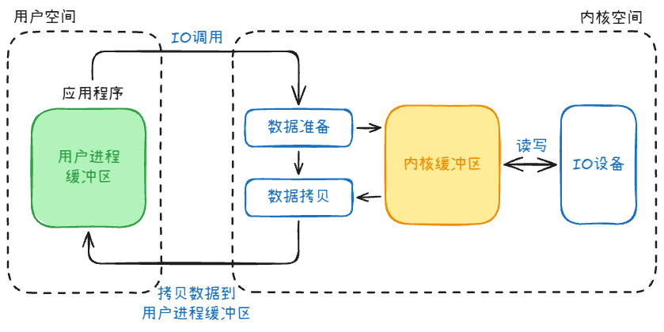
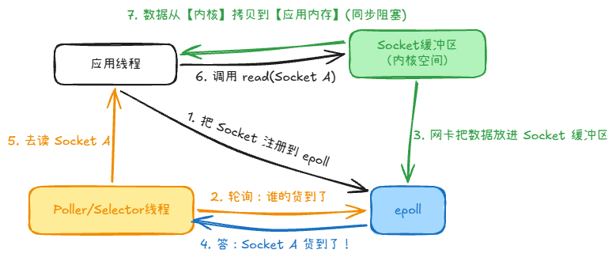

# I/O 基础

## I/O 是什么

I/O（Input/Output，输入/输出）是应用程序与外部世界交换数据的过程。常见对象包括网络连接、磁盘文件、终端和其他设备：

- 输入：从 Socket 接收请求、从磁盘读取文件、从标准输入读取内容。
- 输出：向 Socket 发送响应、向磁盘写入文件、向标准输出打印日志。
- Socket、网卡和硬盘都既可以读取也可以写入，因此同时属于输入和输出对象。

## 用户空间与内核空间

应用程序运行在用户空间，不能直接操作网卡、磁盘等硬件；真正的设备访问由操作系统内核完成。用户空间通过系统调用请求内核执行 I/O，内核再负责驱动设备、管理缓冲区和返回结果。

因此，业务代码中调用 `read`、`write`、`recv` 或 `send`，本质上是在发起一次 I/O 调用；实际的 I/O 执行仍发生在内核中。

## 一次 I/O 的两个阶段

以读取网络数据为例，内核处理 I/O 通常包含两个阶段：

1. **准备数据**：等待网卡收到数据，并将数据放入内核缓冲区。
2. **拷贝数据**：将数据从内核缓冲区复制到应用程序的用户空间缓冲区。

可以用这两个阶段区分常被混淆的两组概念：

- **阻塞 / 非阻塞**：数据尚未准备好时，调用线程是等待，还是立即返回并稍后再试。
- **同步 / 异步**：应用是在就绪后自己调用 `read` 取得数据，还是先提交 I/O 请求、之后再取得完成结果。

同步 I/O 中，`read` 返回时应用才拿到这次调用读取的数据；异步 I/O 中，应用先提交请求，之后通过完成事件、完成队列或回调得知结果。这里的“非阻塞”不等于“异步”：非阻塞 `read` 没数据时立即返回，但数据就绪后仍由应用调用它来读取。

---

# 一、 常见 I/O 模型全景图

## 1. BIO（Blocking I/O，同步阻塞 I/O）

- 含义：对阻塞 socket 调用 `read`，数据未就绪时，调用线程会等待；数据到达并完成拷贝后，调用才返回。
- 常见写法：一个连接由一个线程持续处理。若连接数很大且多数连接空闲，线程栈和调度成本会增高；这是一种应用架构，不是阻塞 I/O 强制要求的线程模型。
- 适用场景：连接数较少、并发需求不高，或已有线程池控制并发的程序。

---

## 2. 非阻塞 I/O（Non-blocking I/O）

把 socket 设为非阻塞后，`read` 遇到暂时无数据会立即返回 `EAGAIN`，应用稍后再试。若应用不断对每个 socket 自己轮询，空转会消耗 CPU；因此处理大量连接时，通常再配合 I/O 多路复用等待就绪。

## 3. I/O 多路复用（I/O Multiplexing）

- 过程：应用把多个 socket 交给 `select`、`poll` 或 Linux 的 `epoll` 监视；等待调用返回可读/可写的描述符后，应用再对它们调用 `read/write`。等待就绪的线程可以阻塞在 `epoll_wait`，所以“多路复用”不是所有线程都不阻塞。
- 作用：一个或少量线程可等待许多连接的就绪事件，避免为每个空闲连接单独占一个等待线程；可处理的连接数仍受资源和实现限制。

三种接口的主要区别：

| 接口 | 如何监视与返回就绪项 |
| --- | --- |
| `select` | 每次传入待监视的描述符集合；Linux 常见 `fd_set` 接口受 `FD_SETSIZE` 限制。 |
| `poll` | 每次传入描述符数组，没有 `fd_set` 的固定上限，但仍需检查数组中的描述符。 |
| `epoll` | 先维护关注的描述符集合，`epoll_wait` 返回就绪事件，适合大量连接且只有部分连接活跃的场景。 |

`epoll` 默认使用 LT（水平触发）：只要仍可读，就可能反复报告就绪。ET（边缘触发）侧重状态变化；通常要配合非阻塞描述符，并持续读取直到返回 `EAGAIN`，否则可能遗漏尚未读完的数据。Java NIO 的 `Selector` 是这一类就绪通知接口的应用，不能把“非阻塞 I/O”和“多路复用”直接当作同义词。

---

## 4. AIO（Asynchronous I/O，异步 I/O）

- 过程：应用先提交读写请求，再从完成事件或完成队列取得结果，也可以由运行库调用回调；提交请求时不必一直等数据就绪。
- 与多路复用的区别：`epoll` 通知“现在可以尝试读写”，应用仍要自己调用 `read/write`；异步 I/O 的完成事件表示提交的操作已有结果。
- 边界：提交、等待或获取完成事件的具体调用方式取决于接口，不能说异步 I/O 的每一步都绝不会阻塞。

---

# 二、 还有什么 I/O？（进阶与底层 I/O 模型）

除了前面的阻塞、非阻塞、多路复用和异步 I/O，还可以了解下面几种通知方式或数据路径优化。

## 5. 信号驱动 I/O（Signal-driven I/O）

- 原理：应用为描述符启用异步信号通知；就绪时内核发送 `SIGIO`，应用随后调用 `read/recvfrom` 获取数据。信号通知表示“可尝试读取”，不是数据已自动拷贝到应用缓冲区。
- 局限性：信号处理与事件分发较复杂，通常不作为高并发 TCP 服务的首选方案。

---

## 6. io_uring（Linux 的异步 I/O 接口）

`io_uring` 自 Linux 5.1 引入，使用提交队列（SQ）与完成队列（CQ）在用户空间和内核之间交换请求与结果。

1. 应用把 I/O 请求放入 SQ，通过接口通知内核处理；完成后，从 CQ 读取结果。
2. 共享环减少了反复提交与获取结果的开销，但通常仍需调用 `io_uring_enter`，不能把默认模式说成“无系统调用”。
3. SQPOLL 可让内核线程轮询 SQ，在适用条件下减少提交系统调用；它会占用内核线程，也不保证所有操作都无系统调用。

`io_uring` 能处理多种 I/O 操作，但是否比 `epoll` 或普通读写更合适，要结合负载、内核版本和实现测量。

---

## 7. 零拷贝与 Direct I/O（磁盘/网络数据传输优化）

它们关心的是数据经过哪些缓冲区，与“等待 I/O 时线程是否阻塞”是不同维度：

- `sendfile`：将文件数据在内核中转交给 socket，避免普通 `read` 到用户缓冲区、再 `write` 回内核的往返；“零拷贝”指减少这类拷贝，不代表整个硬件路径完全没有拷贝。
- `mmap`：把文件页映射到进程地址空间，应用可直接访问映射内存；如果随后用普通 `write` 发往 socket，仍可能再拷贝进 socket 缓冲区，不能与 `sendfile` 画等号。
- `O_DIRECT`：直接 I/O 尽量绕过页缓存，常用于应用自己管理缓存的场景；它解决的是缓存路径问题，不等同于文件到 socket 的零拷贝。

---

# 三、Go协程的网络阻塞呢？

Go 的网络代码常写成顺序调用：`conn.Read` 没读到数据之前，这个 goroutine 的后续语句不会执行。这里的 G 是 goroutine，M 是操作系统线程，P 是运行 Go 代码所需的调度资源。

- **网络 socket**：Go 在支持的平台上使用非阻塞描述符和运行时 netpoller（Linux 上基于 `epoll`）。`conn.Read` 暂无数据时，运行时暂停等待的 G，让原来的 M 有机会运行其他 G；就绪后再把等待的 G 变为可运行。业务代码因此不用自己写就绪事件循环。
- **线程边界**：M 并非永不阻塞。文件 I/O、cgo 或其他阻塞系统调用可能占住 M；运行时可让别的 M 继续执行可运行的 G。负责等待网络就绪的 M 本身也可能阻塞在 `epoll_wait`。

所以可概括为“同步的代码写法 + 运行时调度网络就绪事件”，不要把它说成所有 I/O 都是异步完成，也不要说 M 从不进入内核等待。
