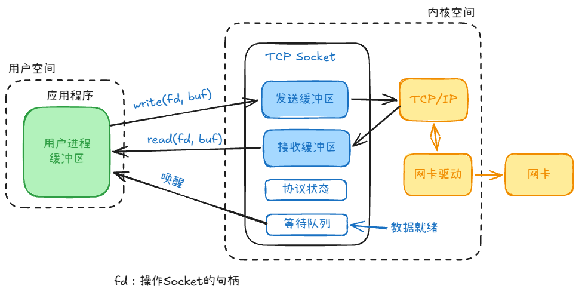
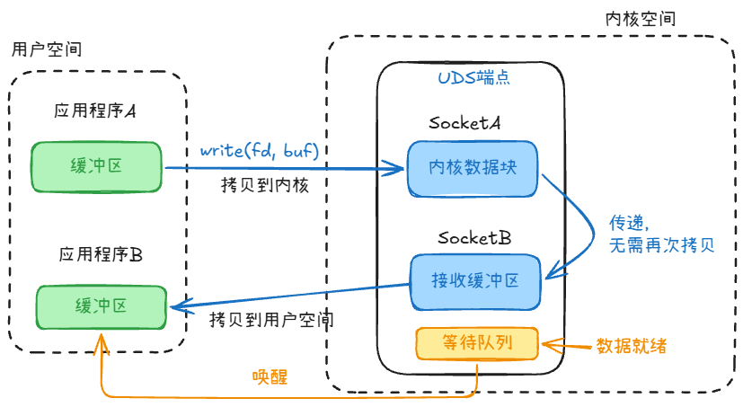

## 什么是socket

1. 从应用开发视角（API）：
    - Socket 是操作系统内核提供给程序员的一套网络通信编程接口（API）。
    - 无论上层是写 HTTP、RPC、WebSocket 还是 FTP，它们的底层归根结底都是在调用 Socket API（如 socket(), bind(), listen(), connect(), read(), write() 等）。
2. 从操作系统视角（文件/描述符）：
    - 在 Unix / Linux “一切皆文件” 的哲学中，Socket 本质上就是一个特殊的文件描述符（File Descriptor, fd）。
    - 读写网络数据，在系统调用层面和读写普通本地文件几乎一模一样：都是用 read() 和 write()。
3. 从网络协议视角（通信端点）：
    - Socket 是网络上一个唯一的通信端点。
    - 它在逻辑上由 “IP 地址 + 端口号 + 传输协议（TCP/UDP）” 唯一定位。

##  Socket 的底层长什么样

- 发送缓冲区（Send Buffer）：
	- 你的代码调用 write(fd, "hello") 时，并不是直接把数据送上了网线，而是拷贝进了内核的 Socket 发送缓冲区就返回了。
	- 网卡会在合适的时候自己从这里取走数据并打包发出。
- 接收缓冲区（Receive Buffer）：
	- 网卡收到网络数据包，拼装好后放入这个缓冲区。
	- 当你的代码调用 read(fd, buf) 时，CPU 负责把数据从接收缓冲区拷贝到你的程序内存。
- 协议状态机：
	- 记录连接当前的状态（比如 TCP 的 LISTEN, SYN_SENT, ESTABLISHED, CLOSE_WAIT 等）。
- 等待队列：
	- 当没有数据可读时，发起 read() 的线程会被挂起到这个等待队列中休眠；
	- 当网卡收到数据后，硬件中断触发，内核再从这个队列里唤醒你的线程。

## Unix Domain Socket 

 TCP Socket 设计出来的目的是为了让**不同机器**通过网络进行通信。

而 **Unix Domain Socket (UDS，Unix 域套接字)**，是它的“孪生兄弟”。它专门用于同一台机器上的不同进程之间（IPC，进程间通信）进行高效通信。

既然在同一台机器上，它就**完全不需要经过网卡、不需要 TCP/IP 协议栈、不需要计算校验和、不需要处理丢包重传**。

在文件系统中，UDS 通常表现为一个特殊的文件（文件类型为 s，如 /var/run/docker.sock）。进程通过这个文件路径来建立连接，而不是通过 IP:端口。

1. 寻址：UDS 用文件路径（如 `/tmp/app.sock`）；网络 Socket 用 IP + 端口（如 `127.0.0.1:8080`）
2. 性能：UDS 直接内存拷贝，不走协议栈；`127.0.0.1` 仍要走完整 TCP/IP
3. 资源：UDS 只占文件描述符和内核内存；网络 Socket 还占端口号、TCP 缓冲区
4. 跨主机：UDS 只能本机；网络 Socket 改 IP 就能跨机器
5. 权限：UDS 用文件权限（chmod、chown）；网络 Socket 靠防火墙或应用层鉴权
6. 特殊能力：UDS 能传文件描述符；网络 Socket 不能

## SSE 和 WebSocket

1. SSE是单向推流；WebSocket是双向流。
2. SSE是http/https协议；WebSocket 协议（通过 HTTP 握手升级为 ws:// 或 wss://）
3. SSE支持 UTF-8 文本；WebSocket 不仅支持文本，还支持二进制流

