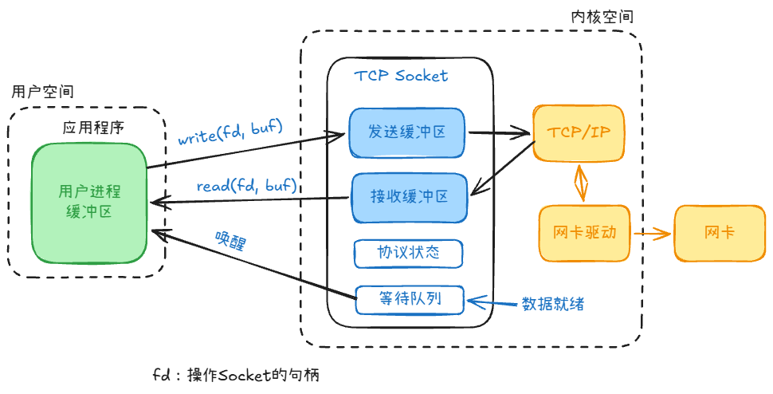
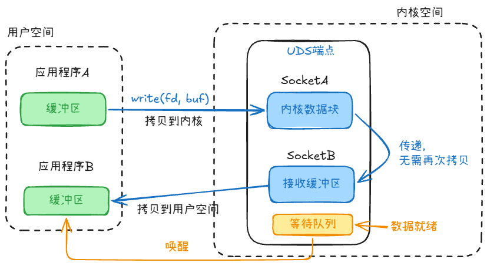

## 什么是socket

1. 从应用开发视角（API）：
    - Socket 是操作系统内核提供给程序员的一套网络通信编程接口（API）。
    - 无论上层是写 HTTP、RPC、WebSocket 还是 FTP，它们的底层归根结底都是在调用 Socket API（如 socket(), bind(), listen(), connect(), read(), write() 等）。
2. 从操作系统视角（文件/描述符）：
    - 在 Unix / Linux “一切皆文件” 的哲学中，Socket 本质上就是一个特殊的文件描述符（File Descriptor, fd）。
    - 读写网络数据，在系统调用层面和读写普通本地文件几乎一模一样：都是用 read() 和 write()。
3. 从网络协议视角（通信端点）：
    - 对 IP 网络上的监听 socket，可以用传输协议、本地 IP 和本地端口描述其绑定端点；它不能单独标识每一条已建立连接。
    - 一条已建立的 TCP 连接由源 IP、源端口、目标 IP、目标端口和传输协议这五个字段区分。若已限定为 TCP，也常简称四元组。因此同一个服务端 IP:端口可以同时对应许多客户端连接。
    - Unix Domain Socket 不使用 IP 和端口，而是在本机通过路径、抽象名称等方式寻址。

##  Socket 的底层长什么样

- 发送缓冲区（Send Buffer）：
	- 代码调用 `write(fd, "hello")` 时，成功写入通常表示数据已被内核接收处理，并不代表对端应用已收到；阻塞模式下也可能等待缓冲区可用，或只写入部分数据。
	- 内核协议栈后续组织报文并交给网卡发送。
- 接收缓冲区（Receive Buffer）：
	- 网卡收到网络数据包，拼装好后放入这个缓冲区。
	- 当你的代码调用 read(fd, buf) 时，CPU 负责把数据从接收缓冲区拷贝到你的程序内存。
- 协议状态机：
	- 记录连接当前的状态（比如 TCP 的 LISTEN, SYN_SENT, ESTABLISHED, CLOSE_WAIT 等）。
- 等待队列：
	- 对阻塞 socket，数据未就绪时调用 `read` 的线程可能休眠等待；对非阻塞 socket，`read` 会返回 `EAGAIN`，应用可通过 `epoll` 等机制等待就绪。
	- 数据到达后，内核通知等待者；具体唤醒的是线程还是运行时管理的任务，取决于 I/O 模型。

## Unix Domain Socket 

TCP Socket 可用于跨主机通信，也可通过 `127.0.0.1` 在本机进程之间通信。

**Unix Domain Socket（UDS，Unix 域套接字）**用于同一台机器上的进程间通信（IPC）。

UDS 不经过网卡或 TCP/IP 协议栈，因此省去网络寻址、路由和 TCP 重传等处理；这不等于应用缓冲区与内核之间完全不发生拷贝。普通 `write` 仍要把发送进程的数据交给内核，接收进程调用 `read` 时也通常要拷贝到自己的用户缓冲区。

使用路径命名的 UDS 在文件系统中表现为特殊的 socket 文件，例如 `/var/run/docker.sock`；Linux 还支持抽象命名空间和匿名 UDS，并非每条 UDS 连接都对应一个磁盘路径。

1. 寻址：路径命名的 UDS 可用 `/tmp/app.sock`；TCP Socket 可用 `127.0.0.1:8080` 等 IP:端口，已建立连接还要区分对端地址。
2. 数据路径：UDS 绕过网卡和 TCP/IP 协议栈；loopback TCP 虽不经过物理网卡，仍由 TCP/IP 协议栈处理。两者的实际性能差异应以具体负载测量。
3. 资源：两者都占文件描述符和内核缓冲区；TCP 还使用端口及相应协议状态。
4. 跨主机：UDS 只能用于本机；网络 Socket 可用于跨主机通信，前提是地址和网络可达。
5. 权限：路径命名的 UDS 可利用文件权限，网络 Socket 可配合防火墙；两者都可能需要应用层鉴权。
6. 特殊能力：UDS 可通过 `SCM_RIGHTS` 把文件描述符传给另一进程，传递的是描述符引用，不是把文件内容复制过去。

## SSE 和 WebSocket

1. SSE是单向推流；WebSocket是双向流。
2. SSE是http/https协议；WebSocket 协议（通过 HTTP 握手升级为 ws:// 或 wss://）
3. SSE支持 UTF-8 文本；WebSocket 不仅支持文本，还支持二进制流
