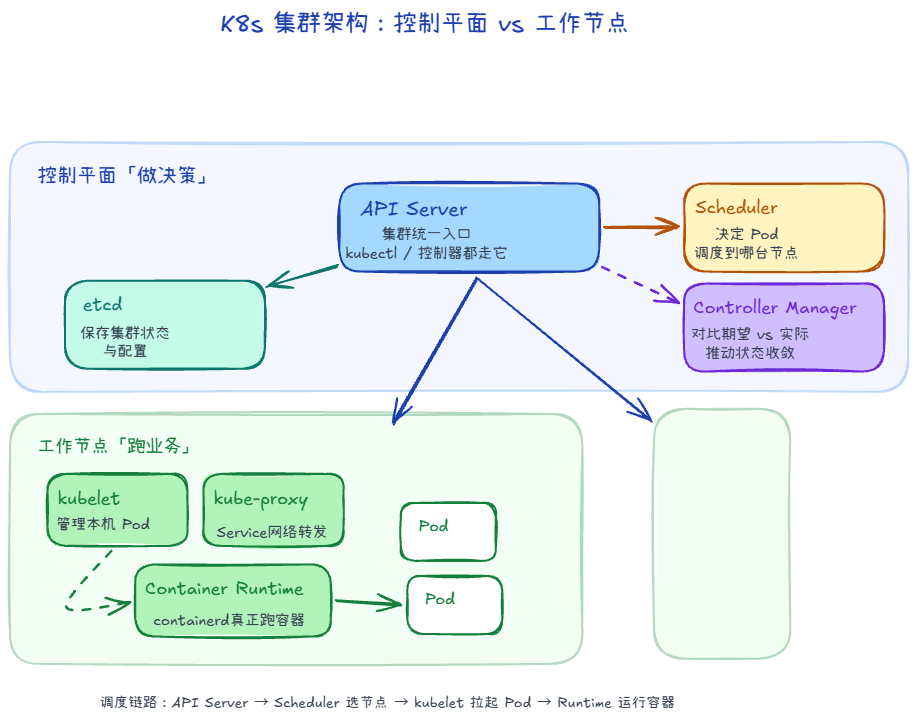
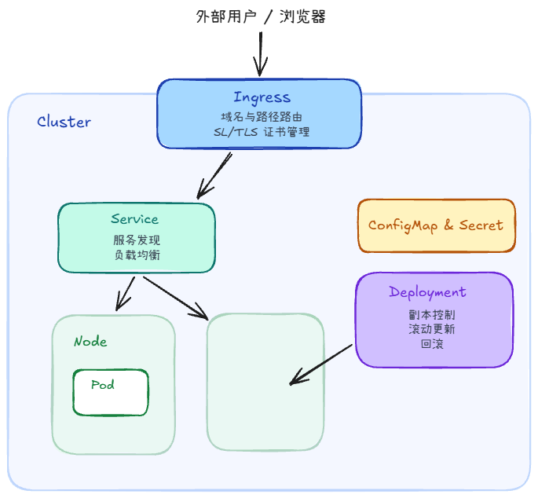

## 控制平面有哪些组件？

### 1. kube-apiserver（集群的统一网关与入口）

1. 暴露了 Kubernetes API（RESTful API），所有的外部客户端（如 kubectl、Dashboard）以及集群内部的组件（如 Scheduler、Controller）都必须通过它来交互。
2. 负责安全控制：对所有请求进行身份验证、授权和准入控制。
3. 它是唯一直接与 etcd 数据库进行读写交互的组件

### 2. etcd（集群数据库）

1. 一个高可用、强一致性的分布式键值（Key-Value）数据库。
2. 用于存储 Kubernetes 集群的所有状态信息和元数据、敏感信息与配置数据
3. 应通过 kubectl 或 Kubernetes API 修改资源；API Server 将状态写入 etcd，控制器和 kubelet 通过 API Server 的 Watch 逐步感知变化，不应直接修改 etcd 中的资源数据。

### 3. kube-scheduler（分发任务的调度器）

1. 监听 kube-apiserver 中新创建的、且尚未分配到具体 Node 的 Pod。
2. 根据一系列复杂的调度策略（如 CPU/内存资源是否充足、亲和性/反亲和性（Affinity）、污点与容忍度（Taints and Tolerations）、数据本地性等），为该 Pod 选择一个最合适的 Worker 节点（Node）去运行。
3. Pod 的资源 request 是调度时预留资源的依据；limit 是运行时的上限。CPU 超限通常被限速，内存达到 cgroup 上限可能触发 OOM Kill。没有内存 limit 的容器也可能在节点内存不足时被终止。

### 4. Controller Manager (控制器管理器)

1. 运行各种控制器进程。每个控制器都是一个“死循环”，不断地对比集群的实际状态与用户定义的期望状态（Desired State），并在不一致时尝试修复，使其达到一致。

## Node 上有哪些组件

### 1. kubelet（Node 节点上的管家）

1. 接收并执行指令：它通过 API Server 接收分配到该节点的 Pod 清单（PodSpec），并确保这些 Pod 在该节点上正常运行。
2. 容器生命周期管理：它不会直接去运行容器，而是通过 CRI（容器运行时接口） 调用容器运行时（如 Containerd）来创建、启动、停止和销毁容器。
3. 健康检查（Probes）：Liveness 失败时重启容器；Readiness 失败时将 Pod 从 Service 的可用端点中摘除，不重启；Startup 探针成功前，Liveness 和 Readiness 不执行。容器进程退出则按 Pod 的 restartPolicy 处理。
4. 状态汇报：定期向控制平面的 API Server 汇报该节点自身的资源状态（CPU、内存、磁盘等）以及 Pod 的运行状态。

### 2. kube-proxy（网络代理）

1. 实现 Service 机制：Kubernetes 的 Service 是一个逻辑概念，真正的网络路由规则是由 kube-proxy 在每个节点上实现的。
2. 网络规则维护：它监听 API Server 中 Service 和 EndpointSlice 的变化，在节点上维护转发规则（如 iptables 或 IPVS）。
3. 流量访问 ClusterIP 时由节点网络数据路径按规则选取后端 Pod，不是每个数据包都由 kube-proxy 进程转发，也不保证严格轮询。CNI 插件负责 Pod 网络连接和 IP 分配；kube-proxy 负责 Service 规则，不负责给 Pod 分配 IP。

### 3. Container Runtime（容器运行时）

1. Kubernetes 本身不直接运行容器，它需要依赖容器运行时来下载容器镜像、创建和运行容器。
2. Kubernetes 支持通过 CRI (Container Runtime Interface) 标准与多种容器运行时进行交互。
3. 常见的容器运行时：
    1. Containerd（目前最主流、最轻量级的标准选择）
    2. CRI-O（专门为 Kubernetes 设计的轻量级运行时）
    3. Docker（在新版 K8s 中已移除直接支持，但 Docker 也是基于 Containerd 的，目前通过 cri-dockerd 适配器依然可以使用）

## 资源对象


### 1. Pod（容器组）

K8s 中最小的部署和调度单元。一个 Pod 里面可以包含一个或多个容器（Container）。通常情况下，一个 Pod 只运行一个主容器。

为什么需要 Pod?

- 同一个 Pod 内的容器共享相同的网络 IP、端口空间和存储卷。它们之间可以通过 `localhost` 直接通信，就像住在一个房间里的室友。
- Pod 的网络命名空间由 Pause（infra）容器维持，业务容器加入该命名空间；默认不共享 PID 命名空间。
- 容器进程退出时，kubelet 可在原 Pod 中重启容器；Pod 被删除或替换时，新 Pod 通常会获得新的 IP。

```yml
apiVersion: v1
kind: Pod
metadata:
  name: nginx
spec:
  containers:
    - name: nginx
      image: nginx
```

### 2. Node（节点）

1. 就是我们前面提到的工作节点（可以是物理机或虚拟机）。
2. 它是 Pod 运行的物理载体。一栋大楼（Node）里可以划分出很多个房间（Pod）。

关系：一个 Node 上可以运行多个 Pod。kube-scheduler 根据资源 request、调度约束等，为尚未绑定节点的 Pod 选择 Node。

### 3. Deployment（部署/无状态控制器）

1. 它是用来管理 Pod 生命周期的控制器。
2. 在实际生产中，我们几乎从不直接创建单个 Pod，而是通过 Deployment 来创建和管理 Pod。

主要功能：
1. 副本控制：你告诉 Deployment “我要运行 3 个 Nginx Pod”，它就会维护期望副本数；Pod 被删除后由 ReplicaSet 补建，容器在原 Pod 中的重启不需要补建 Pod。
2. 滚动更新（Rolling Update）：按更新策略逐步创建新版 Pod、缩减旧版 Pod。配合 Readiness 探针和足够副本，可降低升级中断风险；不能仅凭滚动更新配置保证零停机。
3. 回滚（Rollback）：如果新版本上线后发现有 Bug，可以一键回滚到上一个稳定版本。
4. 自动扩缩容：HPA 根据 CPU、内存或自定义指标调整 Deployment 的副本数。CPU/内存利用率目标依赖容器的相应资源 request；request 是计算利用率的分母。

```yml
apiVersion: apps/v1
kind: Deployment
metadata:
  name: nginx
spec:
  replicas: 3
  selector:
    matchLabels:
      app: nginx
  template:                 # Pod 的定义模板
    metadata:
      labels:
        app: nginx
    spec:
      containers:
        - name: nginx
          image: nginx
```

负责运行和管理 Pod 的工作负载资源（控制器）：
- Deployment：适合无状态应用，如 Web 服务。支持扩缩容、滚动升级和回滚。
- ReplicaSet：保证指定数量的 Pod 一直存在。通常由 Deployment 自动创建，不直接使用。
- DaemonSet：让每个符合条件的节点各运行一个 Pod，常用于日志采集、监控 Agent。
- StatefulSet：适合有状态应用；Pod 使用 `web-0` 这样的稳定序号，可配合 Headless Service 得到稳定 DNS，通过 PVC 保留存储，并按序创建、删除 Pod。无状态服务通常使用 Deployment。

### 4. Service（服务）

1. 由于 Pod 的 IP 地址经常变化（一重建 IP 就变了），客户端无法直接通过 Pod IP 稳定地访问应用。
2. Service 就是定义了一组 Pod 的持久访问入口（稳定 IP 和 DNS 域名）。

主要功能：
1. 服务发现：不管后端的 Pod 怎么销毁重建、IP 怎么变，Service 的 IP（ClusterIP）是固定不变的。
2. 负载均衡：当流量到达 Service 时，它会自动将请求分发（负载均衡）给后端的多个 Pod。

```yml
apiVersion: v1
kind: Service
metadata:
  name: nginx
spec:
  selector:
    app: nginx
  ports:
    - port: 6666
      targetPort: 80
  type: ClusterIP
```

- ClusterIP
    - 默认类型，只允许从集群内部访问：集群内客户端 → ClusterIP → Pod
    - 适合 Web 服务访问数据库、服务之间互相调用。
- NodePort
    - 在每个节点开放一个端口，外部可通过：任意节点IP:NodePort → Service → Pod
    - 默认 NodePort 范围通常是 30000–32767。
- LoadBalancer
    - 由云平台提供一个外部负载均衡器和公网入口：公网IP → 云负载均衡器 → Service → Pod
    - 本地自建集群如果没有安装相应实现，EXTERNAL-IP 可能一直显示 <pending>。
- ExternalName
    - 不代理到 Pod，而是通过 DNS 把 Service 名称映射到外部域名。

### 5. Ingress（应用路由入口）

1. Service 主要负责集群内部的访问和四层（TCP/UDP）负载均衡。而 Ingress 则是集群的统一外网入口（七层 HTTP/HTTPS 路由）。

主要功能：
1. 域名与路径路由：它可以根据域名或 URL 路径，将外部请求分发到不同的 Service。例如：
    - 访问 `api.example.com` -> 路由到 `api-service`
    - 访问 `example.com/web` -> 路由到 `web-service`
2. SSL/TLS 证书管理：在 Ingress 处统一配置 HTTPS 证书，无需在每个 Pod 里单独配置。

> 注意：使用 Ingress 需要在集群中部署一个 Ingress Controller（最常用的是 Nginx Ingress Controller）。*

### 6. ConfigMap & Secret

- ConfigMap：用来存储明文的配置参数（如数据库连接地址、环境变量），实现“代码与配置分离”。
- Secret：存储密码、Token、密钥等敏感数据。API 中的 `data` 字段使用 Base64 编码，它不是加密；应限制 RBAC 读取权限，按需要配置 etcd 静态数据加密。


---

## 问题

### 如果一个 Pod 挂了，会发生什么？

1. 如果容器进程退出，kubelet 按 Pod 的 restartPolicy 在原 Pod 中重启容器；`CrashLoopBackOff` 仍是该 Pod 中的容器反复启动失败。
2. 如果 Deployment 管理的 Pod 被删除、驱逐或节点失联后被判定需要替换，ReplicaSet 才创建新 Pod，Scheduler 再为未绑定的新 Pod 选择健康节点。

### 如果整个 Node 挂了，会发生什么？

1. 节点通过 Lease 和状态更新报告心跳。控制平面在一段时间收不到心跳后将 Node 标记为 NotReady；检测时间受集群配置影响，常见值约 40 秒。
2. 节点控制器在 **Node** 上施加 `node.kubernetes.io/not-ready` 或 `node.kubernetes.io/unreachable` 污点。Pod 默认带有约 300 秒的 `NoExecute` 容忍时间，具体也可配置。
3. 容忍时间届满后，受控制器管理的旧 Pod 被驱逐或删除，控制器补建新 Pod；Scheduler 把新 Pod 调度到符合条件的健康节点。节点故障恢复和存储解绑等过程可能影响实际耗时。

### ConfigMap 变了，Go 进程怎么感知？

在Go+MySQL的场景下，如果数据库地址改了：

1. 环境变量（Env）注入
    - 修改 ConfigMap 中的 `MYSQL_DSN` 不会改变现有容器的环境变量；应用启动时读取的值也不会自动更新。
    - 可执行 `kubectl rollout restart deployment/my-go-app`，让新 Pod 读取新值。
2. Volume 挂载文件
    - ConfigMap 以普通 Volume 挂载时，kubelet 会在一段时间后更新投射文件；使用 `subPath` 挂载则不会自动收到更新。
    - Go 程序可以监听文件变更并重新加载配置，也可以定期读取；需要处理临时文件替换、校验失败和并发读写。
3. 独立配置中心（如 Nacos、Apollo）
    - 应用可订阅独立配置中心的变更。这与直接读写 Kubernetes 自己的 etcd 是两回事，通常不要让业务程序直接连接集群 etcd。
