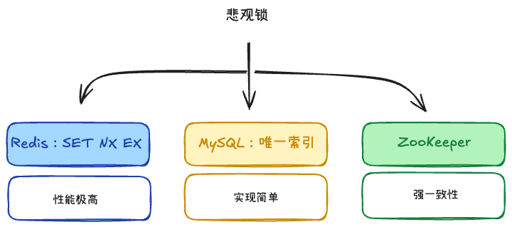

# 分布式锁的实现 +3

## 1. Redis的SET NX EX

**互斥性与原子性**
1. 传统的做法是先 SETNX（如果不存在则设置），再用 EXPIRE 设置过期时间防止服务崩溃导致死锁。但这是两步操作，如果执行完第一步服务器挂了，过期时间没设成功，就会产生永久死锁。
2. 在 Redis 2.6.12 之后，使用一条命令即可解决：SET lock_key unique_value NX EX
3. EX (Seconds)，PX (Milliseconds)

**锁误删**
1. A拿到锁开始执行，但还没执行完，锁就过期了；B成功拿到锁，这时A执行完毕，开始删锁，导致误删
2. 加锁时注入唯一标识（如 UUID/线程 ID）： value 不能是固定值，必须是当前线程的唯一标识。
3. 释放锁时先校验再删除： 只有当锁的 value 等于自己的唯一标识时，才允许删除。

**释放锁的原子性**
1. 承接上一步，“校验 value” 和 “删除 key” 是两步操作（GET ＋ DEL）
2. 所以必须使用 Lua 脚本。Redis 执行 Lua 脚本是单线程、原子性的，能保证校验和删除一气呵成

**锁超时与续期问题**
- 设太短：业务没执行完，锁提前过期，导致并发安全问题。
- 设太长：如果服务挂了，别的服务要等很久锁才能释放，影响性能。

所以使用锁续期（Watchdog / 看门狗）机制。
1. 在加锁成功时，启动一个后台守护线程（比如每隔 10 秒检查一次）。
2. 如果业务还没执行完，后台线程自动延长锁的 TTL（比如重新刷回 30 秒）。
3. 业务执行完释放锁时，关闭这个守护线程。
（Java 的 Redisson 框架已经完美实现了这个 Watchdog 功能）

**可重入性问题**
同一个线程在持有了锁之后，如果后续的代码（比如同一个线程内的嵌套方法）再次请求获取同一把锁，应该被允许，否则会造成死锁（自己卡死自己）。

1. 不能用简单的 String 结构，改用 Hash 结构。Hash 的 key 是锁的名字，field 是线程标识，value 是锁的重入计数（Counter）。
2. 加锁时，如果是同一个线程，计数器 +1；释放锁时，计数器 -1，直到计数器为 0 时才真正执行 DEL。

## 2. MySQL的唯一索引
- 实现简单
- 并发性低

## 3. etcd、ZooKeeper
- 复杂
- 强一致性

# 分布式ID

## 1. UUID
- 本地生成，性能高。
- 不依赖其它服务
- 太长，无序

## 2. 数据库自增和号段模式
- 性能比每次查数据库高很多。
- ID 趋势递增，对数据库索引友好。

## 3. 雪花算法：0 | timestamp | machine-id | sequence
- 生成的是整数，适合做数据库主键
- 依赖机器时钟，时钟回拨可能导致重复。

## 4. Redis 生成 ID
- 强依赖 Redis。
- Redis 持久化和主从切换要处理好，否则可能丢失或回退