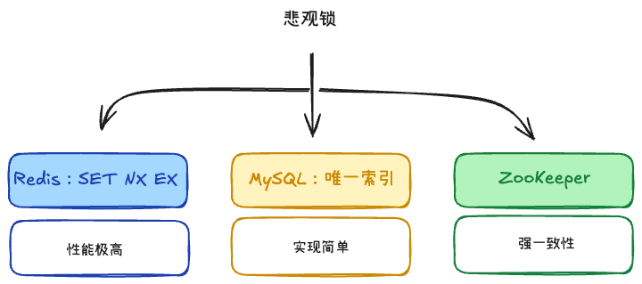
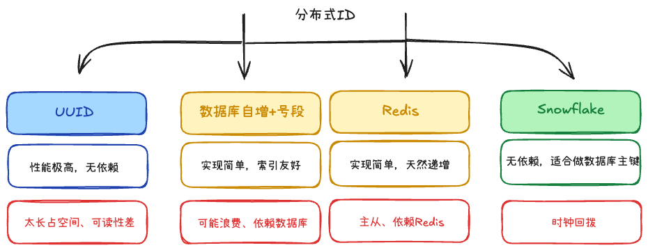

# 分布式锁的实现 +3

## 1. Redis的SET NX EX

**互斥性与原子性**
1. 传统的做法是先 SETNX（如果不存在则设置），再用 EXPIRE 设置过期时间防止服务崩溃导致死锁。但这是两步操作，如果执行完第一步服务器挂了，过期时间没设成功，就会产生永久死锁。
2. 使用一条命令同时设置锁和过期时间：`SET lock_key unique_value NX EX 30`。返回成功才算取得锁。
3. EX (Seconds)，PX (Milliseconds)

**锁误删**
1. A拿到锁开始执行，但还没执行完，锁就过期了；B成功拿到锁，这时A执行完毕，开始删锁，导致误删
2. 每次加锁都使用唯一随机值（如 UUID）作为 value，不能只用固定的进程或线程 ID。
3. 释放锁时先校验再删除： 只有当锁的 value 等于自己的唯一标识时，才允许删除。

**释放锁的原子性**
1. 承接上一步，“校验 value” 和 “删除 key” 是两步操作（GET ＋ DEL）
2. 所以必须使用 Lua 脚本。Redis 执行 Lua 脚本是单线程、原子性的，能保证校验和删除一气呵成

**锁超时与续期问题**
- 设太短：业务没执行完，锁提前过期，导致并发安全问题。
- 设太长：如果服务挂了，别的服务要等很久锁才能释放，影响性能。

普通 `SET NX EX` 不会自动续期。业务确需长时间持锁时，客户端可在确认自己仍持有锁后续期，例如后台 goroutine 定期更新 TTL；续期失败必须停止依赖该锁的写操作。Redisson 的 Watchdog 是客户端能力，并非 Redis 命令自带功能。

**可重入性问题**
普通 `SET NX EX` 锁不可重入；同一执行单元再次获取同一把锁也会失败。如果业务确实需要重入，可由客户端记录持有者身份与重入次数，并保证加锁、续期和释放的原子性。

例如 Redisson 使用 Hash 记录持有者和计数；这属于库的实现方案，不能把它当成 Redis 锁的默认语义。

**失效边界**

- TTL 到期但原业务仍在执行时，另一个客户端可能拿到锁。续期也无法消除所有暂停、网络故障造成的窗口。
- Redis 主库写入锁后、复制到从库前就故障切换，新主可能让另一客户端再次获得同一把锁。因此单实例或异步主从 Redis 锁不应承诺强一致互斥；对写入正确性要求很高时，还需业务侧幂等、版本校验或 fencing token 等保护。

## 2. MySQL的唯一索引
- 实现简单
- 并发性低

## 3. etcd、ZooKeeper

- etcd 可用 lease 绑定锁键；租约到期后键自动删除。ZooKeeper 可用临时节点，持有者会话失效后节点消失。
- 两者依赖多数派达成一致，适合需要更强锁语义的场景，但仍要处理持有者长时间暂停、会话失效后继续写入等问题。

# 分布式ID

选型时先看是否需要短整数主键、趋势递增和离线生成：UUID v4 本地生成但长且无序；雪花算法生成趋势递增整数，需要管理机器号和时钟；号段模式减少数据库访问次数。

## 1. UUID
- 本地生成，性能高。
- 不依赖其它服务
- UUID v4 较长且随机，直接作为 InnoDB 聚簇主键通常会增加索引维护成本。

## 2. 数据库自增和号段模式
- 数据库自增每次分配依赖数据库；号段模式一次从数据库领取一个区间，再由应用在内存中逐个发号，降低数据库访问频率。
- ID 趋势递增，对数据库索引友好；号段用尽或服务重启时要重新领取，允许出现不连续的 ID。

## 3. 雪花算法：0 | timestamp | machine-id | sequence
- 常见实现生成 64 位趋势递增整数，适合做数据库主键；机器号必须避免冲突。
- 依赖机器时钟，时钟回拨可能导致重复或生成失败，需要明确回拨处理策略。

## 4. Redis 生成 ID
- 强依赖 Redis。
- Redis 持久化和主从切换要处理好，否则可能丢失或回退
