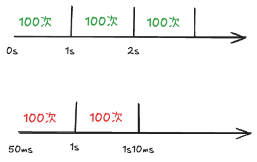
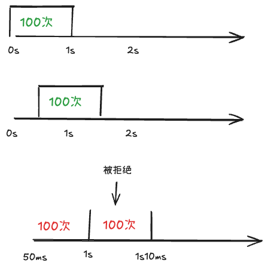
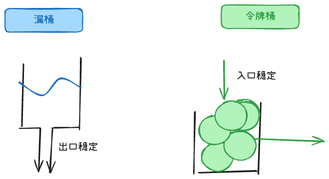

## 限流算法有哪些？ +1
### 固定窗口计数器



每分钟只能有x个请求，实现简单。

但是有临界突刺问题，比如第1秒最后10ms进来100个请求，第2秒前10ms又进来100个请求，短时间内实际通过了200个请求。

最简单的 Redis 实现是 String + INCR。

### 滑动窗口计数器、滑动日志



规则举例：任意连续 1 秒内，最多 100 次请求。

1. 滑动窗口计数器

滑动窗口把一个大窗口拆成多个小格子，请求来了就落到当前小格子里，统计最近一段时间所有格子的总和

比如拆成6格，每格10ms，只记录来了几次。新请求来了，该格+1，然后把最近6格的次数加起来，如果超过100，则拒绝请求。

```
Key:   ratelimit:login:10001          ← 一个用户一个 key
Field: 1718000060, 1718000061, ...   ← 每个小格的时间戳（10秒一格）
Value: 该格子的请求次数

HINCRBY ratelimit:login:10001 1718000060 1
# 删掉 6 格以前的 field，HGET 最近 6 个 field 求和
```

2. 滑动日志

而滑动日志会记录每个请求的时间戳，每次请求进来时删除窗口外的旧记录，再判断窗口内请求数是否超过阈值。精度更高。

来一个请求，就记一条时间戳；每次判断时：删掉 60 秒之前的旧记录。数还剩多少条，超过 100 → 拒绝

滑动日志要存的是：每一次请求的时间，不是「某 10 秒来了几次」。

```
用 Hash 会遇到的问题:
1. field 会冲突：假设10:00:05 这一秒内来了 3 次 → 同一个 field，只能存一个数，丢请求
2. Hash 没有「按 score/时间范围删除」这种操作

ZSET 结构：
score  = 请求时间戳（用于排序、范围删）
member = 唯一 ID（如 nanoid，或 timestamp+uuid，防重复）

每次请求：
# 1. 删掉窗口外的
ZREMRANGEBYSCORE ratelimit:login:10001 0 (now - 60)
# 2. 看窗口内有多少
count = ZCARD ratelimit:login:10001
# 3. 未超限则记录本次
if count < 100:
    ZADD ratelimit:login:10001 now {unique_id}
```

### 漏桶、令牌桶算法



漏桶把请求看成水，请求先进入桶，桶以固定速率向外流出。出口速率稳定，但即使系统暂时有空闲能力，也只能按固定速率放行。

令牌桶按固定速率生成令牌，请求必须拿到令牌才能通过。漏桶控制的是流出速率，更强调平滑。

 Go 官方的 `x/time/rate` 库实现了令牌桶算法。

## 简洁版

常见的限流算法有 5 种：

1. 固定窗口 ：在固定时间窗口内限制请求数，比如每分钟 100 个。但它有"突刺流量"问题——窗口边界可能有 2 倍流量。

2. 滑动窗口 ：把大窗口分成多个小格子（比如 1 分钟分成 6 个 10 秒格子），新请求只统计最近 6 个格子的总和。这样平滑了边界。

3. 滑动日志 ：按时间戳记录每个请求，统计时只保留最近 1 分钟的日志。最精确，但存储开销大。

4. 漏桶 ：出口按固定速率流出，强行平滑流量。

5. 令牌桶 ：按固定速率加令牌，请求拿令牌才能处理。 优点是可以处理突发流量 ——如果桶里有积攒的令牌，突发请求可以一次性处理。