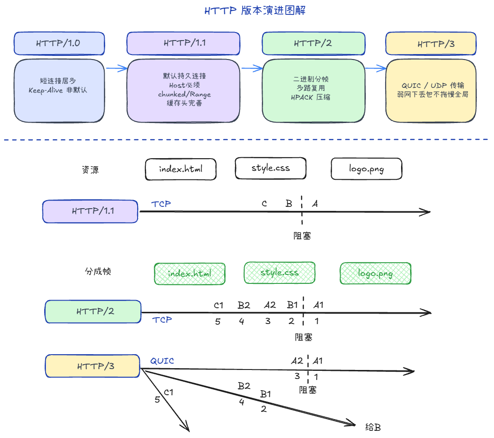

## HTTP 1.0/1.1的区别 +1

1. 响应码多了
2. 缓存控制策略更精细
3. 1.0是整包上传；1.1支持分段、断点续传
4. 1.1强制要写Host
5. 1.1是默认持久连接（Keep-Alive）

## HTTP 各版本的区别 +1

1. **1.0 / 1.1**：一条 TCP 上请求基本按序走（A→B→C），前面卡住后面都得等 → **队头阻塞**
2. **2**：二进制分帧 + 多路复用，A1、B1 可交错发；但底层仍是 **一条 TCP 字节流**，丢一个包整条连接上的流都可能被拖住 → **TCP 层队头阻塞**
3. **3**：跑在 **QUIC（UDP）** 上，仍是单连接多路复用，但各 **Stream 独立** 排序/重传 → A 流丢包，B 流不必等

## QUIC 的优点 +1

1. 传输握手与 TLS 合并，比 TCP 三次握手再 TLS 更少 RTT（首次约 1-RTT）
2. 用 **Connection ID** 标识连接，不绑死四元组，换网（Wi-Fi→4G）可不断连
3. **Stream 级**多路复用，缓解 HTTP/2 被底层 TCP「连坐」的队头阻塞

