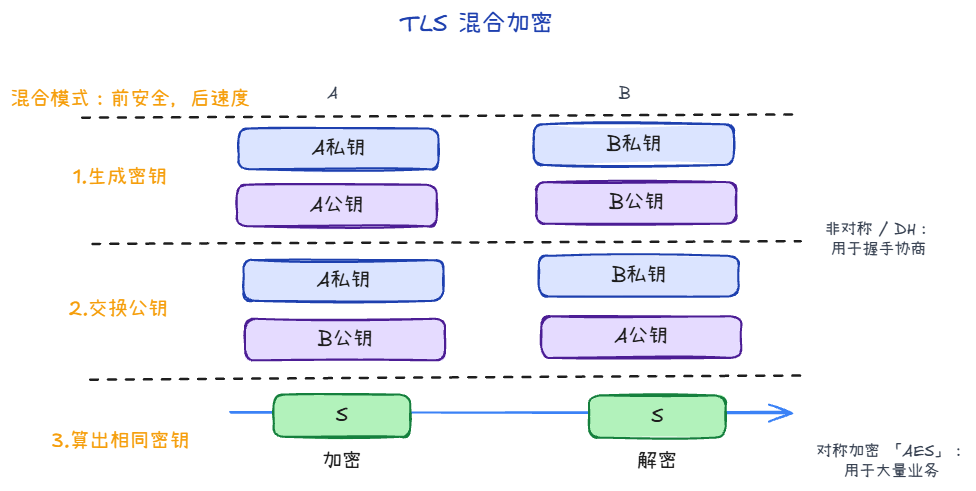
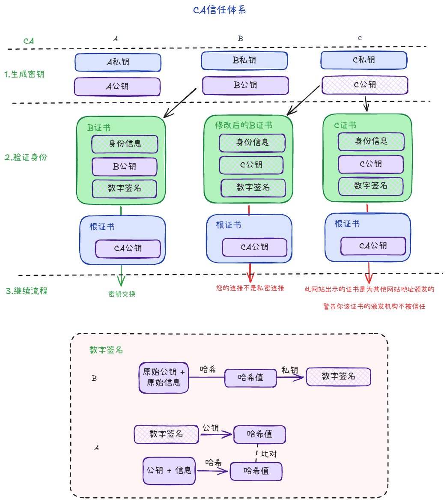

**HTTPS = HTTP + TLS**。TCP 建连后先做 TLS 握手，再在同一连接上传 HTTP（线路上是密文）。

## 典型顺序

1. **TCP 三次握手**
2. **TLS 握手**：协商版本、密码套件、交换密钥参数
3. 服务端返回**证书链**，客户端校验域名、有效期、CA 签名
4. 双方导出**会话密钥**（对称密钥）
5. 后续 HTTP 请求/响应用会话密钥 **AES 对称加密**传输

## 算法（混合加密）

TLS 不用「全程非对称」，而是**握手非对称 + 传数据对称**：

**密钥交换（ECDHE / DH，现代 TLS 主流）**

1. 客户端、服务端各自生成**临时**公钥/私钥，交换公钥（不直接传会话密钥）
2. 客户端用「自己私钥 + 对方公钥」算出共享秘密 S；服务端同理，得到**同一份 S**
3. S 再派生出**会话密钥**，后续 HTTP 数据用 **AES** 加解密

**为什么不用 RSA 全程加密业务数据？**

- 对称加密（AES）：快，适合大量数据
- 非对称加密：慢，只用在握手阶段协商密钥 / 验签

## 证书（防中间人）

只交换公钥不够：中间人可截获并换成自己的公钥，分别与两端建会话。

### 证书里有什么

1. 明文信息部分（TBS, To Be Signed）：
    - 服务器的公钥（Public Key）（极其重要，用于后续握手协商对称密钥）。
    - 绑定的域名（Subject / SAN）（如 *.google.com、example.com）。
    - 颁发者信息（Issuer）（比如 DigiCert、Let's Encrypt）。
    - 证书有效期（Validity）（生效日期与失效日期）。
    - 序列号、签名算法（如 SHA256withRSA）等。
2. CA 的数字签名（Digital Signature）：
    - 证书颁发机构（CA）对上述全部明文信息进行哈希后，用 CA 自己的私钥 加密生成的签名。

### 客户端怎么验

1. 用系统/浏览器内置的**受信根证书**验证证书链
2. 检查访问域名是否匹配、是否过期/吊销
3. 验签通过 → 确认公钥确实属于该站点，再进入密钥交换

验签步骤：
1. B对明文信息进行哈希，用 CA 自己的私钥 加密生成的签名。
2. A收到明文+数字签名
    1. 对明文信息进行哈希A
    2. 对签名用 CA 公钥 解密得到哈希B
    3. 比对看是否正确

### 信任链

[ 根证书 Root CA ] ────────── (微软/苹果/Google 提前预埋在操作系统或浏览器中，天生信任)
        │ 签名并颁发
        ▼
[ 中间证书 Intermediate CA ] ── (由服务端在握手时一并下发，用来隔离风险)
        │ 签名并颁发
        ▼
[ 服务器证书 Server / Leaf ] ── (绑着你网站的域名和公钥)

1. 逐级往上验：
    - 用浏览器访问 https://xxx.com，服务器会把**一整串证书（证书链）**扔给你的浏览器
    - 客户端用中间 CA 的公钥验证服务器证书的签名；
    - 接着，客户端用根 CA 的公钥去验证中间 CA 证书的签名；
2. 信任的锚点（Trust Anchor）：
    - 最终会追溯到顶层的 根 CA（Root CA）。
    - 根证书是自签名的（自己给自己签名）。
    - 客户端为什么信它？因为各大根 CA 的根证书，在操作系统或浏览器出厂安装时，就已经被硬编码放进了系统的“受信任的根证书颁发机构”列表（Trust Store）中！
