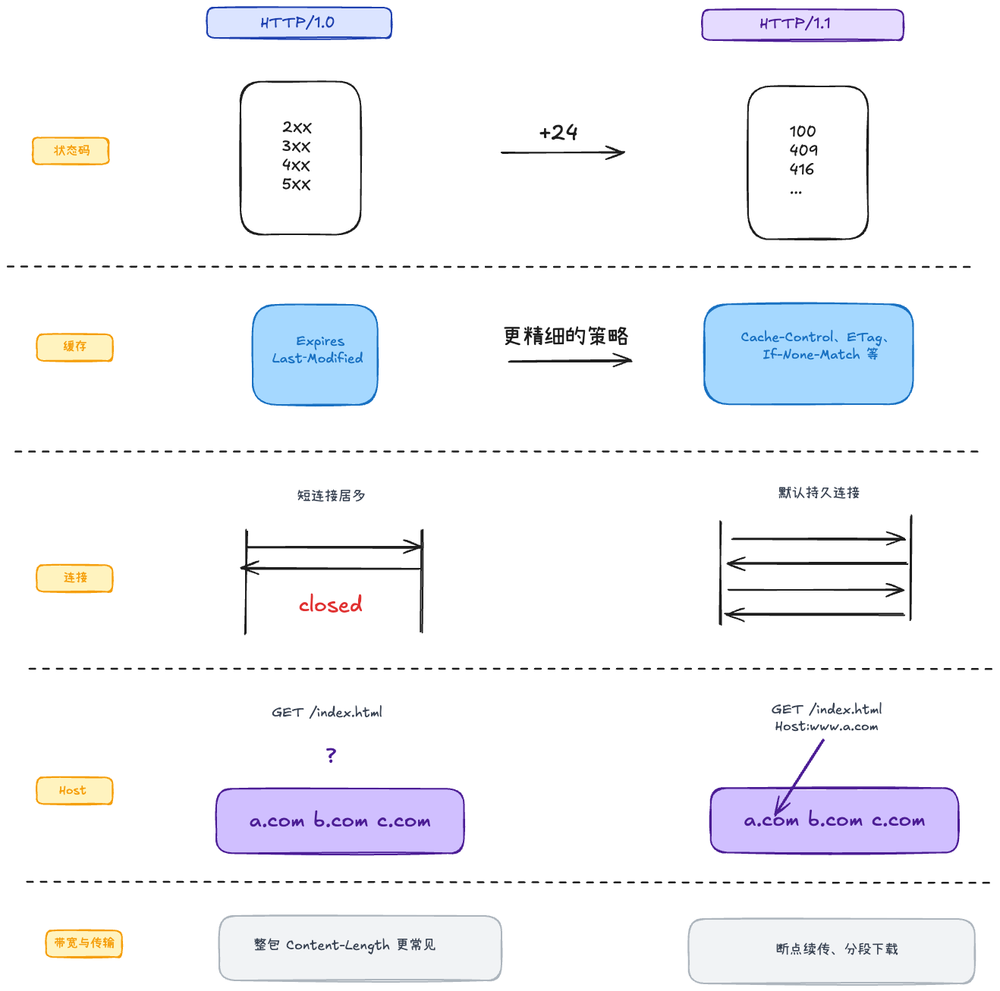
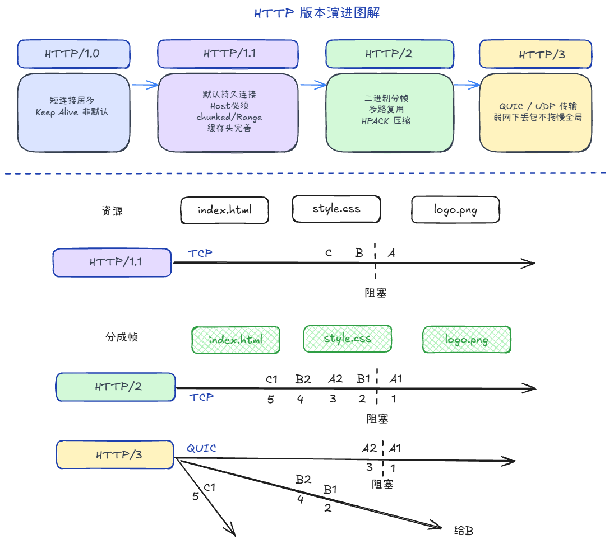

## HTTP 1.0/1.1的区别 +1

1. 响应码多了
2. 缓存控制策略更精细
3. 1.0是整包上传；1.1支持分段、断点续传
4. 1.1强制要写Host
5. 1.1是默认持久连接（Keep-Alive）

## HTTP 各版本的区别 +1

1. **1.0 / 1.1**：一条 TCP 上请求基本按序走（A→B→C），前面卡住后面都得等 → **队头阻塞**
2. **2**：二进制分帧 + 多路复用，A1、B1 可交错发；但底层仍是 **一条 TCP 字节流**，丢一个包整条连接上的流都可能被拖住 → **TCP 层队头阻塞**
3. **3**：跑在 **QUIC（UDP）** 上，仍是单连接多路复用，但各 **Stream 独立** 排序/重传 → A 流丢包，B 流不必等

**QUIC 的优点**

1. 传输握手与 TLS 合并，比 TCP 三次握手再 TLS 更少 RTT（首次约 1-RTT）
2. 用 **Connection ID** 标识连接，不绑死四元组，换网（Wi-Fi→4G）可不断连
3. **Stream 级**多路复用，缓解 HTTP/2 被底层 TCP「连坐」的队头阻塞

## HTTPS +1

**HTTPS = HTTP + TLS**。TCP 建连后先做 TLS 握手，再在同一连接上传 HTTP（线路上是密文）。

### 典型顺序

1. **TCP 三次握手**
2. **TLS 握手**：协商版本、密码套件、交换密钥参数
3. 服务端返回**证书链**，客户端校验域名、有效期、CA 签名
4. 双方导出**会话密钥**（对称密钥）
5. 后续 HTTP 请求/响应用会话密钥 **AES 对称加密**传输

### 算法（混合加密）

TLS 不用「全程非对称」，而是**握手非对称 + 传数据对称**：

**密钥交换（ECDHE / DH，现代 TLS 主流）**

1. 客户端、服务端各自生成**临时**公钥/私钥，交换公钥（不直接传会话密钥）
2. 客户端用「自己私钥 + 对方公钥」算出共享秘密 S；服务端同理，得到**同一份 S**
3. S 再派生出**会话密钥**，后续 HTTP 数据用 **AES** 加解密

**为什么不用 RSA 全程加密业务数据？**

- 对称加密（AES）：快，适合大量数据
- 非对称加密：慢，只用在握手阶段协商密钥 / 验签

### 证书（防中间人）

只交换公钥不够：中间人可截获并换成自己的公钥，分别与两端建会话。

**证书里有什么**

1. 站点身份（域名、有效期等）
2. 站点**公钥**
3. CA 对证书内容的**数字签名**

**客户端怎么验**

1. 用系统/浏览器内置的**受信根证书**验证证书链
2. 检查访问域名是否匹配、是否过期/吊销
3. 验签通过 → 确认公钥确实属于该站点，再进入密钥交换

**数字签名**

CA 对证书信息做哈希，用 CA **私钥**签名；客户端用 CA **公钥**验签。中间人改不了合法签名，也拿不到 CA 私钥伪造「属于目标域名」的证书。

