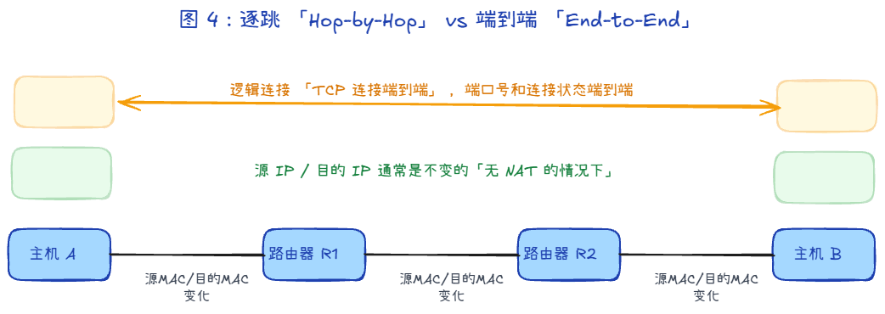
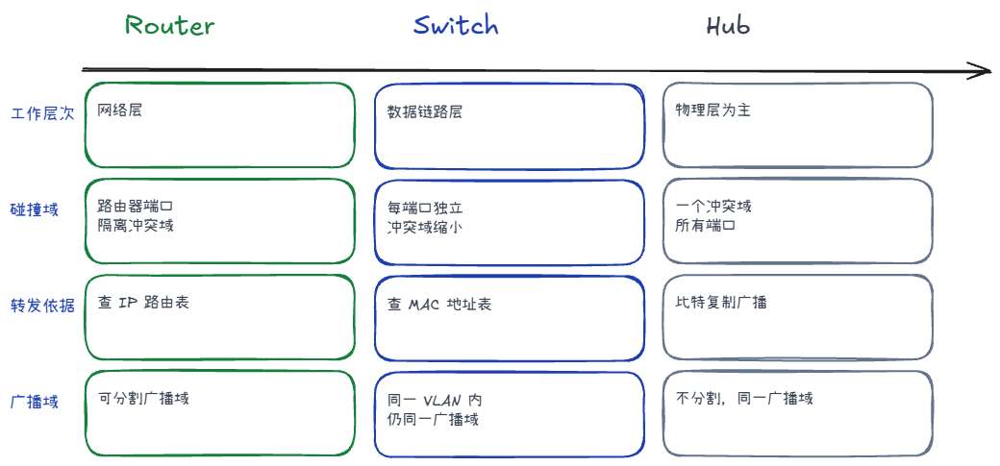

## IP 地址和子网掩码 +1

IP是由网络号和主机号组成的

子网掩码与IP地址相与得到网络号

## IP 和 MAC 的区别？ +1

1. IP属于网络层，MAC属于这个数据链路层。
2. IP 端到端寻址，MAC 链路层下一跳寻址；跨网段时目标 IP 不变，MAC 会随每一跳变化
3. IP 跨网络，找到目标主机所在网络； MAC同一局域网内，精准找到某台物理网卡
IP就像地址，MAC相当于你家的门牌，快递跨小区运输时只看地址，送到小区门口，再按照这个门牌号找到你家。

## 交换机和路由器的区别？ +1

1. 层级：交换机是数据链路层的，针对MAC地址；路由器是网络层的，针对IP地址
2. 广播域：交换机是不能隔离广播域的，广播帧会发给所有的端口；路由器是每个端口都是一个独立的广播域，天然的阻隔了广播风暴。
