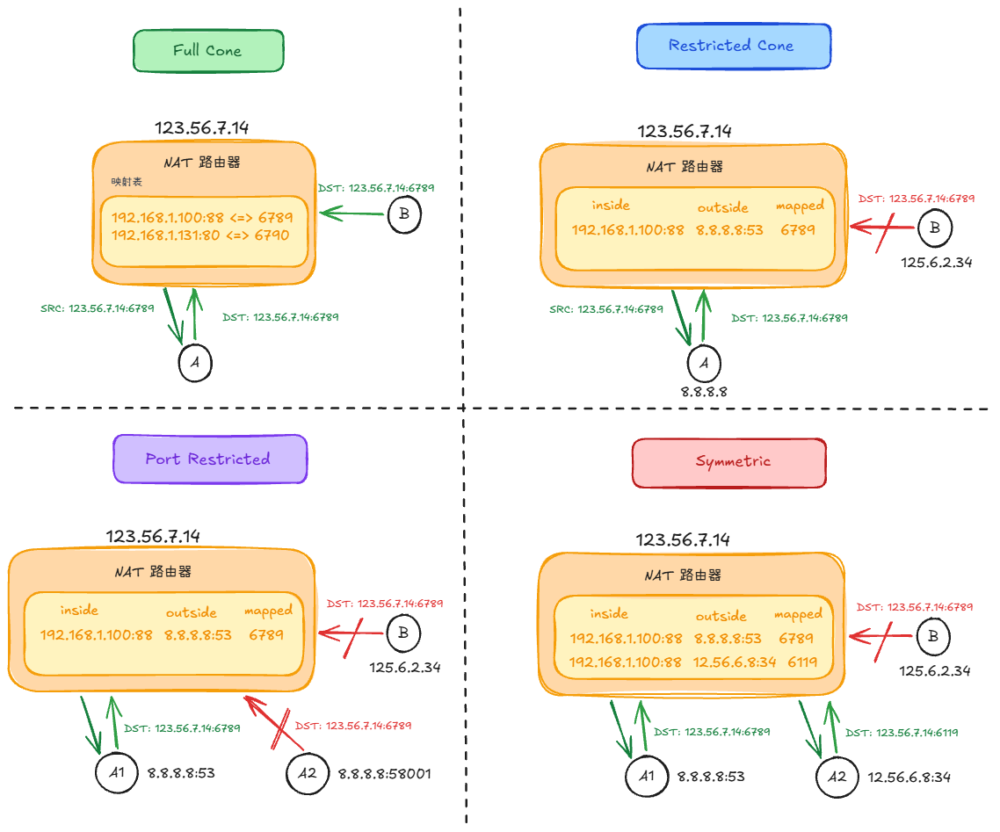
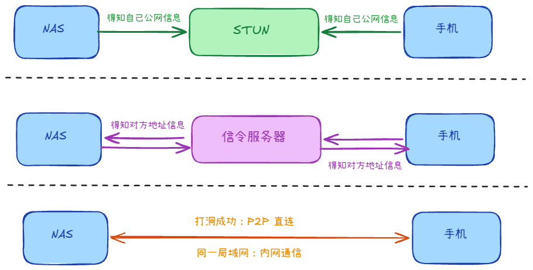
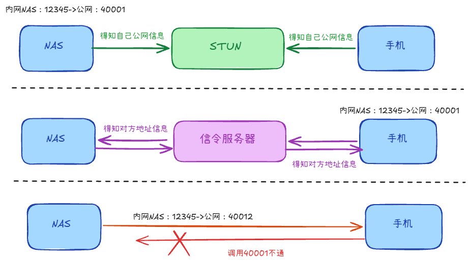

因为项目和这个有关，所以可能被问的多一些

## NAT 是什么？

为了解决IPV4地址不足的问题，有了NAT技术的出现，让内网的多个设备可以通过NAT来共享一个公网地址去向外网访问。

副作用：内网可主动出站；外网一般不能主动连内网（映射表里没有）→ 才有穿透问题

## 常见类型有哪些？

路由器有个映射表，出站时记 内网 IP:Port ↔ 公网 IP:Port

1. 全锥型：映射之后地址不变，任何地址都可以通过这个公网地址访问内网设备
2. 受限型：只有被访问过的地址，才能通过这个公网地址访问内网设备
3. 端口受限：只有被访问过的地址+端口，才能通过
4. 对称型：针对不同的访问地址，会映射不同的端口

打洞难度越来越大

## NAT 穿透怎么做？

**STUN穿透**
- 两方向 STUN 查询，得到自己在 NAT 外的公网 IP:Port
- 两方通过信令服务器交换公网地址
- 双方同时发请求，为了在映射表里留下记录
- 此时再发，就能通信了

**TURN穿透**
- 在对称型NAT时，STUN穿透困难，因为地址会变化
- 服务端会连接TURN服务器，它会生成一个新的地址
- 服务端把这个地址给客户端，让它请求
- 双方就通过这个TURN服务器进行转发通信

