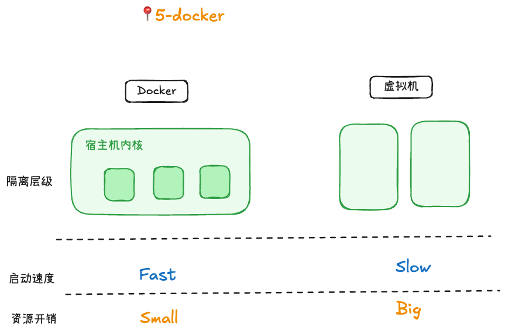
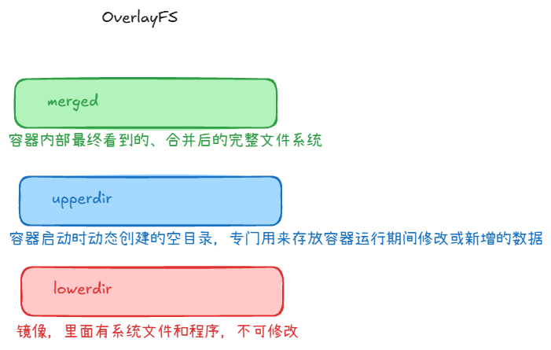
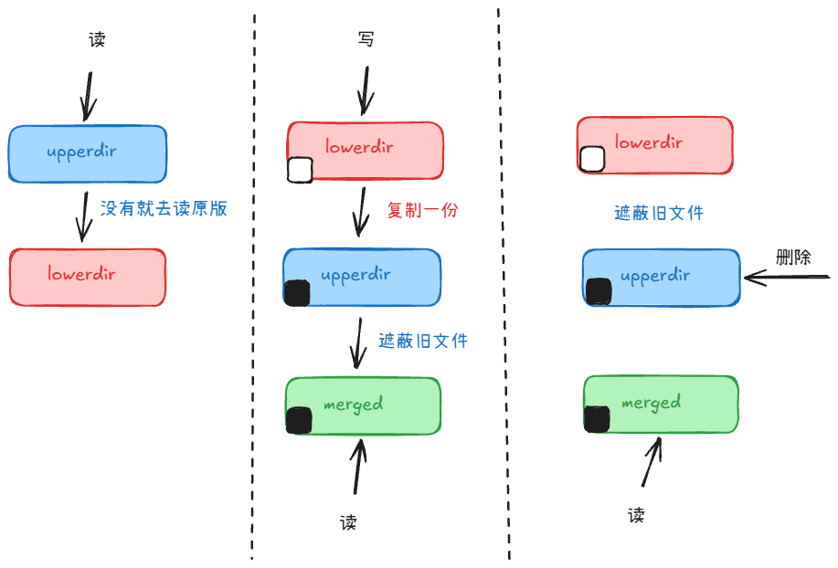
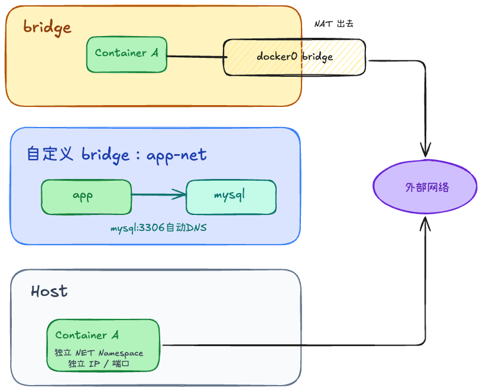

## Docker 为什么比虚拟机快？



Docker 不是虚拟机。容器共享宿主机内核，虚拟机则有完整 Guest OS 和独立内核。

| 维度   | Docker 容器     | 虚拟机           |
| ---- | ------------- | ------------- |
| 隔离层级 | 进程级隔离，共享宿主机内核 | 硬件级虚拟化，独立操作系统 |
| 启动速度 | 秒级甚至更快        | 通常更慢          |
| 资源开销 | 较小            | 较大            |
| 隔离强度 | 相对弱，依赖内核能力    | 更强            |
| 典型场景 | 应用交付、微服务部署、CI | 多系统运行、强隔离环境   |

## Docker Image 和 Container 有什么区别？

1. 状态：Image是静态的；Container是动态的，正在运行的
2. 可读写性：Image只读；Container只写
3. 占用空间：Image较大
4. 关系：一个Image可以启动N个容器；一个容器基于一个镜像启动

### Image 为什么是只读的？

为了安全、分层共享、极速启动和节省空间。

### Container 为什么可以写？



为了满足程序运行时的写需求，并通过 OverlayFS 的 Copy-on-Write 技术，在不破坏只读镜像的前提下，为每个容器提供独立的写入沙盒



## Docker 为什么镜像这么小？

1. 不包含内核
2. 只保留了程序运行所必须的最小化运行时环境，去掉了图形界面、硬件驱动等

### alpine 为什么只有几 MB？

1. 用 musl libc 代替 glibc，体积更小，速度极快、更加安全。
2. 用 BusyBox 代替标准 GNU 工具集。把几十个最常用的 Unix 工具全部打包合并到了一个极小的可执行文件中（只有 1MB 多）

> 在 Linux 世界中，libc（C 标准库）是所有程序的基石。程序只要运行在 Linux 上，最终都需要通过 libc 来调用 Linux 内核的功能

### scratch 是什么？

scratch 是一个虚拟的、完全空白的镜像。

- 它的体积是 0 字节。
- 它里面没有任何文件：没有文件夹、没有 sh/bash、没有 C 语言库，什么都没有。
- 你不能通过 docker pull scratch 拉取它，因为它只是 Docker 内部保留的一个关键字，代表“绝对的起点”

## 一个 Docker 容器启动以后，里面 PID 1 是谁？

谁是主进程，谁就是 PID 1。你在 Dockerfile 的 CMD 或 ENTRYPOINT 中指定的那个启动命令，运行起来后就是 PID 1。

### PID1 为什么特殊？

1. “收割”僵尸进程
2. 对信号（Signal）的特殊处理机制

> 在 Linux 中，如果我们给普通进程发送 SIGTERM（终止信号），程序默认会退出。但是，Linux 内核对 PID 1 进行了特殊保护：如果 PID 1 进程没有显式地为某个信号注册监听器（Handler），那么它会忽略这个信号。

### 为什么很多 Dockerfile 要用 `exec`？

用新的进程替换当前进程，但保留原来的 PID

### 为什么需要 tini？

1. 信号转发：当 docker stop 发送 SIGTERM 给 tini（PID 1）时，tini 会非常敬业地立刻转发给你的应用（PID 2）。
2. 收割僵尸：当有孤儿进程产生并被托管给 PID 1 时，tini 会自动调用系统调用，把这些僵尸进程全部干净利落地收割掉，防止内存泄漏。

> docker run --init -d my-node-app

---

# 第二层：Dockerfile
## 为什么要 Multi-stage Build？

1. 极大地减少镜像体积
2. 提高安全性（减少攻击面）
3. 更快的传输和部署

## 为什么 COPY go.mod 再 go mod download？

利用缓存

## ENTRYPOINT 和 CMD 有什么区别？

- ENTRYPOINT：容器启动时必定执行的命令（主程序）。	
- CMD：传递给 ENTRYPOINT 的默认参数，或默认命令。

---

# 第三层：网络

Docker 默认网络是什么？ bridge



## host 网络和 bridge 网络区别？

1. 网络隔离：bridge安全隔离；host直接共享宿主机的网络命名空间
2. IP地址和端口：bridge容器有独立的内网 IP，需要通过 -p 进行端口映射；host 和宿主机共用同一个 IP

## 容器之间如何通信？

1. 通过容器的 IP 地址通信，容器重启后，IP 地址可能会发生变化
2. 使用自定义 Bridge 网络 + 容器名
    - 创建一个自定义网络：docker network create my-net
    - 启动容器 A 并加入该网络：docker run -d --name appA --network my-net nginx
    - 启动容器 B 并加入该网络：docker run -d --name appB --network my-net nginx
    - 此时，容器 A 可以直接通过 http://appB 访问容器 B，Docker 内部的 DNS 会自动把 appB 解析为它的实际 IP。

## docker-compose 为什么服务名可以直接访问？

docker-compose 帮你在后台创建了自定义网络，并利用了 Docker 原生的内置 DNS 服务，实现了通过服务名自动解析 IP 的功能

---

# 第四层：Volume、资源限制

## Bind Mount 和 Volume 区别？

1. 管理：Volume是由Docker统一管理；Bind Mount直接映射宿主机的绝对路径
2. 影响：如果容器内挂载点本来就有文件，这些文件会自动复制到 Volume 中；Bind Mount的话，会被宿主机的文件夹直接覆盖（隐藏）
3. 使用场景：数据库持久化用Volume；热更新用Bind Mount
4. 命令：Volume无需指定地址；Bind Mount显式指定 type=bind，并指定地址

```
docker run --mount source=my-vol,target=/app nginx
docker run --mount type=bind,source=/data/mysql,target=/var/lib/mysql nginx
```

## 为什么 OOM Killer 会杀容器？

Linux 内核有一个保护机制叫 OOM Killer。当系统物理内存耗尽，为了防止整个操作系统崩溃（Kernel Panic），内核必须充当“杀手”，挑选一个或多个进程强制杀死，以释放内存。

---

# 第六层：实际部署

## docker-compose.yml 主要写哪些内容？

```yaml
# 1. 核心大板块一：服务定义 (Services) —— 你的容器们
services:
  
  # 服务 A：你的 Go 业务应用
  web-app:
    image: myregistry.com/go-app:v1.2.0    # 1. 镜像地址
    container_name: go-web-service          # 2. 容器名称
    restart: always                         # 3. 重启策略（崩溃后自动重启）
    ports:
      - "8080:8080"                         # 4. 端口映射 (宿主机:容器)
    environment:                            # 5. 环境变量
      - DB_HOST=db-service                  # 直接使用下方定义的服务名作为数据库连接地址
      - DB_USER=root
      - DB_PASSWORD=my_secure_pwd
    volumes:
      - ./config:/app/config                # 6. Bind Mount (挂载配置文件)
      - app-logs:/app/logs                  #    Volume (持久化日志)
    depends_on:                             # 7. 启动顺序依赖（先启动 db，再启动 web）
      - db-service
    networks:                               # 8. 加入自定义网络
      - my-app-net

  # 服务 B：数据库
  db-service:
    image: mysql:8.0
    container_name: mysql-db
    restart: always
    environment:
      MYSQL_ROOT_PASSWORD: my_secure_pwd
      MYSQL_DATABASE: app_db
    volumes:
      - db-data:/var/lib/mysql              # Volume (数据库数据持久化)
    networks:
      - my-app-net

# 2. 核心大板块二：命名卷定义 (Volumes) —— 独立于容器的数据存储
volumes:
  db-data:                                  # 声明一个名为 db-data 的持久化卷
  app-logs:                                 # 声明一个日志卷

# 3. 核心大板块三：自定义网络 (Networks) —— 容器通信的桥梁
networks:
  my-app-net:                               # 声明一个自定义桥接网络
    driver: bridge

```
## Docker Compose常见属性

1. depends_on + healthcheck：保证“容器 A 启动好并能对外提供服务了，容器 B 再启动”

```yaml
 depends_on:
      postgres-db:
        condition: service_healthy

healthcheck:
    test: ["CMD-SHELL", "curl -f http://localhost:8080/health || exit 1"]
    interval: 10s       # 检查间隔：每 10 秒听诊一次
    timeout: 5s         # 超时时间：如果 5 秒内没响应，算作一次失败
    retries: 3          # 容错次数：连续失败 3 次，正式判定为 "unhealthy"
    start_period: 30s   # 缓冲期/启动期：容器启动后的前 30 秒内，失败不计入次数
```

2. restart：崩溃重启策略

- restart: unless-stopped

3. logging：日志滚动限制

```yaml
logging:
      driver: "json-file"
      options:
        max-size: "10m" # 单个日志文件最大 10MB
        max-file: "3"   # 最多保留 3 个归档，多余的自动删除
```

## 线上升级镜像怎么做？

1. 修改配置文件，比如v1.3.0
2. 拉取新镜像
3. 滚动启动新版本：docker compose up -d --no-deps --build web-app

# 第七层：底层

Docker 容器并不是真正的“虚拟机”，它本质上只是宿主机上的一个普通进程。之所以能起到虚拟机的效果，全靠 Linux 内核的两个机制：Namespace（命名空间）和Cgroups（Control Groups，控制组）

## Docker 如何隔离

让容器内的进程产生错觉，以为自己独占了整台电脑：
1. PID Namespace：让容器拥有自己独立的进程树
2. NET Namespace：给容器分配独立的网卡、IP 地址和路由表。
3. Mount Namespace：让容器拥有独立的文件系统挂载点。

## Docker 如何限制 CPU？

1. 限制CPU数量
2. 绑定对应CPU核心
3. 限制CPU权重

## Containerd（容器运行时）

负责**容器生命周期管理（拉取镜像、启动容器、停止容器）**的核心底层代码

现在的 Kubernetes 就是跳过 Docker 直接与 containerd 交互来运行容器的