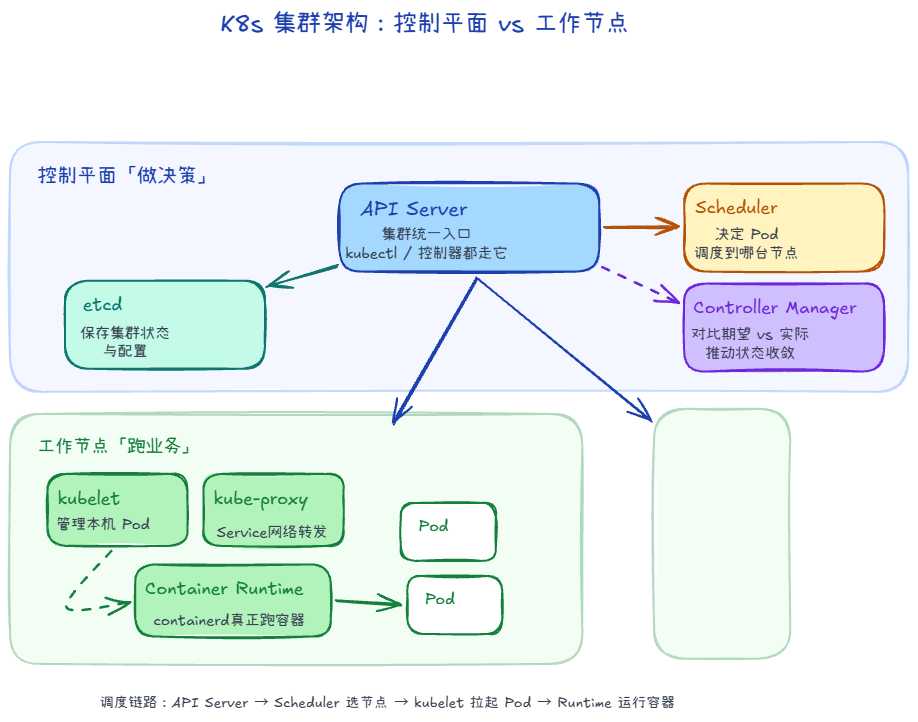
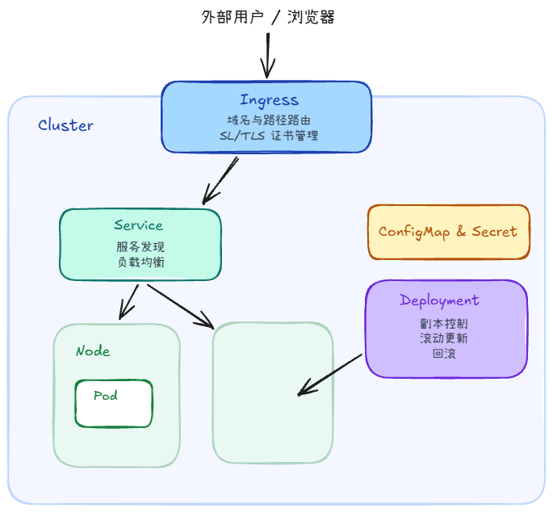

# Kubernetes

## Master 有哪些组件？

### 1. kube-apiserver（集群的统一网关与入口）

1. 暴露了 Kubernetes API（RESTful API），所有的外部客户端（如 kubectl、Dashboard）以及集群内部的组件（如 Scheduler、Controller）都必须通过它来交互。
2. 负责安全控制：对所有请求进行身份验证、授权和准入控制。
3. 它是唯一直接与 etcd 数据库进行读写交互的组件

### 2. etcd（集群数据库）

1. 一个高可用、强一致性的分布式键值（Key-Value）数据库。
2. 用于存储 Kubernetes 集群的所有状态信息和元数据、敏感信息与配置数据
3. 当管理员在 etcd 中修改配置后，由于 etcd 的 Watch 机制，所有服务器会瞬间收到通知并更新本地配置，实现“一处修改，全局生效”
### 3. kube-scheduler（分发任务的调度器）

1. 监听 kube-apiserver 中新创建的、且尚未分配到具体 Node 的 Pod。
2. 根据一系列复杂的调度策略（如 CPU/内存资源是否充足、亲和性/反亲和性（Affinity）、污点与容忍度（Taints and Tolerations）、数据本地性等），为该 Pod 选择一个最合适的 Worker 节点（Node）去运行。

### 4. Controller Manager (控制器管理器)

1. 运行各种控制器进程。每个控制器都是一个“死循环”，不断地对比集群的实际状态与用户定义的期望状态（Desired State），并在不一致时尝试修复，使其达到一致。

## Node 上有哪些组件

### 1. kubelet（Node 节点上的管家）

1. 接收并执行指令：它通过 API Server 接收分配到该节点的 Pod 清单（PodSpec），并确保这些 Pod 在该节点上正常运行。
2. 容器生命周期管理：它不会直接去运行容器，而是通过 CRI（容器运行时接口） 调用容器运行时（如 Containerd）来创建、启动、停止和销毁容器。
3. 健康检查（Probes）：持续监控容器的运行状态（Liveness、Readiness 和 Startup 探针），如果容器挂了，它会负责重启容器。
4. 状态汇报：定期向 Master 节点的 API Server 汇报该节点自身的资源状态（CPU、内存、磁盘等）以及 Pod 的运行状态。

### 2. kube-proxy（网络代理）

1. 实现 Service 机制：Kubernetes 的 Service 是一个逻辑概念，真正的网络路由规则是由 kube-proxy 在每个节点上实现的。
2. 网络规则维护：它会监听 API Server 中 Service 和 Endpoint 的变化，并在节点上写入网络规则（通常使用 Linux 的 iptables 或 IPVS 模式）。
3. 负载均衡：当外部或内部流量访问 Service 的虚拟 IP（ClusterIP）时，kube-proxy 负责将请求均匀地转发到后端具体的某一个 Pod。

### 3. Container Runtime（容器运行时）

1. Kubernetes 本身不直接运行容器，它需要依赖容器运行时来下载容器镜像、创建和运行容器。
2. Kubernetes 支持通过 CRI (Container Runtime Interface) 标准与多种容器运行时进行交互。
3. 常见的容器运行时：
    1. Containerd（目前最主流、最轻量级的标准选择）
    2. CRI-O（专门为 Kubernetes 设计的轻量级运行时）
    3. Docker（在新版 K8s 中已移除直接支持，但 Docker 也是基于 Containerd 的，目前通过 cri-dockerd 适配器依然可以使用）

## 资源对象

### 1. Pod（容器组）

K8s 中最小的部署和调度单元。一个 Pod 里面可以包含一个或多个容器（Container）。通常情况下，一个 Pod 只运行一个主容器。

为什么需要 Pod?

- 同一个 Pod 内的容器共享相同的网络 IP、端口空间和存储卷。它们之间可以通过 `localhost` 直接通信，就像住在一个房间里的室友。
- Pod 是短寿命（短暂的）的。如果一个 Pod 挂了，K8s 不会去修复它，而是会创建一个全新的 Pod 来代替它，因此 Pod 的 IP 地址是经常变化的。

### 2. Node（节点）

1. 就是我们前面提到的工作节点（可以是物理机或虚拟机）。
2. 它是 Pod 运行的物理载体。一栋大楼（Node）里可以划分出很多个房间（Pod）。

关系：一个 Node 上可以运行多个 Pod，Master 节点会根据 Node 的资源剩余情况，把 Pod 分配到合适的 Node 上。

### 3. Deployment（部署/无状态控制器）

1. 它是用来管理 Pod 生命周期的控制器。
2. 在实际生产中，我们几乎从不直接创建单个 Pod，而是通过 Deployment 来创建和管理 Pod。

主要功能：
1. 副本控制：你告诉 Deployment “我要运行 3 个 Nginx Pod”，它就会确保任何时候集群里都有 3 个 Nginx Pod 在运行。如果有 Pod 挂了，它会自动新建一个。
2. 滚动更新（Rolling Update）：当你要升级应用版本时，Deployment 可以做到“先建一个新版的 Pod，再删一个旧版的 Pod”，实现零停机时间（Zero Downtime）的平滑升级。
3. 回滚（Rollback）：如果新版本上线后发现有 Bug，可以一键回滚到上一个稳定版本。

### 4. Service（服务）

1. 由于 Pod 的 IP 地址经常变化（一重建 IP 就变了），客户端无法直接通过 Pod IP 稳定地访问应用。
2. Service 就是定义了一组 Pod 的持久访问入口（稳定 IP 和 DNS 域名）。

主要功能：
1. 服务发现：不管后端的 Pod 怎么销毁重建、IP 怎么变，Service 的 IP（ClusterIP）是固定不变的。
2. 负载均衡：当流量到达 Service 时，它会自动将请求分发（负载均衡）给后端的多个 Pod。

### 5. Ingress（应用路由入口）

1. Service 主要负责集群内部的访问和四层（TCP/UDP）负载均衡。而 Ingress 则是集群的统一外网入口（七层 HTTP/HTTPS 路由）。

主要功能：
1. 域名与路径路由：它可以根据域名或 URL 路径，将外部请求分发到不同的 Service。例如：
    - 访问 `api.example.com` -> 路由到 `api-service`
    - 访问 `example.com/web` -> 路由到 `web-service`
2. SSL/TLS 证书管理：在 Ingress 处统一配置 HTTPS 证书，无需在每个 Pod 里单独配置。

> 注意：使用 Ingress 需要在集群中部署一个 Ingress Controller（最常用的是 Nginx Ingress Controller）。*

### 6. ConfigMap & Secret

- ConfigMap：用来存储明文的配置参数（如数据库连接地址、环境变量），实现“代码与配置分离”。
- Secret：专门用来存储敏感数据（如密码、Token、密钥），以 Base64 编码加密存储。

---

## 问题

### 如果一个 Pod 挂了，会发生什么？

1. 通过Deployment创建Pod
2. kubelet 进程会发现容器挂了，根据 Pod 的 restartPolicy（重启策略，默认是 Always）尝试在本地重启。
3. 如果本地重启失败或 Pod 被删除，Deployment 后台的 ReplicaSet 控制器 会在集群中进行状态对比
4. ReplicaSet 会立刻向 API Server 发起请求：“再帮我建一个新 Pod”。
5. Scheduler（调度器） 介入，选一个健康的 Node，把新 Pod 调度过去。

### 如果整个 Node 挂了，会发生什么？

1. 状态检测（Lease 机制）：每个 Node 会定期向 Master 发送心跳。如果 Node 挂了，Master 连续一段时间（默认 40秒）收不到心跳，会将该 Node 标记为 NotReady 状态。
2. 触发驱逐（Eviction）：Master 发现 Node 挂了，会在该 Node 的所有 Pod 上打上“不可达”的污点。默认 5分钟（300秒） 后，Controller Manager 会启动驱逐程序。
3. 重新调度：
    - 这些被驱逐的 Pod 会在 Master 节点上被标记为“待重建”。
    - Scheduler 会在其他健康的 Node 上重新创建并运行这些 Pod。

### Kubernetes 为什么能够自动恢复？

1. 声明式（Declarative）：你不需要告诉 K8s “怎么做”（比如：先调这个 API 创建容器，再调那个分配 IP），你只需要告诉它**“最终状态是什么”**（比如：我要 3 个 Nginx 副本）。
2. 控制循环（Reconciliation Loop / 调协循环）：K8s 控制器（Controller Manager）内部运行着无数个死循环。它的工作只有三步：
    - Watch（看）：通过 API Server 监听集群的实际状态（Actual State）。
    - Diff（比对）：将实际状态与你声明的期望状态（Desired State）进行对比。
    - Act（做）：如果发现不一致，就调用底层 API 执行操作，直到实际状态逼近期望状态。

### 既然 etcd 支持“毫秒级、无需重启”的配置更新，为什么实际运维中，我们还要用 Volume 挂载、环境变量或滚动重启等看似更慢、更重的方式来更新配置？

如果直连etcd，直接去 Watch etcd 中的 Key，那就是毫秒级更新，完全不重启。但是**代码侵入性极高**。

为了让应用不与 etcd 耦合，K8s 充当了“中介”：管理员把配置 **ConfigMap**（配置表）和 **Secret**（密码表写给 K8s（存在 etcd 里），K8s 再通过以下三种方式转交给应用：
1. 以 Volume 挂载文件的方式（自动更新，但需要应用支持热重载）
2. 以环境变量（Env）方式注入（无法自动更新）
3. 手动触发滚动更新（最常用）：kubectl rollout restart deployment <my-app>
