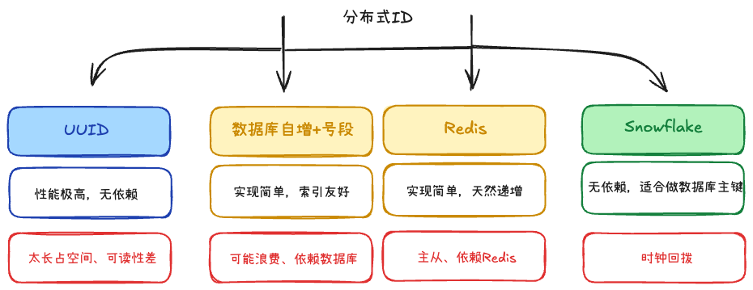

## 分布式锁的实现 +3

1. Redis的SET NX EX
	- 性能高
	- 注意锁过期、误删问题
2. MySQL的唯一索引
	- 实现简单
	- 并发性低
3. etcd、ZooKeeper
	- 复杂
	- 强一致性

## 分布式ID

1. UUID
	- 本地生成，性能高。
	- 不依赖其它服务
	- 太长，无序
2. 数据库自增和号段模式
	- 性能比每次查数据库高很多。
	- ID 趋势递增，对数据库索引友好。
3. 雪花算法：0 | timestamp | machine-id | sequence
	- 生成的是整数，适合做数据库主键
	- 依赖机器时钟，时钟回拨可能导致重复。
4. Redis 生成 ID
	- 强依赖 Redis。
	- Redis 持久化和主从切换要处理好，否则可能丢失或回退