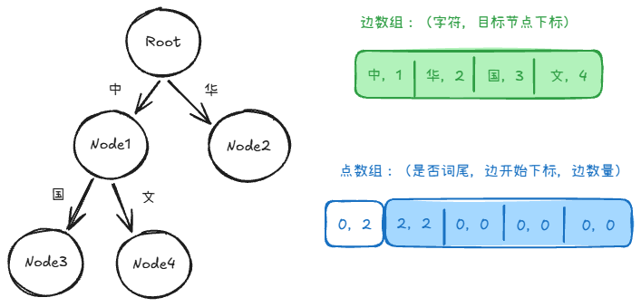

# 优化

## 我印象最深的是

项目刚上线时，有用户反馈文档中心执行异常。我先确认了问题现象，用户操作，版本。然后去看日志发现没有打印没有panic，怀疑是内存cpu问题，接着我在测试机复现，用 top 发现内存占用高，接着用 pprof 定位，发现瓶颈在 Bleve 建立索引阶段。

查官方文档和 AI 建议效果都不太好，我就去读了 Bleve 的源码。最后通过三个方案解决：一是调整配置，比如禁用 _all 字段来减小索引体积；二是文档分块，1MB 一块；三是批量提交，累计 10MB 再写入，优化吞吐。

最终效果很明显，峰值 heapInuse 降了 76%，彻底解决了这个问题

## 为什么它的all默认是true呢？设计收益是什么？

Bleve 默认 all=true 是为了让“无配置全文搜索”成立。偏向“搜索体验优先”而不是“索引成本优先”

设计收益的话，第一个是搜索更简单，搜索语句相对更短一点；避免漏查，字段解藕，以后新增字段，全文搜索默认覆盖他们

## 怎么理解30兆的会比30个1兆的性能影响更大呢？

1. 当程序处理一个 30MB 的连续文档时，Go 语言的分析器和 Bleve 需要在内存中开辟巨大的连续空间或大对象来存放原始文本、分词后的 Token 数组以及倒排索引的临时对象。
2. 而30 个 1MB 的块：系统每次只需要处理 1MB 的数据，内存峰值大大降低

## 内存降低70%怎么测的

调整两个变量：单块大小和批量提交大小。分块大小测试了 1 MB、2 MB、5 MB、10 MB 等档位；批量提交也分别测试 5 MB、10 MB 等配置。

评估不只看总耗时，还看索引吞吐、搜索延迟、内存峰值、磁盘占用、失败或 OOM 情况，以及检索结果是否正确

块太小的问题是块数量会明显增加，索引元数据、切分和提交次数变多，写入放大，检索时也可能需要合并更多候选结果；优点是单次处理和内存压力更可控。  

## 聚合算法是什么？

1. 主文档分两类
	1. 无子文档的，小文档，内容在主文档自己这里
	2. 有子文档的，大文档，内容在子文档里
2. 遍历搜索结果，判断是主文档还是分块；主文档保存到 Map，分块的高亮保存到另一个 Map
3. 如果只匹配到分块，没匹配到主文档，需要主动查询主文档信息
4. 按顺序遍历主文档 ID，拼接高亮内容，取前 5 个片段

### 文件更新后旧分块怎么办？重建到一半失败了？

先删旧子文档 + Bleve 旧索引，再重建。

如果失败，主文档有状态标记：ready、indexing、failed。搜索会过滤，并会有重试

### 按 1MB 固定字节切有什么问题？

从切点处往前倒查200字节，优先找段落、换行、句号等自然边界；找不到再回退到 UTF-8 字符边界

## 分块后索引相比不分块体积变大了吗？

倒排 posting 增加 + 每个 chunk 的字段/文档元数据重复 + 可能的 Doc Values

不过 Posting List 又采用压缩存储，所以整体索引体积增长有限。我们实际测试中 HeapInuse 降低了约 76%，因此这是一个值得的权衡

# 四、分词

## 技术选型

1. bleve自带的standard分词器，会把中文分成单个汉字，token 数最多，建索引和查询都偏慢
2. jieba需要cgo，带来的交叉编译/设备部署风险；而gse，基于jieba的纯 Go 中文分词库，和sego 的性能表现也是不如 CJDict
3. CJDict的优势是可控，可以自定义实现分词算法

## 算法改进

### 初版实现

初版 tokenizer 的思路：

1. 把词典加载为 map，记录词典最大词长；
2. 对每个中文起点，从最大长度向短长度尝试；
3. 命中则取最长词，未命中则退化为单字。

CPU问题很明显：

- 词数约 31.6 万，最大词长 16 rune
- 长文本中每个中文位置最多会创建 16 个候选字符串
- string分配、map查找、GC压力不断增加

### 改进

1. map 改为前缀树实现
2. 字符串沿 Trie 单次前进
3. 输出最远的 terminal，即最长词

CPU降低，但是RSS升高：
- map元数据增多，几百万个指针散落在各地
- CG不断去扫，压力大

为了解决运行期大 map 的内存问题，把 Trie 压成连续数组：

- edges：存所有的“边”（字符是什么，指向哪个节点）。
- nodes：存节点状态（是不是词尾、子节点的边在哪里）。
- 每个 node 只记录边开始下标和边数量；
- 运行期在该 node 的连续 edge 区间里二分查找。

## 如何测试

1. 第一轮：各个技术的分词效果如何
2. 第二轮：真实查询能不能命中
	- 维护了一组覆盖中文、英文、代码标识符、路径 API 的固定查询集
	- 各个分词器跑索引，记录每个 query 的命中数
3. 第三轮：性能测试
	- 1kb-10MB测试
	- cpu、内存、峰值内存、耗时等指标监控

### 将 Trace 总耗时降低约 48\%、进程 user CPU 降低约 63\%。怎么测的

Trace 总耗时是每个文档的 `total_ms` 字段求和

进程 user CPU 主要看：`/usr/bin/time -v` 里的 `User time (seconds)`，整个测试进程从启动到结束，一共在用户态 CPU 上花了多少秒。

## cjdict搜索效果好在哪

1. 误报：默认的standard有误搜问题，比如搜索关键词 “华人”，当有一篇介绍“中华人民共和国”的新闻时会被搜出来，这被定义为误报
2. 相关性：比如计算机，standard会拆成3个字，权重会很低；cjdict就会完整去搜，真正高相关的技术文章就到前面了
	- TF：出现次数越多，得分越高
	- IDF：一个词越罕见，它的权重就越高。
	- BM25： 词频（TF）增高，得分快速饱和，有明确上限
3. 效率：一长句，standard 必须去每个单字的“倒排索引表”（极长，因为单字在成千上万篇文章里都有）里进行复杂的求交集计算，甚至还要计算它们之间的位置关系，看它们是不是挨在一起的
